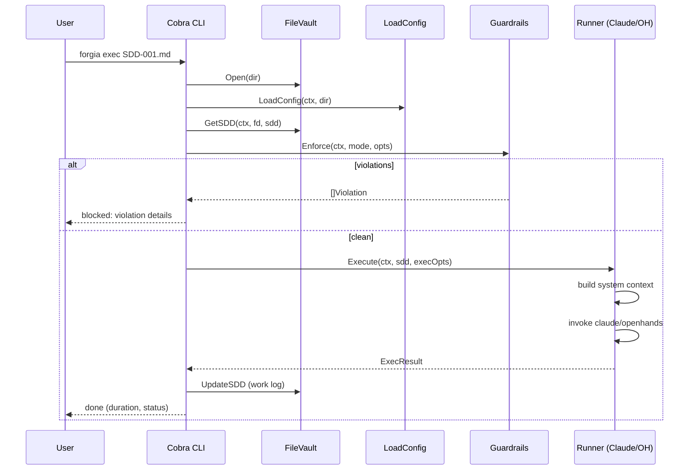

# FD-001: Port Bash CLI to Go binary

## Problem / Problema

Forgia's CLI is split in two: a 1087-line Bash script (`bin/forgia`) handling 7 commands, and a Go binary (`cmd/forgia/`) with only `sync` and `version`. All internal Go packages are implemented and tested (FileVault, config, guardrails, MCP, beads, boardsync, runner interface) but none of them are wired to CLI commands.

This means:
- Users run the Bash CLI, which has known fragility (TOML parsing with grep/sed, stdin pipe issues, platform-dependent date/sed)
- The Go packages sit unused despite being battle-tested (100+ tests)
- Two codebases to maintain for the same functionality
- New features require changes in both Bash and Go
- 11 slash commands are loose markdown files with no registry, no embedding, no context wiring

The goal is a single Go binary that replaces `bin/forgia` entirely — zero Bash dependency.

## Solutions Considered / Soluzioni Considerate

### Option A: Incremental migration (command by command)

Each Bash command gets a Go equivalent alongside the Bash version. Users switch via `FORGIA_USE_GO=1` env var. When all commands are ported, Bash is removed.

- **Pro:** Low risk, can ship incrementally, easy rollback per command
- **Pro:** E2E tests can run against both backends
- **Con / Contro:** Longer timeline, dual maintenance during migration
- **Con / Contro:** Feature drift between Bash and Go versions

### Option B (chosen): Full port in one branch / Porto completo in un branch (scelta)

Port all 7 commands to Go in a single feature branch. Embed vault templates and slash commands via `go:embed`. Ship as a complete replacement.

- **Pro:** Clean cut, no dual maintenance period, all packages already implemented
- **Pro:** `go:embed` eliminates runtime dependency on `modules/` directory
- **Pro:** Single binary distribution (cross-compiled for linux/darwin × amd64/arm64)
- **Con / Contro:** Larger PR, higher review effort
- **Con / Contro:** Risk of subtle behavior differences vs Bash (mitigated by existing E2E tests)

## Architecture / Architettura

### Integration Context / Contesto di Integrazione

```mermaid
flowchart TD
    subgraph existing ["Existing / Esistente"]
        V[internal/vault<br/>FileVault]
        C[internal/config<br/>LoadConfig]
        G[internal/guardrails<br/>Enforce]
        B[internal/board<br/>GitHubBoard]
        M[internal/mcp<br/>ProviderRegistry]
        R[internal/runner<br/>Runner interface]
        BD[internal/beads<br/>Client]
        P[internal/process<br/>Spawn]
    end

    subgraph new ["New Cobra Commands / Nuovi"]
        INIT[cmd init.go]
        STATUS[cmd status.go]
        DOCTOR[cmd doctor.go]
        VALIDATE[cmd validate.go]
        EXEC[cmd exec.go]
        BATCH[cmd batch.go]
        WATCH[cmd watch.go]
        SKILL[cmd skill.go]
    end

    subgraph embed ["go:embed"]
        TPL[vault-template/]
        CMDS[claude-commands/*.md]
    end

    INIT --> V
    INIT --> C
    INIT --> BD
    INIT --> TPL
    STATUS --> V
    STATUS --> B
    STATUS --> BD
    DOCTOR --> V
    DOCTOR --> C
    DOCTOR --> M
    VALIDATE --> V
    VALIDATE --> G
    EXEC --> V
    EXEC --> G
    EXEC --> R
    EXEC --> P
    BATCH --> V
    BATCH --> R
    BATCH --> BD
    WATCH --> V
    WATCH --> R
    SKILL --> CMDS
    SKILL --> R

    style existing fill:#f0f0f0,stroke:#999
    style new fill:#d4edda,stroke:#28a745
    style embed fill:#fff3cd,stroke:#ffc107
```

### Data Flow / Flusso Dati

## Interfaces / Interfacce

| Component / Componente | Input | Output | Protocol / Protocollo |
|------------------------|-------|--------|-----------------------|
| `cmd/init.go` | `--dir` flag, embedded templates | scaffolded `.forgia/` | FileVault.InitVault() |
| `cmd/status.go` | vault dir | formatted table (FDs, SDDs, board) | FileVault.ListFDs/ListSDDs |
| `cmd/doctor.go` | vault dir, system PATH | health report | exec.LookPath, Config, MCP.Healthy |
| `cmd/validate.go` | SDD file path or FD dir | pass/fail + violations | Guardrails.Enforce, frontmatter parse |
| `cmd/exec.go` | SDD file, `--runner`, `--dry-run`, `--mode` | ExecResult + work log update | Runner.Execute, Guardrails.Enforce |
| `cmd/batch.go` | FD dir, `--runner`, `--dry-run` | sequential ExecResults | Runner.Execute per SDD |
| `cmd/watch.go` | FD dir, `--debounce` | auto-exec on new SDDs | fsnotify + Runner.Execute |
| `cmd/skill.go` | skill name, args | Claude output | embedded markdown + Claude CLI |
| `embed/templates` | `go:embed modules/vault-template` | `embed.FS` | compile-time |
| `embed/commands` | `go:embed modules/claude-commands` | `embed.FS` | compile-time |

## Planned SDDs / SDD Previsti

1. SDD-001: `go:embed` scaffold — embed vault templates + slash commands, expose via `internal/embed` package. Must export `VaultTemplateFS()` and `SlashCommandFS()` returning `fs.FS`
2. SDD-002: `forgia init` — Cobra command, wire InitVault + templates + stack detection
3. SDD-003: `forgia status` + `forgia doctor` — read-only commands, vault + board + beads
4. SDD-004: `forgia validate` — SDD validation, frontmatter checks, guardrails pre-check
5. SDD-005: Claude runner — concrete Runner implementation, system context builder, file monitor
6. SDD-006: `forgia exec` + `forgia batch` — execution commands, guardrails enforcement, work log update
7. SDD-007: `forgia watch` — fsnotify watcher, debounce, auto-exec
8. SDD-008: `forgia skill` — skill registry, embedded markdown loader, Claude invocation
9. SDD-009: Bash deprecation — add banner to bin/forgia, update install.sh + README, E2E migration

## Constraints / Vincoli

- Go 1.25+ — use `iter.Seq`, `slog`, `testing/synctest`
- Context propagation: all I/O functions take `ctx context.Context` as first parameter
- Structured logging: `slog.InfoContext(ctx, ...)`, never bare `slog.Info`
- Error wrapping: always `fmt.Errorf("context: %w", err)`
- Compile-time interface checks: `var _ Interface = (*Struct)(nil)`
- Type assertions: always comma-ok pattern
- Tests: table-driven, `t.Helper()`, `t.TempDir()`
- No `init()` — explicit initialization only
- Guardrails are absolute — deny.toml enforced at runtime
- Spec first, code second — each SDD must be approved before execution
- Commits: `feat(FD-001): SDD-NNN — description` + `Signed-off-by` + `Co-Authored-By`

## Verification / Verifica

- [ ] `go build ./...` produces single binary with all commands
- [ ] `forgia init` scaffolds identical vault structure as Bash version
- [ ] `forgia status` output matches Bash version (format may differ)
- [ ] `forgia doctor` checks all: vault, git, docker, claude, bd, fswatch, yq, MCP
- [ ] `forgia validate` catches same errors as Bash validate-sdd.sh
- [ ] `forgia exec` runs SDDs with Claude runner (constitution + guardrails context)
- [ ] `forgia exec --dry-run` simulates without modifying files
- [ ] `forgia exec --mode=guard` enforces boundaries from SDD
- [ ] `forgia batch` executes all pending SDDs in dependency order
- [ ] `forgia watch` auto-executes new SDDs on file change
- [ ] `forgia skill fd-status` lists FDs from embedded command
- [ ] E2E tests pass against Go binary (not Bash)
- [ ] Cross-compile: linux/darwin × amd64/arm64
- [ ] `bin/forgia` shows deprecation banner pointing to Go binary
- [ ] All existing 100+ Go tests still pass
- [ ] No regression in CI (test + build + E2E)

## Notes / Note

- Upstream: Deepzima/forgia#63
- Context files read: CONTRIBUTING.md, .forgia/constitution.md, .forgia/dev-guide/lang/go.md
- Dependencies ready: FileVault (#48), Config (#49), Guardrails (#52), Board (#35), MCP (#55), Runner interface (#41)
- ferruvich's PRs #61 (arch skills) and #62 (sdd-dry-run) add more slash commands — embed those too after merge
- The Bash E2E tests (`tests/e2e*.sh`) should be ported to Go integration tests progressively
