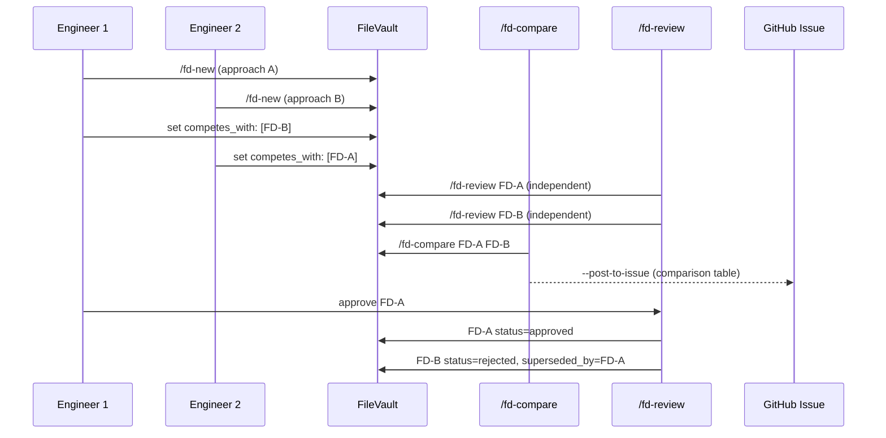

# FD-002: Competitive FD workflow

## Problem / Problema

When a feature has multiple viable approaches, the team needs to propose competing FDs, compare them side-by-side, and make a documented decision. Today Forgia supports only one FD per feature — competing proposals live in comments or separate docs, making the decision process unstructured and hard to trace.

Real example: issue #28 (CLI rewrite) had Go, Rust, TypeScript as options. The evaluation happened ad-hoc. With competitive FDs, each engineer writes a formal FD, they get reviewed independently, then compared with a structured report.

## Solutions Considered / Soluzioni Considerate

### Option A: FD variants as separate files with letter suffix

Competing FDs use naming convention `FD-NNNa`, `FD-NNNb` etc. Each is a full FD with `competes_with` frontmatter linking them. A new `/fd-compare` command generates the comparison.

- **Pro:** Clean naming, each FD is independent, works with existing vault structure
- **Pro:** `competes_with` field already exists in FD type
- **Pro:** Rejected FDs serve as ADRs (decision record)
- **Con / Contro:** Letter suffix breaks hash-based ID convention (FD-a3f2 vs FD-a3f2a)

### Option B (chosen): FD variants with full hash IDs + competes_with linking / Varianti con hash completi (scelta)

Each competing FD gets its own hash ID (like any FD). They link to each other via `competes_with` and to the same `upstream_issue`. The `/fd-compare` command finds competitors via these fields.

- **Pro:** No naming convention change — hash IDs stay consistent
- **Pro:** `forgia status` groups by `upstream_issue` naturally
- **Pro:** Works with board sync (each FD = separate card)
- **Con / Contro:** Slightly less obvious which FDs compete (need to read frontmatter)

## Architecture / Architettura

### Integration Context / Contesto di Integrazione

```mermaid
flowchart TD
    subgraph existing ["Existing / Esistente"]
        V[internal/vault<br/>FD type with competes_with]
        S[cmd/status.go<br/>forgia status]
        R[modules/claude-commands<br/>fd-review.md]
        B[internal/board<br/>SyncFromVault]
    end

    subgraph new ["New / Nuovo"]
        CMP[modules/claude-commands<br/>fd-compare.md]
        REJ[internal/vault<br/>RejectCompetitors()]
        GRP[cmd/status.go<br/>grouped display]
        POST[fd-compare<br/>--post-to-issue]
    end

    CMP --> V
    CMP --> POST
    REJ --> V
    GRP --> V
    GRP --> S
    POST --> B

    style existing fill:#f0f0f0,stroke:#999
    style new fill:#d4edda,stroke:#28a745
```

### Data Flow / Flusso Dati



## Interfaces / Interfacce

| Component | Input | Output | Protocol |
|-----------|-------|--------|----------|
| `/fd-compare` | 2+ FD IDs | Structured comparison table | Claude slash command |
| `--post-to-issue` | comparison + upstream_issue | GitHub comment | gh api |
| `RejectCompetitors()` | approved FD ID | competitors set to rejected | vault.UpdateFD |
| `forgia status` | vault FDs | grouped table by upstream_issue | CLI output |

## Planned SDDs / SDD Previsti

1. SDD-001: `/fd-compare` slash command — read 2+ FDs, generate comparison table (dimensions, architecture, criteria overlap, recommendation)
2. SDD-002: Auto-reject + `forgia status` grouping — RejectCompetitors() in vault, status command groups competing FDs
3. SDD-003: Integration Wiring — `--post-to-issue` flag, `/fd-review` triggers auto-reject on approve, E2E test of full competitive workflow

## Constraints / Vincoli

- Go 1.25+, Cobra for CLI updates
- `/fd-compare` is a Claude slash command (markdown), not Go logic
- `RejectCompetitors()` is Go logic in vault package
- Must not break existing single-FD workflow
- Rejected FDs are NEVER deleted — they serve as ADRs
- Board sync must handle rejected status (card moved to rejected column)

## Verification / Verifica

- [ ] `/fd-compare FD-A FD-B` generates structured comparison
- [ ] `/fd-compare --post-to-issue` posts to linked GitHub issue
- [ ] Approving FD-A auto-rejects FD-B with reason and superseded_by
- [ ] `forgia status` groups competing FDs by upstream_issue
- [ ] Rejected FDs searchable and readable (not deleted)
- [ ] `/fd-review` works on competing FDs independently
- [ ] Board sync handles rejected status
- [ ] Existing single-FD workflow unchanged

## Notes / Note

- Upstream: Deepzima/forgia#29
- `competes_with`, `rejected_reason`, `superseded_by` fields already in vault.FD type
- Board sync already supports status mapping — just need "rejected" as a column option
- First real use case was issue #28 (CLI rewrite evaluation)
