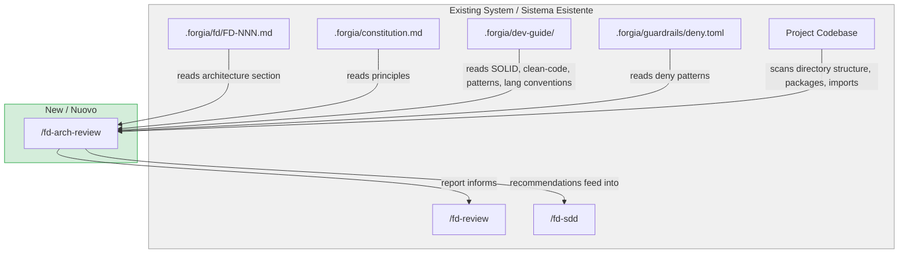
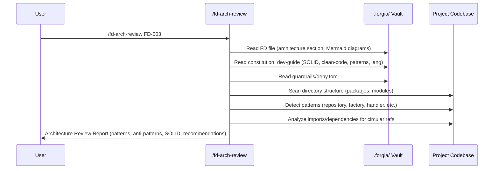

# FD-003: /fd-arch-review — architecture review with pattern detection

## Problem / Problema

The Forgia workflow currently has a gap between FD creation and FD review: when an FD is authored, the architecture section (Mermaid diagrams, component breakdown, interfaces) is written by the human or the agent that created it, but there is no automated step that validates the proposed architecture against the actual codebase structure, known design patterns, SOLID principles, and anti-patterns.

`/fd-review` checks that diagrams exist and that sections are filled — it does not analyze whether the architecture is sound. A developer can create an FD with a clean-looking integration diagram that introduces circular dependencies, God Objects, or violates the project's own coding conventions, and it will pass review.

This matters because SDDs are generated from the FD's architecture section. If the architecture is flawed, every SDD inherits those flaws, and agents will implement bad designs. Catching architectural issues before SDD generation saves significant rework.

The command should be usable both as a standalone review tool and as a pre-step to `/fd-review`, so that review findings can reference architecture quality.

## Solutions Considered / Soluzioni Considerate

### Option A: Inline architecture checks in `/fd-review`

Add architecture analysis passes directly into the existing `/fd-review` slash command — pattern detection, SOLID compliance, anti-pattern scanning all become additional checklist items in the review.

- **Pro:** Single command, no additional step in the workflow
- **Pro:** Architecture issues block review automatically
- **Con / Contro:** Makes `/fd-review` significantly larger and harder to maintain — it already has 5 checklist groups
- **Con / Contro:** Users can't run architecture review independently (e.g., during FD authoring, before submitting for review)
- **Con / Contro:** Mixing gate logic (pass/fail) with advisory analysis (recommendations) in one command

### Option B (chosen) — Separate `/fd-arch-review` slash command / Opzione B (scelta)

Create a new Claude Code slash command (`/fd-arch-review FD-NNN`) that performs dedicated architecture analysis. It reads the FD's architecture section and the existing codebase, then produces a structured report covering: pattern detection, anti-pattern scanning, dependency graph analysis, SOLID compliance scoring, and actionable recommendations.

The command is advisory — it produces a report but does not gate anything. `/fd-review` can reference arch review findings but remains the actual gate.

- **Pro:** Single responsibility — architecture analysis is isolated from gate review
- **Pro:** Can be run repeatedly during FD authoring (iterative improvement)
- **Pro:** Report format is structured and reusable (by `/fd-sdd` to inject constraints)
- **Pro:** Does not increase `/fd-review` complexity
- **Con / Contro:** Extra step in the workflow (but optional, not a gate)
- **Con / Contro:** `/fd-review` won't automatically fail on architecture issues unless the developer runs arch-review first

## Architecture / Architettura

### Integration Context / Contesto di Integrazione

### Data Flow / Flusso Dati

## Interfaces / Interfacce

| Component / Componente | Input | Output | Protocol / Protocollo |
|------------------------|-------|--------|-----------------------|
| `/fd-arch-review` slash command | FD identifier (`FD-NNN`) | Markdown report (pattern table, anti-pattern table, dependency graph, SOLID score, recommendations) | Claude Code slash command (`$ARGUMENTS`) |
| Codebase scanner (within command logic) | Project root directory | List of packages/modules, detected patterns, import graph | Filesystem read (Glob, Grep, Read tools) |
| Dev-guide loader (within command logic) | `.forgia/dev-guide/principles/`, `.forgia/dev-guide/lang/` | Loaded principles and conventions as context | File read |

## Planned SDDs / SDD Previsti

1. SDD-001: `/fd-arch-review` slash command — the Claude Code markdown prompt file (`modules/claude-commands/fd-arch-review.md`). Defines the full analysis flow: FD reading, codebase scanning, pattern detection, anti-pattern detection, dependency graph generation, SOLID compliance scoring, and report formatting.
2. SDD-002: Integration wiring and documentation — update `.forgia/dev-guide/review-process.md` to include `/fd-arch-review` as a step between `/fd-review` and `/fd-sdd` in the workflow. Verify the slash command auto-loads via the existing embedded skill system (`internal/skill/embedded.go` → `LoadEmbedded()`). Run E2E validation that the command is discoverable via `forgia skills`.

## Constraints / Vincoli

- **Slash command only**: The deliverable is a markdown prompt file in `modules/claude-commands/`. No Go code changes required — the existing embed system picks it up automatically.
- **Read-only operation**: The command must never modify FD files, codebase files, or any vault content. It is purely analytical.
- **Must use existing dev-guide**: Pattern detection and SOLID checks must reference `.forgia/dev-guide/principles/` (SOLID, clean-code, design-patterns) and `.forgia/dev-guide/lang/` conventions — not hardcoded rules.
- **Guardrails compliance**: Codebase scanning must respect `deny.toml` read patterns — never read files matching deny patterns.
- **Milestone**: Phase 2 - Core
- **Parent issue**: #20 (design skills)
- **Related**: #18 (compliance scoring), #19 (behavior constraints)

## Verification / Verifica

- [ ] `/fd-arch-review FD-NNN` produces a structured report with all 5 sections: Pattern Analysis, Anti-Pattern Detection, Dependency Graph, SOLID Compliance, Recommendations
- [ ] Pattern detection scans actual codebase directory structure (not just the FD text)
- [ ] Anti-pattern detection checks for: God Object, Circular Dependency, Missing Interface, Hardcoded Config, Missing Error Context
- [ ] SOLID compliance scores each principle (S, O, L, I, D) individually
- [ ] Dependency graph is generated as a Mermaid diagram from actual codebase imports/packages
- [ ] Recommendations are actionable (specific file/package references, not vague advice)
- [ ] Command respects guardrails — does not read files matching deny.toml patterns
- [ ] Command is purely read-only — does not modify any files
- [ ] Report can be referenced by `/fd-review` and `/fd-sdd`
- [ ] Slash command auto-loads via existing embedded skill system (no Go code changes)
- [ ] `.forgia/dev-guide/review-process.md` updated with `/fd-arch-review` step in the workflow diagram
- [ ] Command is discoverable via `forgia skills`

## Notes / Note

- Upstream: [Deepzima/forgia#22](https://github.com/Deepzima/forgia/issues/22)
- Parent: [Deepzima/forgia#20](https://github.com/Deepzima/forgia/issues/20) (design skills)
- Related: [Deepzima/forgia#18](https://github.com/Deepzima/forgia/issues/18) (compliance scoring), [Deepzima/forgia#19](https://github.com/Deepzima/forgia/issues/19) (behavior constraints)
- The issue proposes that `/fd-arch-review` runs before `/fd-review` and that `/fd-sdd` incorporates recommendations into SDD constraints. This integration is advisory — no hard coupling is introduced. Future work could add an optional arch-review gate to `/fd-review`.
- Context files discovered and read:
  - `.forgia/constitution.md`
  - `.forgia/dev-guide/principles/solid.md`
  - `.forgia/dev-guide/principles/clean-code.md`
  - `.forgia/dev-guide/principles/design-patterns.md`
  - `.forgia/dev-guide/lang/go.md`
  - `.forgia/dev-guide/lang/shell.md`
  - `.forgia/guardrails/deny.toml`
  - `modules/claude-commands/fd-review.md` (existing review command, for integration reference)
