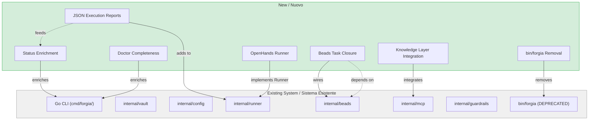
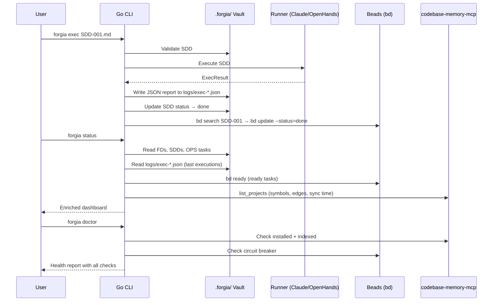

# FD-004: Go CLI feature parity with bin/forgia bash CLI

## Problem / Problema

The Go CLI (`cmd/forgia/`) is intended to fully replace the bash CLI (`bin/forgia`, already marked as DEPRECATED). While the Go version covers the core command surface (`init`, `status`, `doctor`, `validate`, `exec`, `batch`, `watch`) and adds new capabilities not in bash (`sync`, `skill`/`skills`, `version`), several features within existing commands are missing or incomplete.

Key gaps prevent removing `bin/forgia`:
- `forgia status` only shows FDs with nested SDDs — missing OPS tasks, execution log summaries, Beads ready tasks, and knowledge layer stats
- `forgia doctor` lacks checks for OpenHands, Claude commands, Beads circuit breaker, LLM API keys, and knowledge layer health
- `forgia exec` does not generate JSON execution reports or close Beads tasks on success
- No OpenHands runner implementation exists in Go (bash has a full Docker-based runner)
- Knowledge layer (codebase-memory-mcp) has config structs but zero runtime integration

Until these gaps are closed, both CLIs must be maintained in parallel, creating confusion for users and duplicated maintenance burden. The bash CLI cannot be removed until the Go binary is a complete drop-in replacement.

## Solutions Considered / Soluzioni Considerate

### Option A: Incremental parity — close gaps one at a time

Address each gap independently across multiple PRs with no fixed order. Each command is enhanced as needed.

- **Pro:** Low risk per change, easy to review
- **Pro:** Can ship partial improvements incrementally
- **Con / Contro:** No clear milestone for removing `bin/forgia` — the bash CLI lingers indefinitely
- **Con / Contro:** Risk of drift — new bash features added while Go catches up

### Option B (chosen) — Phased parity with bash removal as final step / Opzione B (scelta)

Organize gaps into prioritized SDDs. Priority 1 (must-have) items are done first, then Priority 2 (important), then Priority 3 (stubs). The final SDD removes `bin/forgia` and updates all references. E2E tests validate parity before removal.

- **Pro:** Clear endpoint — bash removal is an explicit SDD with prerequisites
- **Pro:** Prioritized: critical gaps first, nice-to-haves later
- **Pro:** E2E tests ensure no regression when bash is removed
- **Pro:** Single branch strategy avoids merge conflicts
- **Con / Contro:** Large FD with many SDDs — requires disciplined sequencing
- **Con / Contro:** Some SDDs have cross-dependencies (status needs JSON reports from exec)

## Architecture / Architettura

### Integration Context / Contesto di Integrazione

### Data Flow / Flusso Dati

## Interfaces / Interfacce

| Component / Componente | Input | Output | Protocol / Protocollo |
|------------------------|-------|--------|-----------------------|
| `status` enrichment | Vault dir, Beads client, Knowledge config | Enriched dashboard (OPS, logs, Beads, knowledge stats) | CLI stdout |
| `doctor` completeness | System state (Docker, claude, bd, API keys, codebase-memory-mcp) | Health report with pass/fail/skip per check | CLI stdout |
| JSON execution reports | `ExecResult` from runner | `logs/exec-{SDD}-{timestamp}.json` | JSON file write |
| Beads task closure | SDD ID, Beads client | Task status updated to done | `bd` CLI subprocess |
| OpenHands runner | SDD, ExecOptions, Docker config | ExecResult | Docker container exec |
| Knowledge layer | KnowledgeConfig, codebase-memory-mcp CLI | Index stats, MCP JSON config | CLI subprocess + JSON |
| `bin/forgia` removal | All parity verified | bin/forgia deleted, references updated | Git rm + doc edits |

## Planned SDDs / SDD Previsti

1. SDD-001: `status` enrichment — add OPS task listing, execution log summaries (from `logs/exec-*.json`), Beads ready tasks, and knowledge layer stats to `forgia status`
2. SDD-002: `doctor` completeness — add checks for OpenHands image/container, Claude commands, Beads circuit breaker, LLM API key presence, knowledge layer health
3. SDD-003: JSON execution reports + Beads task closure — ensure `forgia exec` writes structured JSON to `logs/exec-*.json` and calls `bd search`/`bd update` on successful SDD completion
4. SDD-004: OpenHands runner — implement `Runner` interface for OpenHands Docker execution: image pull, workspace mount, API key injection, port binding, config from `[runner.openhands]`
5. SDD-005: Knowledge layer integration — wire codebase-memory-mcp into `init` (auto-index + `.mcp.json`), `status` (stats display), and `doctor` (health check)
6. SDD-006: E2E parity tests — port/adapt `tests/e2e.sh` to run against the Go binary, validate all commands produce equivalent output to bash
7. SDD-007: `bin/forgia` removal and integration wiring — remove `bin/forgia`, update README, CLAUDE.md, mise tasks, CI workflows, and any documentation referencing the bash CLI. This is the final SDD and must only execute after all previous SDDs pass.

## Constraints / Vincoli

- **Sequential dependency**: SDD-003 (JSON reports) must complete before SDD-001 (status enrichment) can display execution logs. SDD-006 (E2E tests) must pass before SDD-007 (bash removal).
- **Beads is optional**: All Beads integration must gracefully degrade when `bd` is not installed. Use existing `beads.Client.Available()` pattern.
- **Knowledge layer is optional**: codebase-memory-mcp integration must gracefully degrade when not installed. Follow the same pattern as Beads.
- **OpenHands runner requires Docker**: The runner implementation should check Docker availability and fail with a clear error if missing.
- **No breaking changes to Go CLI**: Existing commands must continue working throughout the migration. New features are additive.
- **Milestone**: Phase 2 - Core
- **E2E tests are the gate**: `bin/forgia` cannot be removed until `tests/e2e.sh` passes against the Go binary.
- **Constitution compliance**: All new Go code must follow `dev-guide/lang/go.md` conventions (error wrapping, `t.Parallel()`, interfaces at consumer, etc.)

## Verification / Verifica

- [ ] `forgia status` shows OPS tasks, execution log summaries, Beads ready tasks, and knowledge stats
- [ ] `forgia doctor` checks OpenHands, Claude commands, Beads circuit breaker, API keys, knowledge health
- [ ] `forgia exec` generates JSON execution reports in `logs/exec-*.json`
- [ ] `forgia exec` closes matching Beads task on successful SDD completion
- [ ] OpenHands runner implemented and functional (pulls image, mounts workspace, runs SDD)
- [ ] Knowledge layer integrated into init (auto-index), status (stats), and doctor (health)
- [ ] Go E2E tests cover all ~215 assertions from bash E2E tests (6 files) before bash tests are removed
- [ ] All Go E2E tests pass against the Go binary
- [ ] `bin/forgia` is removed from the repository (only after E2E parity verified)
- [ ] Bash E2E tests (`tests/e2e*.sh`) removed only after Go equivalents confirmed
- [ ] README, CLAUDE.md, mise tasks, and CI workflows updated to reference only the Go binary
- [ ] Beads and knowledge integrations degrade gracefully when tools are not installed

## Notes / Note

- Upstream: [Deepzima/forgia#68](https://github.com/Deepzima/forgia/issues/68)
- The Go CLI already surpasses bash in several areas: guardrails enforcement, board sync, skill system, embedded templates, MCP provider chaining, structured logging, typed config with local overrides
- FD-001 (Go CLI porting) covered the initial port. This FD covers the remaining gaps and the final bash removal
- Priority 3 items from the issue (Vault.Render(), Agent Teams, Docker sandbox, SCM interface) are explicitly excluded from this FD — they are enhancements beyond parity and can be addressed in future FDs
- Context files read:
  - `.forgia/constitution.md`
  - `.forgia/dev-guide/lang/go.md`
  - `.forgia/dev-guide/lang/shell.md`
  - `.forgia/dev-guide/principles/solid.md`
  - `.forgia/dev-guide/principles/clean-code.md`
  - `.forgia/dev-guide/principles/design-patterns.md`
  - `.forgia/dev-guide/coding-conventions.md`
  - `.forgia/dev-guide/commit-conventions.md`
  - `.forgia/dev-guide/review-process.md`
  - `.forgia/guardrails/deny.toml`
