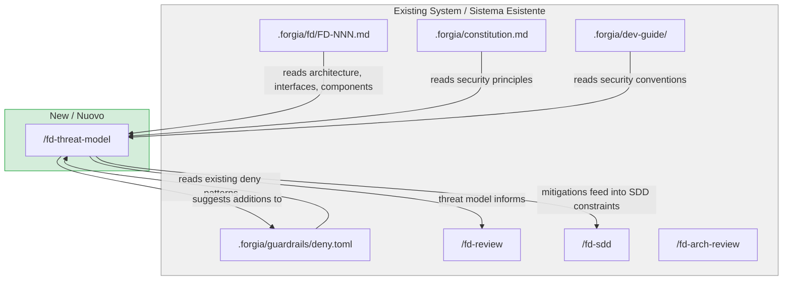
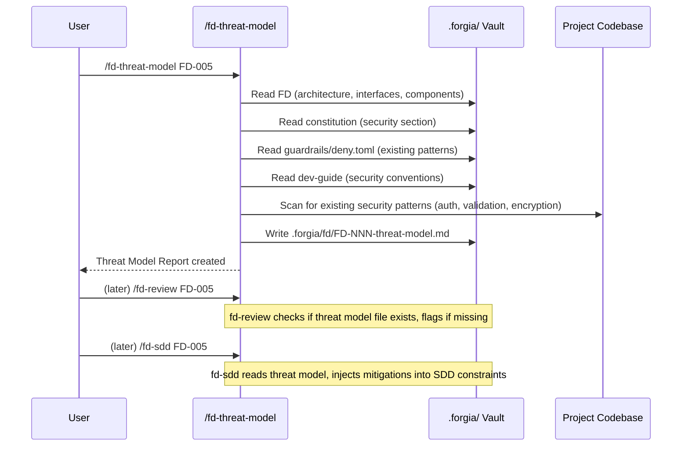

# FD-005: /fd-threat-model — security analysis before implementation

## Problem / Problema

When an FD is approved and SDDs are generated, there is no systematic security analysis step. Developers may introduce vulnerabilities (XSS, privilege escalation, data exfiltration, denial of service) that are only caught during code review or, worse, in production.

The existing Forgia workflow has guardrails (`deny.toml`) that block known-bad operations, and `/fd-review` checks constitution compliance. But neither performs proactive threat modeling — identifying assets, threat actors, and attack surfaces specific to the feature being designed.

Without a dedicated threat analysis step, security mitigations are ad-hoc and depend on the developer's security awareness. A structured STRIDE analysis per FD would produce actionable recommendations that can be injected into SDD constraints, ensuring agents implement security controls by design rather than as an afterthought.

## Solutions Considered / Soluzioni Considerate

### Option A: Add security checks to `/fd-review`

Extend the existing `/fd-review` command with STRIDE analysis, threat identification, and guardrails suggestions as additional checklist items.

- **Pro:** Single command, no additional workflow step
- **Pro:** Security issues would block FD approval directly
- **Con / Contro:** Makes `/fd-review` much heavier — it already has 5 checklist groups
- **Con / Contro:** Threat modeling produces a separate artifact (threat model document) that doesn't fit the pass/fail review format
- **Con / Contro:** Users can't run threat analysis independently or iteratively

### Option B (chosen) — Separate `/fd-threat-model` slash command / Opzione B (scelta)

Create a new Claude Code slash command (`/fd-threat-model FD-NNN`) that performs dedicated security analysis. It reads the FD's architecture, identifies assets and threat actors, runs STRIDE analysis per component, and produces a structured threat model document. Recommendations feed into `/fd-sdd` constraints.

- **Pro:** Single responsibility — security analysis is isolated from gate review
- **Pro:** Produces a standalone threat model artifact that can be reviewed and referenced
- **Pro:** Can be run iteratively during FD authoring
- **Pro:** Recommendations are actionable — directly map to SDD constraints and guardrails additions
- **Con / Contro:** Extra step in the workflow (optional, not a gate)
- **Con / Contro:** Threat model may become stale if FD architecture changes after analysis

## Architecture / Architettura

### Integration Context / Contesto di Integrazione

### Data Flow / Flusso Dati

## Interfaces / Interfacce

| Component / Componente | Input | Output | Protocol / Protocollo |
|------------------------|-------|--------|-----------------------|
| `/fd-threat-model` slash command | FD identifier (`FD-NNN`) | File: `.forgia/fd/FD-NNN-threat-model.md` (persistent artifact) | Claude Code slash command (`$ARGUMENTS`) |
| Threat model file | FD architecture, constitution, guardrails | Markdown with: Assets, Threat Actors, STRIDE table, SDD Recommendations, Guardrails Suggestions | File write to `.forgia/fd/` |
| `/fd-review` integration | Threat model file existence check | Optional flag: "threat model exists/missing" in review output | `/fd-review` reads `.forgia/fd/FD-NNN-threat-model.md` |
| `/fd-sdd` integration | Threat model SDD Recommendations section | Mitigations injected into SDD Constraints sections | `/fd-sdd` reads threat model if present |
| Guardrails suggestions | Identified threats | Proposed additions to `deny.toml` (advisory, not auto-applied) | User manually applies |

## Planned SDDs / SDD Previsti

1. SDD-001: `/fd-threat-model` slash command — the Claude Code markdown prompt file (`modules/claude-commands/fd-threat-model.md`). Defines the full analysis flow: FD reading, asset identification, threat actor enumeration, STRIDE analysis per component, SDD mitigation recommendations, and guardrails suggestions. Output is a **persistent file** at `.forgia/fd/FD-NNN-threat-model.md`.
2. SDD-002: `/fd-review` integration — update `modules/claude-commands/fd-review.md` to optionally check for threat model existence (`.forgia/fd/FD-NNN-threat-model.md`). If missing, flag in review output as advisory (not a blocker).
3. SDD-003: `/fd-sdd` integration — update `modules/claude-commands/fd-sdd.md` to read the threat model file (if present) and inject relevant mitigations into each SDD's Constraints section.
4. SDD-004: Integration wiring — update `.forgia/dev-guide/review-process.md` to document `/fd-threat-model` as an optional security step in the workflow. Verify slash command auto-loads via `go:embed`. Validate `forgia skills` lists it.

## Constraints / Vincoli

- **Slash command only**: The deliverable is a markdown prompt file in `modules/claude-commands/`. No Go code changes needed.
- **Writes threat model file only**: The command creates `.forgia/fd/FD-NNN-threat-model.md` as a persistent artifact. It must never modify the FD itself, guardrails, or codebase files. Guardrails suggestions are advisory — the user decides whether to apply them.
- **STRIDE framework**: The analysis must follow the STRIDE model (Spoofing, Tampering, Repudiation, Information Disclosure, DoS, Elevation of Privilege).
- **Must reference existing guardrails**: The command must read `deny.toml` to avoid duplicating existing protections and to identify gaps.
- **Milestone**: Phase 2 - Core
- **Parent issue**: #20 (design skills)
- **Related**: #17 (runtime guardrails), #19 (behavior constraints), #18 (compliance scoring)

## Verification / Verifica

- [ ] `/fd-threat-model FD-NNN` creates `.forgia/fd/FD-NNN-threat-model.md` with: Assets, Threat Actors, STRIDE Analysis table, SDD Recommendations, Guardrails Suggestions
- [ ] STRIDE table covers all 6 categories (S, T, R, I, D, E) per relevant component
- [ ] SDD recommendations reference specific SDDs by number with concrete mitigations
- [ ] Guardrails suggestions are concrete `deny.toml` patterns, not generic advice
- [ ] Command reads constitution security section and existing deny.toml patterns
- [ ] Command only writes the threat model file — does not modify FD, guardrails, or codebase
- [ ] Command respects guardrails — does not read files matching deny.toml patterns
- [ ] `/fd-review` optionally flags when threat model is missing (advisory, not a blocker)
- [ ] `/fd-sdd` reads threat model and injects mitigations into SDD Constraints when present
- [ ] Slash command auto-loads via existing embedded skill system (no Go code changes)
- [ ] `.forgia/dev-guide/review-process.md` updated with `/fd-threat-model` step
- [ ] Command is discoverable via `forgia skills`

## Notes / Note

- Upstream: [Deepzima/forgia#21](https://github.com/Deepzima/forgia/issues/21)
- Parent: [Deepzima/forgia#20](https://github.com/Deepzima/forgia/issues/20) (design skills)
- Related: [Deepzima/forgia#17](https://github.com/Deepzima/forgia/issues/17) (runtime guardrails), [Deepzima/forgia#19](https://github.com/Deepzima/forgia/issues/19) (behavior constraints), [Deepzima/forgia#18](https://github.com/Deepzima/forgia/issues/18) (compliance scoring)
- The issue proposes that `/fd-review` optionally checks for threat model existence and that `/fd-sdd` reads the threat model to inject mitigations into SDD constraints. This integration is advisory — no hard coupling.
- STRIDE reference: Spoofing, Tampering, Repudiation, Information Disclosure, Denial of Service, Elevation of Privilege
- Context files read:
  - `.forgia/constitution.md` — security section defines guardrails as absolute
  - `.forgia/dev-guide/principles/clean-code.md` — error handling, validation at boundaries
  - `.forgia/dev-guide/lang/go.md` — Go security patterns
  - `.forgia/guardrails/deny.toml` — existing deny patterns (read, execute, write)
  - `.forgia/dev-guide/review-process.md` — workflow to update
  - `modules/claude-commands/fd-arch-review.md` — reference for similar analysis command structure
