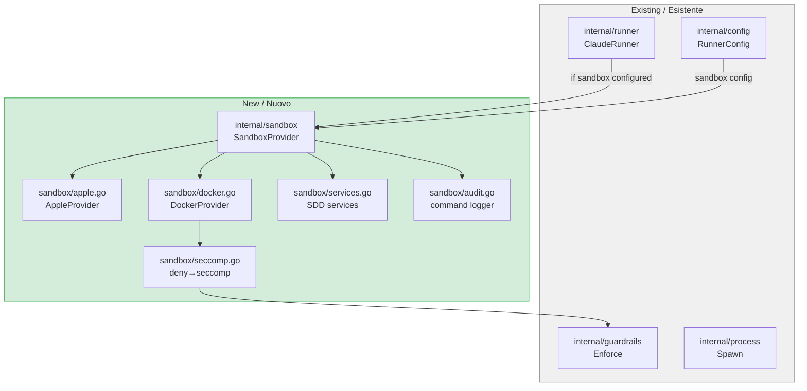
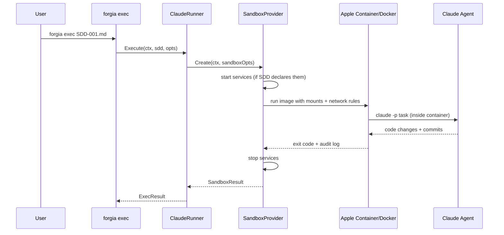

# FD-006: Dual-profile sandbox runner

## Problem / Problema

`forgia exec` runs Claude with `--dangerously-skip-permissions` on the host machine. The agent has full access to filesystem, network, SSH keys, secrets. deny.toml is prompt-level only — the agent "promises" not to violate it but nothing enforces it.

For autonomous execution (`forgia exec`, `forgia batch`, `forgia watch`), the agent needs kernel-level isolation: restricted filesystem, controlled network egress, audited commands.

## Solutions Considered / Soluzioni Considerate

### Option A: Docker-only sandbox

Use Docker containers with seccomp profiles generated from deny.toml.

- **Pro:** Cross-platform, well-understood, seccomp is mature
- **Pro:** OpenHandsRunner already uses Docker
- **Con / Contro:** Namespace isolation only — kernel shared with host, escape possible
- **Con / Contro:** seccomp profiles are complex to generate correctly

### Option B (chosen): Multi-provider sandbox with Apple Container preferred / Multi-provider con Apple Container preferito (scelta)

Abstract sandbox behind `SandboxProvider` interface. Apple Container (VM isolation) preferred on macOS 26+, Docker as fallback.

- **Pro:** Apple Container = VM-level isolation (separate kernel), near-zero escape risk
- **Pro:** Native Apple Silicon performance, no x86 translation
- **Pro:** Docker fallback for CI/Linux
- **Pro:** Same OCI images for both providers
- **Con / Contro:** Apple Container macOS 26+ only
- **Con / Contro:** Two providers to maintain

## Architecture / Architettura

### Integration Context / Contesto di Integrazione

### Data Flow / Flusso Dati

## Interfaces / Interfacce

| Component | Input | Output | Protocol |
|-----------|-------|--------|----------|
| `SandboxProvider` | `SandboxOpts` (image, mounts, network, env) | `SandboxResult` (exit code, audit log) | Go interface |
| `AppleProvider` | same | same | `container run` CLI |
| `DockerProvider` | same + seccomp profile | same | `docker run` CLI |
| `SeccompGenerator` | `*guardrails.Guardrails` | `seccomp.json` bytes | deny.toml → JSON |
| `ServiceManager` | `SDD.Boundaries.Services` | started/stopped | Docker/container lifecycle |
| `AuditLogger` | command stream | `.forgia/logs/audit-SDD-NNN.jsonl` | JSONL file |

## Planned SDDs / SDD Previsti

1. SDD-001: `SandboxProvider` interface + `AppleProvider` — run commands in Apple Container with workspace mount and network config
2. SDD-002: `DockerProvider` + `SeccompGenerator` — Docker sandbox with deny.toml → seccomp.json conversion
3. SDD-003: `ServiceManager` — start/stop services declared in SDD boundaries before/after exec
4. SDD-004: `AuditLogger` — log every command executed inside sandbox to JSONL
5. SDD-005: `ClaudeRunner` wiring — if config says sandbox, wrap execution in sandbox. `forgia doctor` checks provider availability
6. SDD-006: Integration Wiring — E2E test: `forgia exec SDD.md` with sandbox=apple-container runs in VM, produces result, audit log written, services started/stopped

## Constraints / Vincoli

- Go 1.25+, context propagation, slog, error wrapping
- Apple Container v0.10.0 CLI (`container run`)
- Docker v29+ CLI (`docker run`)
- SandboxProvider must be optional — if no sandbox configured, ClaudeRunner runs on host as today
- OCI images shared between providers
- No secrets mounted in sandbox (no ~/.ssh, ~/.gnupg, ~/.aws)
- Network egress restricted to allowlist

## Verification / Verifica

- [ ] `forgia exec SDD.md` with `sandbox=apple-container` runs agent in VM
- [ ] `forgia exec SDD.md` with `sandbox=docker` runs agent in container with seccomp
- [ ] `forgia exec SDD.md` with `sandbox=none` runs on host (backward compatible)
- [ ] Agent cannot read host ~/.ssh from sandbox
- [ ] Agent cannot reach non-allowlisted domains from sandbox
- [ ] SDD services started before exec, stopped after
- [ ] Audit log written to `.forgia/logs/audit-SDD-NNN.jsonl`
- [ ] `forgia doctor` reports sandbox provider availability
- [ ] seccomp profile generated from deny.toml blocks denied commands in Docker
- [ ] All existing tests pass (no regression)

## Notes / Note

- Upstream: Deepzima/forgia#32
- Apple Container verified: v0.10.0, `container run ubuntu:latest uname -a` → Linux 6.18.5 aarch64
- Docker verified: v29.3.0
- OpenHandsRunner already exists — DockerProvider can reuse patterns
- dots issue: Deepzima/dots#8 for Apple Container installation tracking
