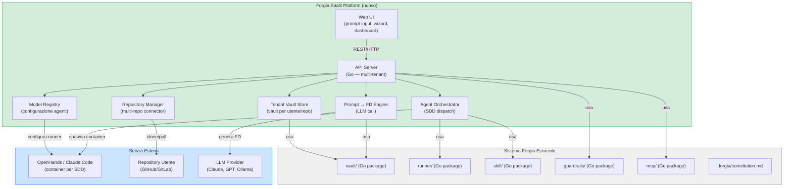
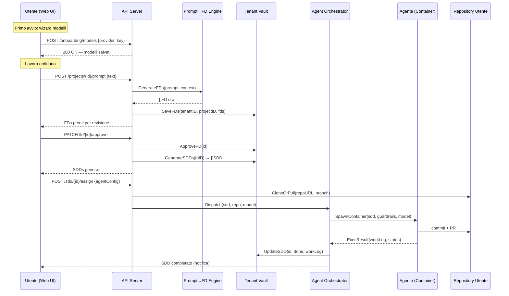

# FD-006: Forgia SaaS Platform

## Problem / Problema

Il workflow Forgia (FD → SDD → agente) è oggi confinato a un singolo repository locale,
richiedendo setup manuale e competenze tecniche per ogni progetto.
Non esiste un modo semplice per:

- avviare un lavoro da un prompt in linguaggio naturale (senza dover scrivere l'FD a mano)
- gestire più repository da un'unica interfaccia
- configurare i modelli AI usati dagli agenti senza toccare file di configurazione
- monitorare l'avanzamento di SDD distribuiti su repository diversi

Il risultato è che il framework rimane un tool da CLI per sviluppatori avanzati,
escludendo utenti meno tecnici e team che lavorano su più repo contemporaneamente.

## Solutions Considered / Soluzioni Considerate

### Option A / Opzione A — Web wrapper attorno al CLI esistente

Costruire un thin layer web (API REST + frontend) che si limita a invocare il binario
`forgia` esistente tramite subprocess su un server ospitato, mantenendo il vault locale
per ogni progetto.

- **Pro:**
  - Riuso immediato di tutta la logica esistente (CLI, skills, guardrails)
  - Minimo refactoring del codice Go
  - Vault rimane su filesystem → nessuna migrazione del modello dati
- **Con / Contro:**
  - Accoppiamento forte al filesystem: multi-tenancy difficile da implementare
  - Scalabilità limitata (subprocess per richiesta)
  - Impossibile ospitare vault di utenti diversi in isolamento sulla stessa macchina senza complessità infrastrutturale elevata

### Option B (chosen) / Opzione B (scelta) — Platform-first con Forgia come libreria Go

Esporre i package `internal/` di Forgia come libreria Go consumata da un backend
multi-tenant (API server). Il frontend web interagisce con l'API; gli agenti eseguono
in container isolati (Docker, OpenHands) per ogni SDD. Il vault per ogni progetto/repo
utente è gestito dal server.

- **Pro:**
  - Multi-tenancy nativa: ogni utente/repo ha il proprio vault isolato
  - I package Go esistenti (`vault/`, `runner/`, `skill/`, `guardrails/`) diventano
    librerie riusabili senza subprocess
  - Scalabilità orizzontale dell'API server
  - Il wizard di onboarding si integra naturalmente nel flusso di registrazione
  - Evoluzione naturale della roadmap Forgia (Phase 3 MCP già pianificata)
- **Con / Contro:**
  - Richiede di portare a Phase 2 (implementazione) i package Go ancora in Phase 1
  - Infrastruttura più complessa (Docker, storage distribuito per i vault)
  - La generazione FD da prompt richiede un nuovo componente LLM (non ancora in Forgia)

## Architecture / Architettura

### Integration Context / Contesto di Integrazione

### Data Flow / Flusso Dati

## Interfaces / Interfacce

| Component / Componente | Input | Output | Protocol / Protocollo |
|------------------------|-------|--------|-----------------------|
| Web UI → API Server | Prompt testo, config modelli, approvazioni FD/SDD | FD draft, stato SDD, notifiche | REST/HTTP JSON |
| API Server → Prompt Engine | Testo prompt + contesto progetto (repo, constitution) | `[]FD` (bozze generate) | In-process Go call |
| API Server → Agent Orchestrator | SDD struct + repo URL + model config | `ExecResult{workLog, commits, status}` | In-process Go call |
| Agent Orchestrator → Runner | `vault.SDD` + `ExecOptions{model, containerCfg}` | `*ExecResult` | In-process Go call (runner interface esistente) |
| Prompt Engine → LLM Provider | System prompt (constitution + template FD) + user prompt | Testo FD strutturato | HTTPS (Anthropic/OpenAI API) |
| API Server → Tenant Vault Store | `tenantID`, `projectID`, operazioni CRUD FD/SDD | FD/SDD struct | In-process Go call (vault interface esistente) |
| Repo Manager → SCM | `repoURL`, `branch`, credenziali | Working directory locale | HTTPS Git clone/pull |

## Planned SDDs / SDD Previsti

1. SDD-001: API Server multi-tenant — scaffold del server Go, autenticazione, gestione tenant e progetti, routing base
2. SDD-002: Tenant Vault Store — adattatore del package `vault/` esistente per multi-tenancy (isolamento per tenantID/projectID, storage su filesystem o object store)
3. SDD-003: Prompt → FD Engine — componente LLM che trasforma il prompt utente in FD strutturati (usa constitution + template come system prompt)
4. SDD-004: Model Registry & Onboarding Wizard — API + UI per configurare i modelli AI al primo avvio (provider, API key, modello default)
5. SDD-005: Repository Manager — gestione connessioni ai repository utente (clone, pull, worktree per SDD)
6. SDD-006: Agent Orchestrator — dispatch degli SDD agli agenti, gestione container, raccolta Work Log e aggiornamento stato
7. SDD-007: Web UI — frontend (dashboard FD/SDD, prompt input, wizard onboarding, stato esecuzione agenti)

## Constraints / Vincoli

- **Spec first, code second** (Constitution §1): nessuna implementazione senza FD approvato e SDD generati
- **Agent isolation** (Constitution §5): ogni SDD deve girare nel proprio container isolato — nessuna esecuzione su host condiviso senza guardrails
- **No hardcoded secrets** (Constitution §Security): API key dei modelli utente vanno in secret manager o variabili d'ambiente cifrate, mai in vault o DB in chiaro
- **Fail-closed** (Constitution §2): se il Prompt Engine fallisce la generazione FD, l'errore è esplicito — nessun fallback silenzioso con FD parziali
- **I package Go `vault/`, `runner/`, `skill/` devono essere in Phase 2 (implementazione)** prima che i corrispondenti SDD della piattaforma possano girare — dipendenza da FD-001/FD-004
- **Multi-tenancy**: vault di tenant diversi devono essere completamente isolati a livello filesystem e permessi
- **Compatibilità Forgia locale**: la piattaforma non deve rompere il workflow CLI esistente — chi usa `forgia` da terminale deve continuare a farlo senza modifiche

## Verification / Verifica

- [ ] Problema chiaramente definito: gap tra CLI mono-repo e necessità multi-repo/multi-utente
- [ ] Almeno 2 soluzioni con pro/contro documentati
- [ ] Diagramma architetturale presente con componenti esistenti (grigio) e nuovi (verde)
- [ ] Interfacce tra tutti i componenti definite nella tabella
- [ ] 7 SDD previsti con scope distinto ciascuno
- [ ] Wizard onboarding modelli incluso nel design (SDD-004)
- [ ] Flusso prompt → FD → SDD → agente → repo tracciato nel sequence diagram
- [ ] Vincoli di sicurezza e isolamento documentati
- [ ] Review completata (`/fd-review`)

## Notes / Note

- Il **Prompt → FD Engine** (SDD-003) è il componente più critico e innovativo: trasforma linguaggio naturale in FD strutturati rispettando template e constitution. Richiede attenzione alla qualità dell'output (FD malformati bloccherebbero `/fd-review`).
- Il **wizard di onboarding** (SDD-004) è il primo punto di contatto dell'utente con la piattaforma: deve essere semplice e guidato, consentendo di configurare almeno un modello prima di poter lanciare il primo prompt.
- La piattaforma eredita la **roadmap MCP** già pianificata in `docs/functional-architecture.md §10` — l'Agent Orchestrator può sfruttare il MCP Server di Forgia come canale di comunicazione con gli agenti.
- **Dipendenze interne**: FD-001 (Go CLI porting) e FD-004 (parity) devono aver portato i package Go in Phase 2 prima che SDD-002, SDD-005, SDD-006 possano essere eseguiti con successo.
- Contesto auto-rilevato:
  - [docs/functional-architecture.md](../../docs/functional-architecture.md) — architettura sistema esistente, dual-profile runner, skill system
  - [docs/go-architecture.md](../../docs/go-architecture.md) — package dependency graph, evolutionary pattern
  - [docs/concepts.md](../../docs/concepts.md) — FD/SDD/Constitution model
  - [.forgia/constitution.md](../constitution.md) — regole immutabili applicate a ogni implementazione
