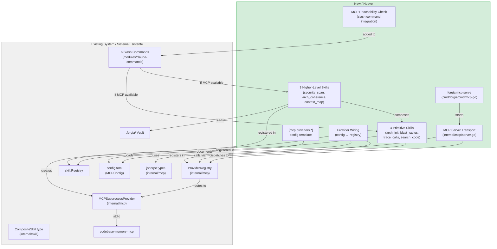
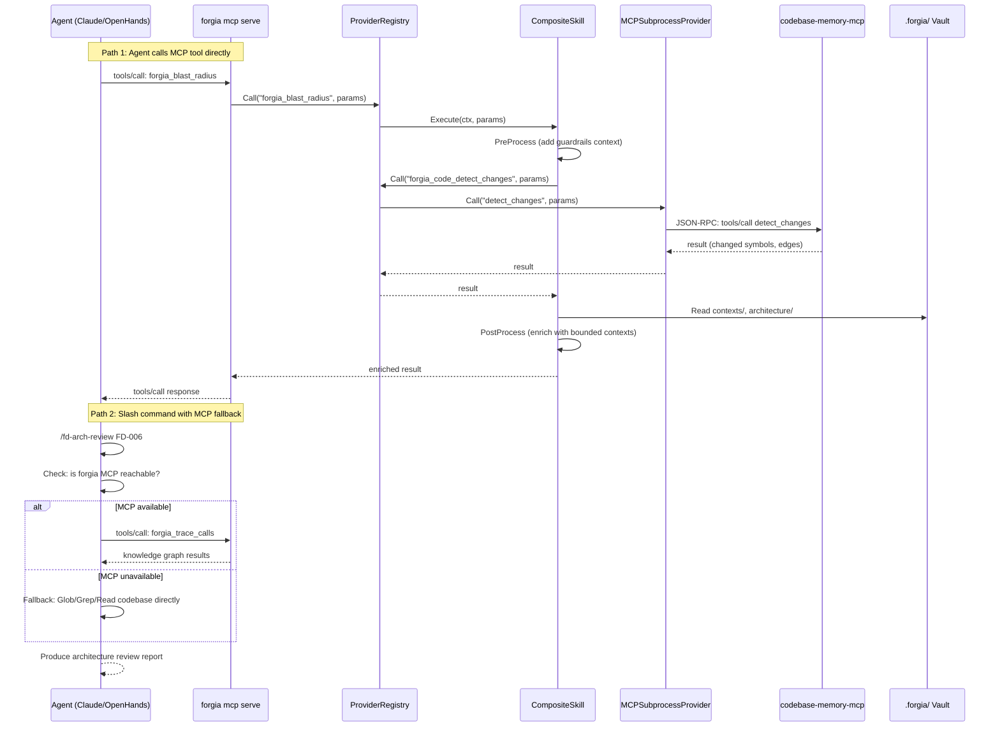

# FD-006: MCP server + composite skills + slash command integration

## Problem / Problema

Forgia has built the MCP client infrastructure (Phase 1): `MCPSubprocessProvider` can spawn and communicate with external MCP servers like `codebase-memory-mcp`, `ProviderRegistry` routes namespaced tool calls, `CompositeSkill` wraps tools with pre/post-processing hooks, and CLI hooks (init/doctor/status) integrate the knowledge layer.

However, Forgia has no MCP **server** mode. This creates two problems:

1. **Agents cannot programmatically access Forgia tools.** Today, agents interact with Forgia through slash commands that require the Claude CLI. Any MCP-compatible agent (not just Claude Code) should be able to call Forgia analysis tools directly via the standard MCP protocol.

2. **Slash commands miss the knowledge graph.** Commands like `/fd-arch-review`, `/fd-threat-model`, and `/sdd-dry-run` scan the codebase using Glob/Grep/Read — basic text matching. The knowledge graph in `codebase-memory-mcp` offers parsed AST, semantic edges, and call graphs that would produce deeper, more accurate analysis. But slash commands have no way to call the composite skills that wrap these tools.

Until the MCP server exists and slash commands can leverage it, agents get a subset of Forgia's potential, and the knowledge graph investment (Phase 1) delivers limited value.

## Solutions Considered / Soluzioni Considerate

### Option A: HTTP REST API

Expose Forgia tools via a traditional HTTP REST API (e.g., `POST /tools/blast-radius`). Agents call endpoints directly.

- **Pro:** Simple to implement, well-understood technology
- **Pro:** Easy to test with curl
- **Con / Contro:** Non-standard for agent tooling — MCP is the emerging protocol for tool-using agents
- **Con / Contro:** Requires separate HTTP server infrastructure
- **Con / Contro:** Claude Code and other MCP-native agents can't use it without adapters

### Option B (chosen) — MCP server on stdio + slash command MCP integration / Opzione B (scelta)

Build `forgia mcp serve` as an MCP server on stdio (standard JSON-RPC 2.0 transport). Register composite skills as MCP tools. Update 6 slash commands to check MCP reachability and prefer composite skills (knowledge graph) when available, with automatic fallback to direct scanning.

- **Pro:** Standard MCP protocol — works with any MCP-compatible agent (Claude Code, OpenHands, custom agents)
- **Pro:** Composable — Forgia can chain with other MCP servers in the ecosystem
- **Pro:** Slash commands get richer analysis from knowledge graph without changing user workflow
- **Pro:** All existing behavior preserved (fallback to direct scanning when MCP unavailable)
- **Con / Contro:** More complex than REST — JSON-RPC 2.0 protocol implementation needed
- **Con / Contro:** Slash commands need MCP reachability detection logic

## Architecture / Architettura

### Integration Context / Contesto di Integrazione

### Data Flow / Flusso Dati

## Interfaces / Interfacce

| Component / Componente | Input | Output | Protocol / Protocollo |
|------------------------|-------|--------|-----------------------|
| `forgia mcp serve` | CLI invocation | Running MCP server on stdio | Cobra command, blocks until SIGINT/SIGTERM |
| MCP Server transport | JSON-RPC requests on stdin | JSON-RPC responses on stdout | JSON-RPC 2.0 (initialize, tools/list, tools/call) |
| `forgia_arch_init` | `get_architecture()` params | Architecture mapped to `.forgia/architecture/` YAML | CompositeSkill → ProviderRegistry |
| `forgia_blast_radius` | `detect_changes()` params | Changes with risk labels + bounded context annotations | CompositeSkill → ProviderRegistry |
| `forgia_trace_calls` | `trace_call_path()` params | Call paths with bounded context annotations | CompositeSkill → ProviderRegistry |
| `forgia_search_code` | `search_graph()` params | Results filtered through guardrails (deny.toml) | CompositeSkill → ProviderRegistry |
| `forgia_security_scan` | Security pattern params | Auth/validation/crypto findings cross-referenced with deny.toml gaps | Higher-level: `forgia_search_code` + vault guardrails |
| `forgia_arch_coherence` | FD/architecture params | Actual call paths vs documented architecture, drift detection | Higher-level: `forgia_trace_calls` + `forgia_arch_init` + vault architecture |
| `forgia_context_map` | Symbol/change params | Changes mapped to bounded contexts | Higher-level: `forgia_search_code` + vault contexts |
| MCP reachability check | Slash command startup | Boolean: MCP available or not | Check if `forgia mcp serve` process is reachable |
| Slash command MCP path | Composite skill name + params | Tool result from knowledge graph | Slash command calls MCP tool instead of Glob/Grep/Read |
| Config template | `[mcp.providers.*]` TOML | Provider configuration for auto-registration | File in `modules/vault-template/config.toml` |

## Planned SDDs / SDD Previsti

1. SDD-001: MCP Server transport — `internal/mcp/server.go` (stdio listener, JSON-RPC request dispatcher, response builder using existing `jsonrpc.go` types) + `cmd/forgia/cmd/mcp.go` (Cobra `forgia mcp serve` command with signal handling via `process.ShutdownManager`). Extract shared stdio JSON-RPC read/write logic into `internal/mcp/transport.go` (`StdioTransport` with `ReadRequest()`/`WriteResponse()`) so both `subprocess.go` (client) and `server.go` can reuse it instead of duplicating the encoding/decoding pattern. **Security (from threat model)**: add request size limit (10MB) to `ReadRequest()` to prevent memory exhaustion; log every `tools/call` invocation (tool name + timestamp, NOT parameters) for audit trail
2. SDD-002: Provider wiring — orchestrator that reads `config.MCPConfig.Providers`, creates `MCPSubprocessProvider` for each, registers in `ProviderRegistry`, starts all providers. Add `[mcp.providers.*]` section with commented examples to `modules/vault-template/config.toml`. **Security (from threat model)**: validate provider command paths before spawning — reject commands containing shell metacharacters (`; | & $ \``); use `exec.LookPath` to resolve to absolute path; log resolved path at startup. Add `"sh -c*"`, `"bash -c*"` to guardrails `[execute]` suggestions in config template comments
3. SDD-003: CompositeSkill vault access — add a `VaultReader` interface to `CompositeSkill` in `internal/skill/skill.go` with only the methods composite skills need (`Constitution`, `GuardrailsRaw`, `GetArchitecture`, `ListContexts`). If SDD-004/005 implementation reveals more methods are needed, widen to full `vault.Vault`. Create `internal/skill/composite.go` with `RegisterCompositeSkills(reg, providerReg, vault)` factory. **Security (from threat model)**: document that VaultReader is intentionally narrow (4 methods) — re-assess if widened
4. SDD-004: Primitive composite skills — implement `forgia_arch_init`, `forgia_blast_radius`, `forgia_trace_calls`, `forgia_search_code` with PreProcess/PostProcess hooks in `internal/skill/composite.go`. **Security (from threat model)**: `forgia_search_code` PostProcess MUST apply `guardrails.CheckFilePaths()` to filter results matching `[read]` deny patterns — add test with fixture containing `.env` and `*.pem` paths verifying they are stripped; `forgia_arch_init` must merge with existing architecture files, not overwrite
5. SDD-005: Higher-level composite skills — implement `forgia_security_scan`, `forgia_arch_coherence`, `forgia_context_map` that compose primitives with vault data reads. **Security (from threat model)**: `forgia_security_scan` must NOT return actual secret values found in code — only file paths and pattern names; apply the same approach as `guardrails.ScanForSecrets()` (report location without content)
6. SDD-006: Slash command MCP integration — update 6 slash commands (`fd-arch-review`, `fd-threat-model`, `arch-init`, `arch-review`, `arch-update`, `sdd-dry-run`) to check MCP reachability and prefer composite skills when available. Each command adds a "Step 0: Check MCP" that attempts a `tools/list` call with a 3-second timeout to verify connectivity — this tests actual reachability, not just process existence. If reachable, use composite skill path; if timeout or error, fall back to direct Glob/Grep/Read scanning. **Security (from threat model)**: cache MCP reachability result for the duration of a single command invocation; document that MCP communication is local-only (stdio, same user)
7. SDD-007: Integration tests — mock MCP provider, namespace routing tests, composite skill execution tests, server E2E test (send JSON-RPC on stdin, verify response on stdout), slash command fallback test. **Security (from threat model)**: add test for `forgia_search_code` guardrails filtering (mock tool returns deny.toml-matched paths → verify stripped); add test for oversized JSON-RPC request → verify server rejects gracefully
8. SDD-008: Integration wiring — startup initialization (load config → create providers → register skills → start server), graceful shutdown, `forgia skills` lists composite skills, update `review-process.md` documentation

## Constraints / Vincoli

- **Go 1.25+, no new external dependencies**: implement JSON-RPC server from existing types in `internal/mcp/jsonrpc.go`. Do not add `mcp-go` or other libraries
- **Backward compatible**: existing CLI commands and slash commands must continue working unchanged. MCP server is additive
- **Slash command fallback is mandatory**: every slash command that checks MCP must work without it. If MCP is unavailable, fall back to Glob/Grep/Read — the current behavior
- **Vault access for composite skills**: PreProcess/PostProcess hooks need `vault.Vault` to read guardrails, architecture, contexts
- **Knowledge layer is optional**: MCP server runs even without codebase-memory-mcp — it just has fewer tools available
- **Milestone**: Phase 2 - Core
- **Depends on**: Phase 1 complete (MCPSubprocessProvider, ProviderRegistry, CompositeSkill type, CLI hooks)
- **Security — provider command validation**: provider command paths from `[mcp.providers.*]` must be validated before spawning — reject shell metacharacters, resolve via `exec.LookPath` (threat model: command injection via config.toml, HIGH risk)
- **Security — guardrails enforcement in search_code**: `forgia_search_code` PostProcess must apply `guardrails.CheckFilePaths()` to strip denied paths from results (threat model: guardrails bypass, HIGH risk)
- **Security — no secret values in output**: `forgia_security_scan` must report locations only, never actual secret content (threat model: info disclosure)
- **Security — request size limit**: MCP server must reject oversized JSON-RPC requests (10MB limit) to prevent memory exhaustion (threat model: DoS)
- **Security — audit logging**: every `tools/call` invocation logged with tool name + timestamp, NOT parameters (threat model: repudiation)

## Verification / Verifica

- [ ] `forgia mcp serve` starts an MCP server on stdio
- [ ] Server handles `initialize`, `tools/list`, `tools/call` messages
- [ ] `MCPSubprocessProvider` auto-registered from `[knowledge]` config
- [ ] All codebase-memory tools available as `forgia_code_*`
- [ ] `[mcp.providers.*]` section documented in config template with commented examples
- [ ] `forgia_arch_init` composite skill implemented and registered
- [ ] `forgia_blast_radius` composite skill implemented and registered
- [ ] `forgia_trace_calls` composite skill implemented and registered
- [ ] `forgia_search_code` composite skill implemented and registered
- [ ] `forgia_security_scan` composite skill implemented and registered
- [ ] `forgia_arch_coherence` composite skill implemented and registered
- [ ] `forgia_context_map` composite skill implemented and registered
- [ ] `/fd-arch-review` uses `forgia_trace_calls` + `forgia_search_code` when MCP available, falls back to Glob/Grep/Read
- [ ] `/fd-threat-model` uses `forgia_security_scan` when MCP available, falls back to direct scanning
- [ ] `/arch-init` uses `forgia_arch_init` when MCP available, falls back to directory scanning
- [ ] `/arch-review` uses `forgia_arch_coherence` when MCP available, falls back to vault check
- [ ] `/arch-update` uses `forgia_arch_coherence` + `forgia_context_map` when MCP available
- [ ] `/sdd-dry-run` uses `forgia_blast_radius` when MCP available, falls back to text analysis
- [ ] All 6 slash commands work without MCP server (fallback path verified)
- [ ] Integration tests pass
- [ ] Graceful shutdown on SIGINT/SIGTERM
- [ ] Provider command paths validated — shell metacharacters rejected (threat model mitigation)
- [ ] `forgia_search_code` strips deny.toml-matched paths from results (threat model mitigation)
- [ ] `forgia_security_scan` returns file locations only, never secret content (threat model mitigation)
- [ ] MCP server rejects JSON-RPC requests larger than 10MB (threat model mitigation)
- [ ] Every `tools/call` invocation logged with tool name + timestamp (threat model mitigation)

## Notes / Note

- Upstream: [Deepzima/forgia#58](https://github.com/Deepzima/forgia/issues/58)
- Phase 1 reference: [Deepzima/forgia#36](https://github.com/Deepzima/forgia/issues/36)
- Enhances: #27 (DDD skills), #22 (/fd-arch-review), #23 (/sdd-dry-run), #21 (/fd-threat-model), #35 (gate intelligente)
- The MCP server implementation follows the reverse pattern of `MCPSubprocessProvider` in `internal/mcp/subprocess.go` — instead of sending requests and reading responses, it reads requests from stdin and writes responses to stdout
- `ProviderRegistry.AllTools()` and `ProviderRegistry.Call()` already provide exactly what `tools/list` and `tools/call` handlers need — the server transport is thin glue
- `CompositeSkill.Execute()` already calls `registry.Call(ToolName(ProviderName, ProviderTool))` — the composite skill pattern is proven, just needs concrete instances
- Estimated new code: ~900 lines (server ~200, transport ~80, skills ~400, command ~80, tests ~140) + slash command updates (~100 lines across 6 files)
- Architecture review findings incorporated: (1) shared `StdioTransport` to avoid duplicating JSON-RPC I/O between client and server, (2) narrow `VaultReader` interface for composite skills instead of full `Vault`, (3) MCP reachability via `tools/list` with timeout (most reliable check)
- Threat model: `.forgia/fd/FD-006-threat-model.md` — 7 assets, 4 threat actors, 16 STRIDE threats. Two HIGH risk findings: command injection via config.toml provider paths, guardrails bypass in search_code. Mitigations injected into SDD descriptions and constraints above
- Context files read:
  - `internal/mcp/mcp.go` — ProviderRegistry, ToolProvider, ToolDefinition, namespace routing
  - `internal/mcp/subprocess.go` — MCPSubprocessProvider implementation
  - `internal/mcp/jsonrpc.go` — JSON-RPC types to reuse for server
  - `internal/skill/skill.go` — CompositeSkill, Skill interface, Registry
  - `internal/config/config.go` — MCPConfig, MCPProviderConfig
  - `internal/mcp/board_provider.go` — reference ToolProvider implementation
  - `.forgia/constitution.md` — security principles
  - `.forgia/guardrails/deny.toml` — deny patterns for search_code filtering
  - `.forgia/dev-guide/lang/go.md` — Go conventions
