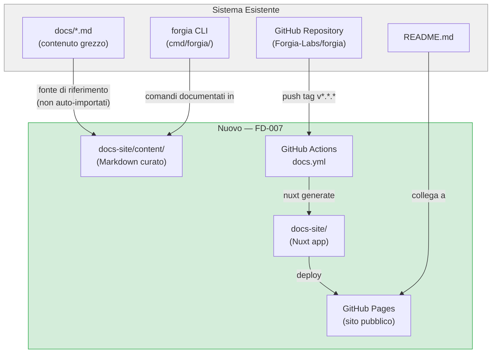
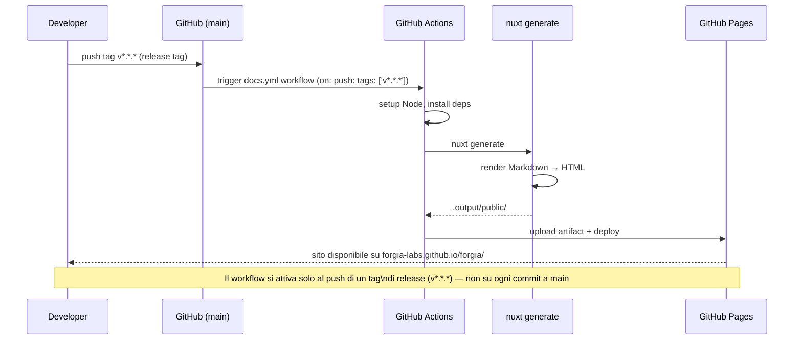

# FD-007: Documentation Website with Nuxt UI + Nuxt Content

## Problem / Problema

Forgia non ha una documentazione pubblica navigabile. Le informazioni su come installarlo, inizializzare un vault, creare FD e SDD, e usare la CLI sono sparse tra README, `docs/`, e file interni del vault.

Questo crea due problemi concreti:

1. **Onboarding lento**: un nuovo utente deve leggere più file Markdown in un repository Git per capire come usare il sistema — senza navigazione, ricerca, o struttura ipertestuale.
2. **Nessuna presenza pubblica**: Forgia non ha un sito ufficiale. Per un progetto open source orientato all'adozione, l'assenza di documentazione web è un ostacolo all'uso e alla contribuzione.

Il contenuto esiste già in forma grezza (`docs/getting-started.md`, `docs/concepts.md`, `docs/functional-architecture.md`, ecc.). Il problema è la mancanza di un layer di presentazione che lo renda accessibile, ricercabile e mantenibile.

## Solutions Considered / Soluzioni Considerate

### Option A: Docusaurus (React)

Generatore statico basato su React con supporto nativo per Markdown e versioning della documentazione.

- **Pro:**
  - Matura e molto diffusa (Meta, Meta, React Native, Jest la usano)
  - Ricerca full-text integrata con Algolia o lunr
  - Versioning nativo dei docs
- **Con / Contro:**
  - Stack React — incompatibile con il resto del progetto (Vue/Nuxt)
  - Richiede dipendenze Node/React distinte dallo stack scelto
  - Personalizzazione UI più verbosa rispetto a Nuxt UI

### Option B (chosen) / Opzione B (scelta): Nuxt + Nuxt UI + Nuxt Content

Sito statico generato con `nuxt generate`, contenuto Markdown gestito da Nuxt Content, UI con componenti Nuxt UI, deployment su GitHub Pages via GitHub Actions.

- **Pro:**
  - Stack coerente con la direzione tecnologica del progetto (Vue/Nuxt)
  - Nuxt Content permette di scrivere docs in Markdown con front matter, componenti Vue inline, e query tramite `queryContent()`
  - Nuxt UI fornisce componenti pronti (navigazione, table of contents, ricerca) senza CSS custom
  - `nuxt generate` produce HTML statico — nessun server necessario su GitHub Pages
  - Pipeline CI/CD semplice con `actions/deploy-pages`
  - Co-localizzazione nel repo — docs e codice cambiano insieme, nessun CMS esterno
- **Con / Contro:**
  - Nuxt Content v3 è recente — API in evoluzione
  - `nuxt generate` con molte pagine può essere più lento di Docusaurus in build molto grandi (non rilevante alla scala attuale)

## Architecture / Architettura

### Integration Context / Contesto di Integrazione

### Data Flow / Flusso Dati

## Interfaces / Interfacce

| Component / Componente | Input | Output | Protocol / Protocollo |
|------------------------|-------|--------|-----------------------|
| `docs-site/` (Nuxt app) | File Markdown in `content/` | HTML statico in `.output/public/` | `nuxt generate` (build-time) |
| GitHub Actions (`docs.yml`) | Tag push `v*.*.*` | Artifact caricato su GitHub Pages | GitHub Actions YAML (`on: push: tags`) |
| GitHub Pages | Artifact `actions/upload-pages-artifact` | Sito pubblico su `forgia-labs.github.io/forgia/` | `actions/deploy-pages` |
| Navigazione sidebar | Front matter `title`, `navigation` nei `.md` | Menu laterale strutturato | Nuxt Content `queryCollection()` |

## Planned SDDs / SDD Previsti

1. SDD-001: Completare e configurare `docs-site/` (scaffold già presente come directory non tracciata) — `nuxt.config.ts`, layout base, Nuxt UI + Content configurati, `baseURL: /forgia/`, primo commit tracciato
2. SDD-002: Contenuto iniziale — sezioni Getting Started, FD Guide, SDD Guide, CLI Reference, Constitution (porte da `docs/` e CLAUDE.md)
3. SDD-003: GitHub Actions workflow (`docs.yml`) — build, upload artifact, deploy su GitHub Pages con path filter

## Constraints / Vincoli

- Il sito vive in `docs-site/` come sotto-directory del repository esistente — nessun repo separato
- `baseURL` deve corrispondere al path di GitHub Pages: `/forgia/`
- Il workflow deve usare `actions/deploy-pages` e richiedere `permissions: pages: write, id-token: write`
- Il contenuto è scritto in italiano per le sezioni narrative (coerente con le convention del progetto), inglese per UI e codice
- Nessun CMS esterno — tutto Markdown nel repo
- Il deploy si attiva **solo su tag di release** con pattern `v*.*.*` — trigger: `on: push: tags: ['v*.*.*']`; il CI principale (push a main/branch) non lo attiva
- Nuxt UI v3 / Nuxt Content v3 (versioni più recenti compatibili con Nuxt 4)

## Verification / Verifica

- [ ] `docs-site/` scaffold committed su `main` con `nuxt generate` che produce output valido
- [ ] Navigazione funzionante: Getting Started, FD Guide, SDD Guide, CLI Reference
- [ ] `nuxt generate` completa senza errori in CI
- [ ] GitHub Actions workflow si attiva al push di un tag `v*.*.*` e NON su push a `main`
- [ ] Sito deployato automaticamente su GitHub Pages dopo ogni tag di release
- [ ] Layout mobile-responsive (verifica su viewport 375px e 1280px)
- [ ] `baseURL: /forgia/` configurato correttamente — nessun asset 404
- [ ] Problem clearly defined / Problema chiaramente definito
- [ ] At least 2 solutions with pros/cons / Almeno 2 soluzioni con pro/contro
- [ ] Architecture diagram present / Diagramma architetturale presente
- [ ] Interfaces defined / Interfacce tra componenti definite
- [ ] SDDs listed / SDD previsti elencati
- [ ] Review completed / Review completata (`/fd-review`)

## Notes / Note

Upstream: [Forgia-Labs/forgia#79](https://github.com/Forgia-Labs/forgia/issues/79)

Il contenuto `docs/getting-started.md`, `docs/functional-architecture.md`, `docs/concepts.md` e `docs/go-architecture.md` sono la fonte di riferimento per popolare le sezioni del sito, ma andranno riscritti/adattati per il formato web (suddivisione in pagine più corte, aggiunta di front matter `title` e `navigation`).

**Contesto auto-scoperto:**
- [`.forgia/constitution.md`](.forgia/constitution.md) — regole immutabili del progetto
- [`docs/functional-architecture.md`](docs/functional-architecture.md) — architettura funzionale e diagrammi
- [`docs/getting-started.md`](docs/getting-started.md) — guida all'installazione e primo utilizzo
