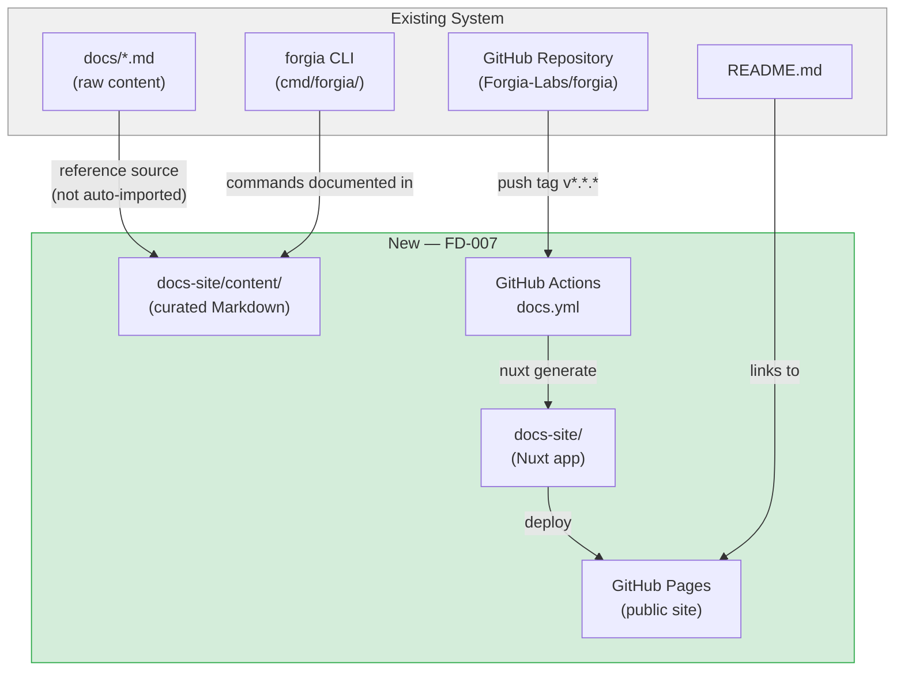
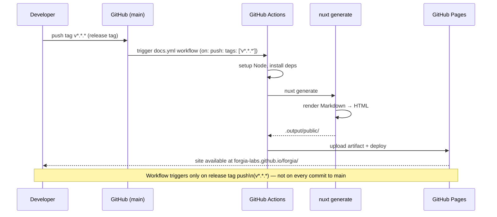

# FD-007: Documentation Website with Nuxt UI + Nuxt Content

## Problem

Forgia has no public navigable documentation. Information about installation, vault setup, creating FDs and SDDs, and using the CLI is scattered across the README, `docs/`, and internal vault files.

This creates two concrete problems:

1. **Slow onboarding**: a new user must read multiple Markdown files in a Git repository to understand how the system works — with no navigation, search, or hypertext structure.
2. **No public presence**: Forgia has no official website. For an open-source project aimed at adoption, the absence of web documentation is a barrier to use and contribution.

The content already exists in raw form (`docs/getting-started.md`, `docs/concepts.md`, `docs/functional-architecture.md`, etc.). The problem is the lack of a presentation layer that makes it accessible, searchable, and maintainable.

## Solutions Considered

### Option A: Docusaurus (React)

Static site generator based on React with native Markdown support and documentation versioning.

- **Pro:**
  - Mature and widely adopted (Meta, React Native, Jest all use it)
  - Built-in full-text search with Algolia or lunr
  - Native docs versioning
- **Con:**
  - React stack — incompatible with the rest of the project (Vue/Nuxt)
  - Requires separate Node/React dependencies from the chosen stack
  - UI customisation is more verbose than Nuxt UI

### Option B (chosen): Nuxt + Nuxt UI + Nuxt Content

Static site generated with `nuxt generate`, Markdown content managed by Nuxt Content, UI built with Nuxt UI components, deployed to GitHub Pages via GitHub Actions.

- **Pro:**
  - Stack consistent with the project's technical direction (Vue/Nuxt)
  - Nuxt Content enables writing docs in Markdown with front matter, inline Vue components, and queries via `queryContent()`
  - Nuxt UI provides ready-made components (navigation, table of contents, search) without custom CSS
  - `nuxt generate` produces static HTML — no server required on GitHub Pages
  - Simple CI/CD pipeline with `actions/deploy-pages`
  - Co-located with the repo — docs and code change together, no external CMS
- **Con:**
  - Nuxt Content v3 is recent — API still evolving
  - `nuxt generate` can be slower than Docusaurus for very large builds (not relevant at current scale)

## Architecture

### Integration Context

### Data Flow

## Interfaces

| Component | Input | Output | Protocol |
|-----------|-------|--------|----------|
| `docs-site/` (Nuxt app) | Markdown files in `content/` | Static HTML in `.output/public/` | `nuxt generate` (build-time) |
| GitHub Actions (`docs.yml`) | Tag push `v*.*.*` | Artifact uploaded to GitHub Pages | GitHub Actions YAML (`on: push: tags`) |
| GitHub Pages | Artifact `actions/upload-pages-artifact` | Public site at `forgia-labs.github.io/forgia/` | `actions/deploy-pages` |
| Sidebar navigation | Front matter `title`, `navigation` in `.md` files | Structured side menu | Nuxt Content `queryCollection()` |

## Planned SDDs

1. SDD-001: Complete and configure `docs-site/` (scaffold already present as untracked directory) — `nuxt.config.ts`, base layout, Nuxt UI + Content configured, `baseURL: /forgia/`, first tracked commit
2. SDD-002: Initial content — Getting Started, FD Guide, SDD Guide, CLI Reference, Constitution sections (ported from `docs/` and CLAUDE.md)
3. SDD-003: GitHub Actions workflow (`docs.yml`) — build, upload artifact, deploy to GitHub Pages triggered on release tag
4. SDD-004: Integration wiring — smoke test script, E2E verification, full pipeline confirmed live

## Constraints

- The site lives in `docs-site/` as a sub-directory of the existing repository — no separate repo
- `baseURL` must match the GitHub Pages path: `/forgia/`
- The workflow must use `actions/deploy-pages` and require `permissions: pages: write, id-token: write`
- Content is written in English for UI and code; narrative sections may be in English too
- No external CMS — all Markdown in the repo
- Deployment triggers **only on release tags** with pattern `v*.*.*` — trigger: `on: push: tags: ['v*.*.*']`; the main CI (push to main/branch) does not trigger it
- Nuxt UI v3 / Nuxt Content v3 (latest versions compatible with Nuxt 4)

## Verification

- [x] `docs-site/` scaffold committed to `main` with `nuxt generate` producing valid output
- [x] Navigation working: Getting Started, FD Guide, SDD Guide, CLI Reference
- [x] `nuxt generate` completes without errors in CI
- [x] GitHub Actions workflow triggers on push of a `v*.*.*` tag and NOT on push to `main`
- [ ] Site deployed automatically to GitHub Pages after every release tag ← pending first tag push
- [ ] Mobile-responsive layout (verified at 375px and 1280px viewports) ← pending live deploy
- [x] `baseURL: /forgia/` configured correctly — no asset 404s
- [x] Problem clearly defined
- [x] At least 2 solutions with pros/cons
- [x] Architecture diagram present
- [x] Interfaces defined between components
- [x] SDDs listed
- [x] Review completed (`/fd-review`)

## Notes

Upstream: [Forgia-Labs/forgia#79](https://github.com/Forgia-Labs/forgia/issues/79)

The content in `docs/getting-started.md`, `docs/functional-architecture.md`, `docs/concepts.md`, and `docs/go-architecture.md` is the reference source for populating the site sections, but must be rewritten/adapted for the web format (split into shorter pages, add front matter `title` and `navigation`).

**Auto-discovered context:**
- [`.forgia/constitution.md`](.forgia/constitution.md) — immutable project rules
- [`docs/functional-architecture.md`](docs/functional-architecture.md) — functional architecture and diagrams
- [`docs/getting-started.md`](docs/getting-started.md) — installation and first-use guide
