# Functional Architecture

> What Forgia does, how the components interact, and how data flows through the system.
> Companion to [go-integration-guide.md](go-integration-guide.md) which covers _how_ the code is structured.

## 1. System Overview

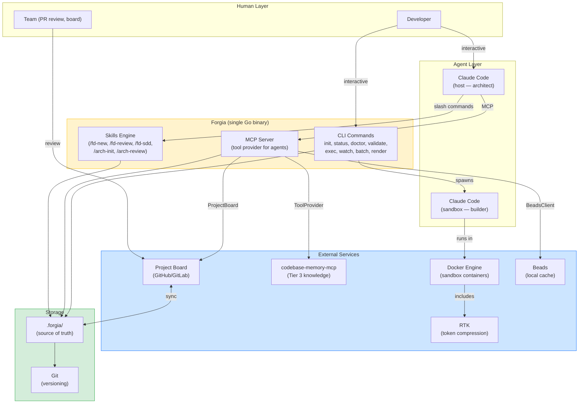

## 2. Artifact Lifecycle

Every artifact in Forgia follows a lifecycle from creation to archival.

> **Note**: The Architecture Phase (`/arch-init`, `/arch-review`, `/arch-update`) is defined in #27 and not yet implemented. The FD and SDD phases are implemented and tested.

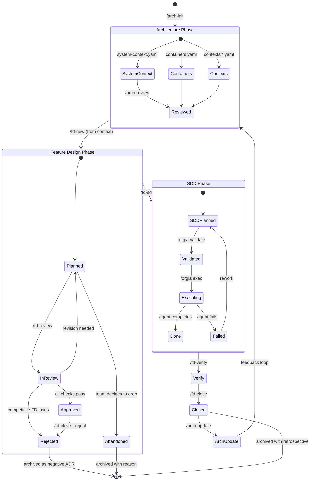

## 3. Data Model

### Artifact hierarchy

```
.forgia/ (vault — source of truth)
│
├── architecture/                    ← C4 Level 1-2 (YAML + derived MD)
│   ├── system-context.yaml
│   ├── containers.yaml
│   ├── technology-decisions.yaml
│   ├── quality-attributes.yaml
│   ├── constraints.yaml
│   └── glossary.yaml
│
├── contexts/                        ← DDD Bounded Contexts (YAML + derived MD)
│   ├── <context-name>.yaml          ← interfaces, dependencies, language
│   └── ...
│
├── fd/                              ← Feature Designs (YAML source, MD derived)
│   ├── FD-<hash>-<slug>.yaml       ← agent reads/writes this
│   ├── FD-<hash>-<slug>.md         ← auto-generated for human review
│   └── _templates/
│
├── sdd/                             ← Execution Specs
│   ├── FD-<hash>/
│   │   ├── SDD-001-<slug>.yaml     ← agent reads/writes this
│   │   ├── SDD-001-<slug>.md       ← auto-generated for human review
│   │   └── ...
│   └── _templates/
│
├── constitution.md                  ← immutable rules
├── config.toml                      ← team config (committed)
├── config.local.toml                ← personal overrides (gitignored)
│
├── guardrails/
│   ├── deny.toml                    ← read/execute/write deny patterns
│   └── ignore                       ← context exclusion patterns
│
├── dev-guide/
│   ├── principles/                  ← clean-code, SOLID, design-patterns
│   ├── lang/                        ← per-language conventions (auto-detected)
│   └── *.md                         ← coding, commit, review conventions
│
├── learnings/                       ← feedback from closed FDs (committed)
│   ├── FD-<hash>.yaml               ← failure modes, successful patterns, suggestions
│   └── ...
│
├── logs/                            ← gitignored
│   ├── exec-<sdd>-<timestamp>.json  ← execution reports
│   └── exec-<sdd>-<timestamp>.log   ← execution logs
│
└── .gitignore                       ← excludes logs/, run/, .beads/
```

### ID System

Hash-based, collision-proof:

```
FD-a3f2   ← 4-char hex from sha256(title + timestamp + author)
SDD-001   ← sequential within FD folder (no cross-FD collision)
```

Same hash everywhere:

```
GitHub Project card ID = Beads task ID = FD file ID = SDD folder name
```

### ID System — migration note

> **Current state**: sequential IDs (FD-001, FD-002) in Markdown with YAML frontmatter.
> **Target state**: hash-based IDs (FD-a3f2) in YAML source with derived MD.
> Migration will happen as part of #35 (GitHub Projects sync). Existing sequential FDs will coexist — no forced migration.

### Format duality — migration note

> **Current state**: Markdown files with YAML frontmatter (`fd/FD-001.md`).
> **Target state**: YAML source of truth with derived MD (`fd/FD-a3f2.yaml` + `fd/FD-a3f2.md`).
> This is a breaking change that happens with the Go rewrite. Migration plan TBD in #35.

### Format duality

```
*.yaml    ← source of truth (agent reads/writes, CLI parses, DB syncs)
*.md      ← derived view (auto-generated for human review, PR diff, Obsidian)
```

The MD is never edited directly. Changes go through YAML, MD is regenerated by `forgia render` (a CLI subcommand that converts YAML → Markdown for any artifact).

**Exceptions** (Markdown-only, human-authored):
- `constitution.md` — prose rules, not structured data
- `dev-guide/*.md` — conventions, not parseable metadata
- `guardrails/ignore` — gitignore-style patterns

## 4. Memory Tiers

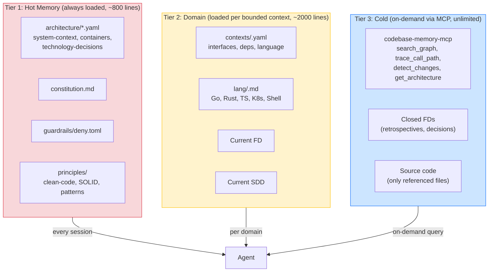

| Tier | What | Loaded when | Size |
|------|------|-------------|------|
| 1 (Hot) | Constitution, guardrails, architecture overview, principles | Every session | ~800 lines |
| 2 (Domain) | Bounded context, language conventions, current FD/SDD | Per domain | ~2000 lines |
| 3 (Cold) | Code graph, closed FDs, source code | On-demand MCP query | Unlimited |

## 5. Security Layers

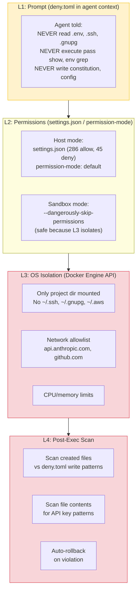

| Layer | Host (architect) | Sandbox (builder) |
|-------|-----------------|-------------------|
| L1 Prompt | deny.toml injected | deny.toml injected |
| L2 Permissions | settings.json + default mode | --dangerously-skip-permissions |
| L3 OS | None (dev is in the loop) | Docker: mount + network + resources |
| L4 Post-Exec | Optional | Mandatory |

> **Note**: RTK (token compression) lives in the sandbox as a **cost optimization**, not a security layer. See §6 Dual-Profile Runner.

## 6. Dual-Profile Runner

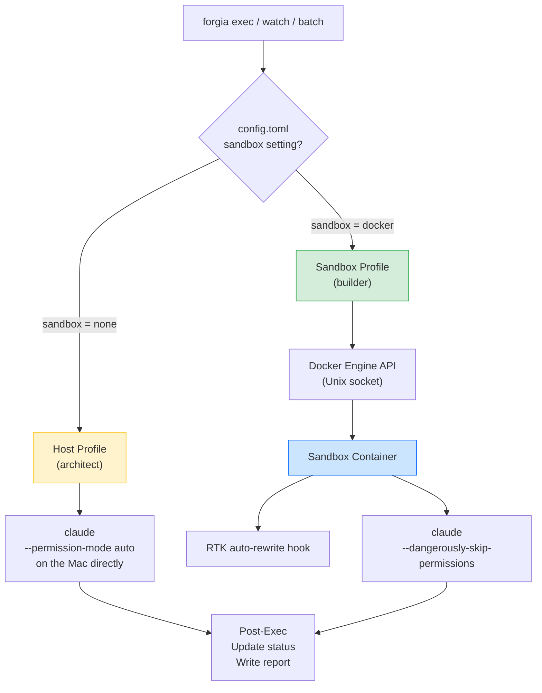

### OpenHands Runner

When configured as runner, OpenHands provides full container isolation with its own agent loop:

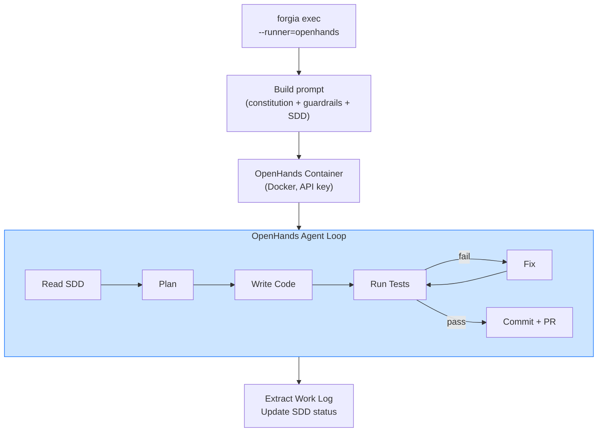

| Aspect | Claude Code (sandbox) | OpenHands |
|--------|----------------------|-----------|
| Auth | Max subscription (flat) | API key (per-token) |
| Agent loop | Claude native | OpenHands own loop |
| Model | Claude only | Any (Claude, GPT, Ollama) |
| Isolation | Docker via Forgia | Docker via OpenHands |
| UI | None (headless) | Web UI on :3000 (optional) |

## 7. External Service Integration

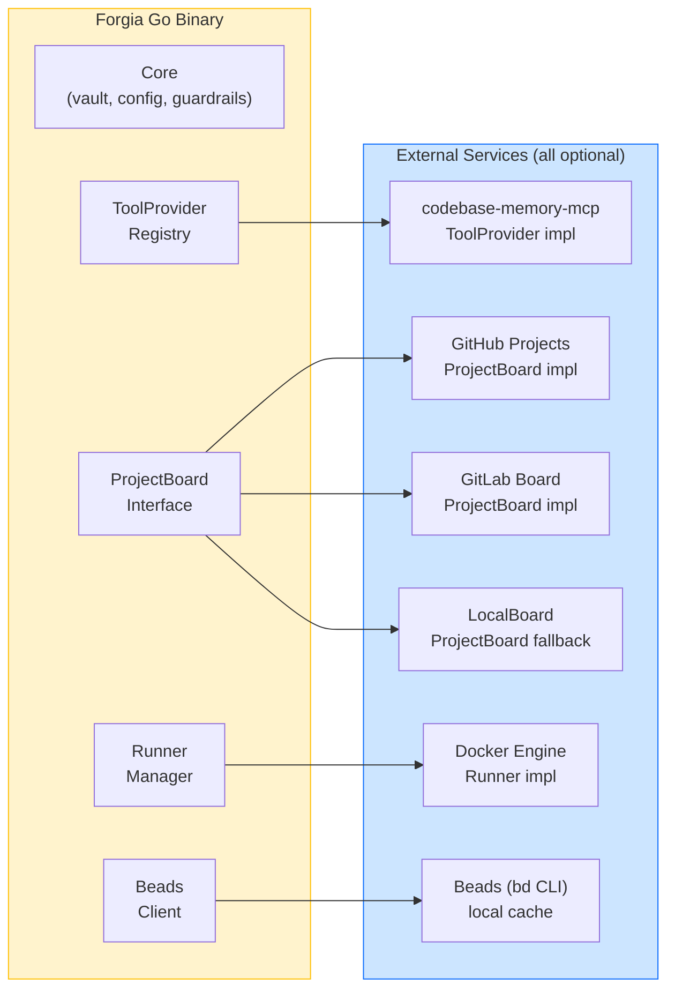

**Design principle: everything optional with graceful fallback.**

| Service | Interface | Required? | Fallback |
|---------|-----------|-----------|----------|
| codebase-memory-mcp | `ToolProvider` | No | No Tier 3, skills work with less context |
| GitHub Projects | `ProjectBoard` | No | `LocalBoard` (filesystem only) |
| GitLab Board | `ProjectBoard` | No | `LocalBoard` |
| Docker Engine | `DockerSandbox` | No | Host mode (permission-mode auto) |
| RTK | In-container hook | No | No token compression |
| Beads (bd) | `BeadsClient` | No | Vault files only (no dep graph) |
| Claude Code | `Runner` | Yes | Primary runner (only required service) |

## 8. The Autonomous Cycle (Future Vision)

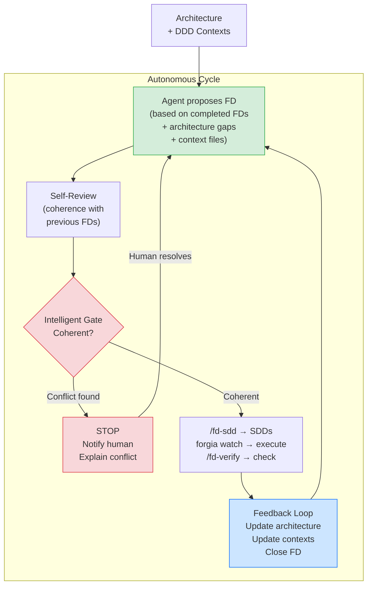

### Gate checks (uses all 3 memory tiers)

| Check | Tier | Source |
|-------|------|--------|
| Contradicts previous FD decisions? | 3 (Cold) | Closed FDs retrospectives |
| Breaks bounded context contracts? | 2 (Domain) | contexts/*.yaml interfaces |
| Quality attributes still achievable? | 1 (Hot) | architecture/quality-attributes.yaml |
| Uses rejected patterns? | 3 (Cold) | Work Log failure modes |
| Dependencies satisfied? | 2 (Domain) | contexts/*.yaml dependencies |
| Blast radius acceptable? | 3 (Cold) | codebase-memory-mcp detect_changes |

### Human gates

The human intervenes at **3 moments only**:

1. **Approve FD** — agent proposed and self-reviewed, human confirms
2. **Resolve conflict** — gate blocked, human decides how to proceed
3. **Review PR** — code is ready, human merges

Everything else is autonomous.

### Who triggers the cycle

| Trigger | How | When |
|---------|-----|------|
| Manual | Developer runs `/fd-new` or `forgia status` → decides next FD | Default, always available |
| Cron | `claude -p "check forgia status, propose next FD"` via crontab | Nightly/weekly autonomous check |
| GitHub Action | On schedule or on issue label `forgia:fd` | CI-driven |
| MCP tool | Another agent calls `forgia_next_fd()` | Agent-to-agent orchestration |

## 9. Feedback Loop — From Code Back to Architecture

The critical missing piece: after code is produced, lessons learned must flow **back** to DDD documents, influencing future FDs. Without this, the architecture diverges from reality.

### The Gap (today)

```
DDD → FD → SDD → Code → Work Log → STOP
                                     ↑ feedback dies here
```

### The Complete Loop

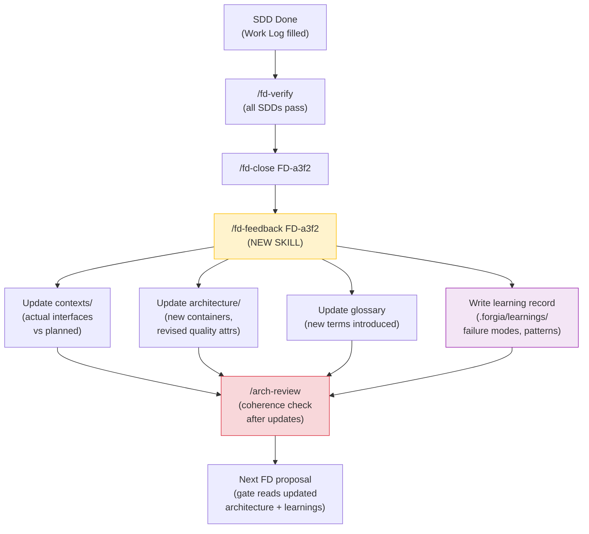

### What `/fd-feedback` does

New skill that runs after `/fd-close`. Reads all Work Logs of the closed FD and routes feedback to the right documents:

| Work Log content | Routes to | Example |
|-----------------|-----------|---------|
| Interface was different than planned | `contexts/<name>.yaml` interfaces section | "CheckRisk takes position + account, not just position" |
| New container/service introduced | `architecture/containers.yaml` | "Added Redis cache for session state" |
| Technology decision changed | `architecture/technology-decisions.yaml` | "Switched from gRPC to HTTP for internal — simpler debugging" |
| Latency/performance measured | `architecture/quality-attributes.yaml` | "Actual p99: 85ms (planned: 100ms) — margin OK" |
| New term introduced | `architecture/glossary.yaml` | "BridgeTimeout: max wait for MT5 bridge response" |
| Failure mode discovered | `.forgia/learnings/<fd-id>.yaml` (NEW) | "gRPC streaming caused memory leak under load" |
| Pattern that worked well | `.forgia/learnings/<fd-id>.yaml` | "Builder pattern for config was clean and testable" |
| Suggestion for future FDs | `.forgia/learnings/<fd-id>.yaml` | "Add integration test template to SDD for DB-dependent features" |

### Learnings directory (new)

```
.forgia/
  learnings/                        ← NEW: persisted knowledge from execution
    FD-a3f2.yaml                    ← learnings from FD-a3f2
    FD-b7c1.yaml                    ← learnings from FD-b7c1
```

```yaml
# .forgia/learnings/FD-a3f2.yaml
fd: FD-a3f2
title: "Scaffold ZeroClaw + Tauri"
closed: "2026-03-20"

failure_modes:
  - pattern: "gRPC streaming"
    context: "Internal service communication"
    outcome: "Memory leak under sustained load"
    recommendation: "Use HTTP for internal, gRPC only for external"

successful_patterns:
  - pattern: "Builder pattern for config"
    context: "Multi-field struct initialization"
    outcome: "Clean, testable, extensible"

suggestions:
  - "Add DB integration test template to SDD for features with persistence"
  - "Include load test acceptance criterion for any streaming interface"

interface_corrections:
  - context: "trading-engine"
    interface: "CheckRisk"
    planned: "check_risk(position) → approved/rejected"
    actual: "check_risk(position, account) → RiskResult{approved, reason, limits}"

new_terms:
  - term: "BridgeTimeout"
    meaning: "Max wait for MT5 bridge response before circuit breaker trips"
```

### How the Gate Intelligente uses learnings

When a new FD is proposed, the gate reads `.forgia/learnings/` (Tier 3 Cold Memory):

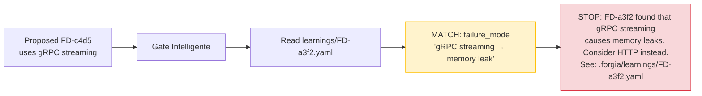

### Complete lifecycle with feedback

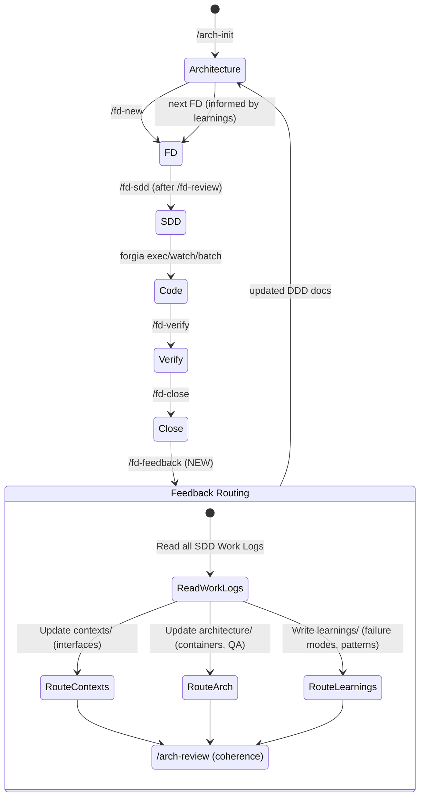

### Skill definition

```
/fd-feedback FD-a3f2
```

| Attribute | Value |
|-----------|-------|
| Category | `architecture` |
| Mode | `both` (slash command + MCP tool `forgia_fd_feedback`) |
| Triggers | After `/fd-close` (can be called manually or auto-triggered) |
| Reads | All SDD Work Logs for the closed FD |
| Writes | `contexts/`, `architecture/`, `learnings/` |
| Then runs | `/arch-review` to verify coherence |

### Auto-trigger on `/fd-close`

`/fd-close` should call `/fd-feedback` automatically:

```
/fd-close FD-a3f2
  1. Archive FD with retrospective
  2. → /fd-feedback FD-a3f2 (auto-triggered)
       a. Read Work Logs
       b. Route to contexts/architecture/learnings
       c. Run /arch-review
  3. Update board card → "Closed"
  4. Done
```

## 10. Project Board Sync

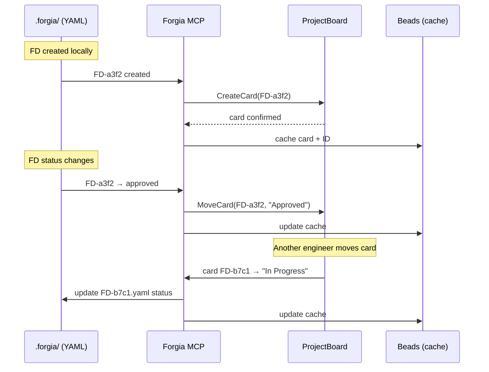

### Competitive FDs on the board

| FD Proposed          | FD Approved    | SDD In Progress    | Done     |
|---------------------|----------------|-------------------|----------|
| FD-a3f2 (approach A) | FD-c4d5        | SDD-001 of FD-c4d5 | FD-x1y2  |
| FD-b7c1 (approach B) |                | SDD-002 of FD-c4d5 |          |
|   └ competes with a  |                |                    |          |

When FD-a3f2 is approved, FD-b7c1 automatically moves to "Rejected" column with reason.

### Card created from web (reverse sync)

A PM or stakeholder can create a card directly on the board (web UI). Forgia syncs it back:

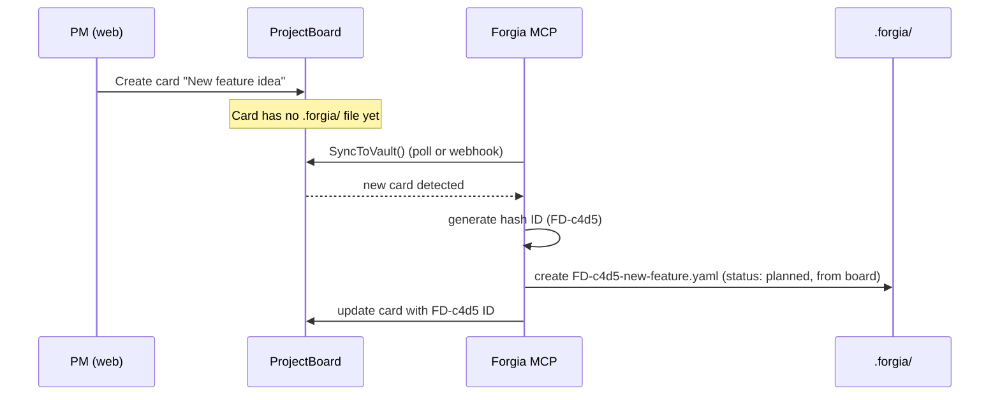

## 10. Skill System

A skill is any capability Forgia exposes — to humans (slash commands), to agents (MCP tools), or both. Three types:

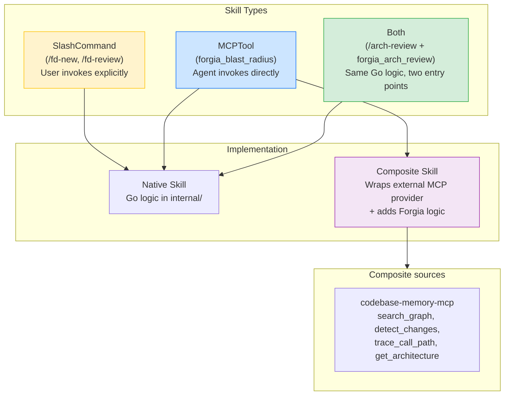

### Skill Registry

All skills register in a central `skill.Registry`. The MCP server and slash command installer both read from it:

```
skill.Registry
  ├── SlashCommands() → list of .md files to install
  ├── MCPTools()      → list of MCP tool definitions to advertise
  └── Get(name)       → execute skill logic
```

### Slash Command Skills (user-facing)

| Skill | Category | Mode | Issue |
|-------|----------|------|-------|
| `/fd-new` | fd | both | #29, #30 |
| `/fd-deep` | fd | slash_command | — |
| `/fd-review` | fd | both | #18 |
| `/fd-sdd` | fd | both | #35 |
| `/fd-verify` | fd | both | #17 |
| `/fd-close` | fd | both | #29 |
| `/fd-feedback` | architecture | both | #27 (feedback loop) |
| `/fd-status` | fd | both | — |
| `/arch-init` | architecture | both | #27 |
| `/arch-review` | architecture | both | #27 |
| `/arch-update` | architecture | both | #27 |
| `/fd-threat-model` | design | both | #21 |
| `/fd-arch-review` | design | both | #22 |
| `/sdd-dry-run` | design | both | #23 |

### Composite Skills (codebase-memory-mcp derived)

These wrap external MCP provider tools with Forgia logic (guardrails check, context enrichment):

| Skill | Provider Tool | Forgia adds | Used by |
|-------|--------------|-------------|---------|
| `forgia_search_code` | `search_graph` | Guardrails filter on results | Agent search |
| `forgia_blast_radius` | `detect_changes` | Cross-check with bounded contexts | Gate intelligente |
| `forgia_trace_calls` | `trace_call_path` | Validate context interface contracts | `/arch-review` |
| `forgia_architecture` | `get_architecture` | Merge with existing architecture/ | `/arch-init` |
| `forgia_dead_code` | `search_graph(dead_code)` | Filter by SDD scope | Cleanup |
| `forgia_reindex` | `index_repository` | Trigger after exec | Post-exec |

### Skill evolution

```
Today (bash):       .md file → Claude interprets → Read/Write/Bash
Transition:         .md file → Claude calls forgia CLI → Go logic
Future (MCP):       .md thin wrapper → forgia_tool() MCP call → Go logic
                    Agent can also call MCP tool directly (no .md needed)
```

Slash commands stay for **explicit UX** and **context savings**. MCP tools exist for **agent-to-agent** calls.

## 11. Configuration Hierarchy

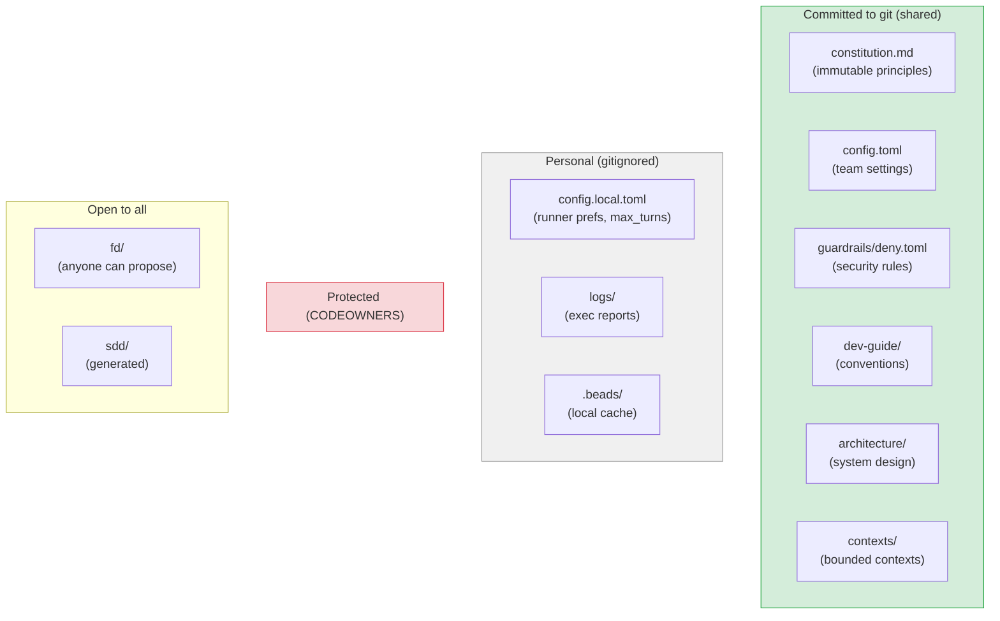

### Loading priority

```
CLI flags > Environment vars > config.local.toml > config.toml > Go defaults
```

## 12. Feature Dependency Graph

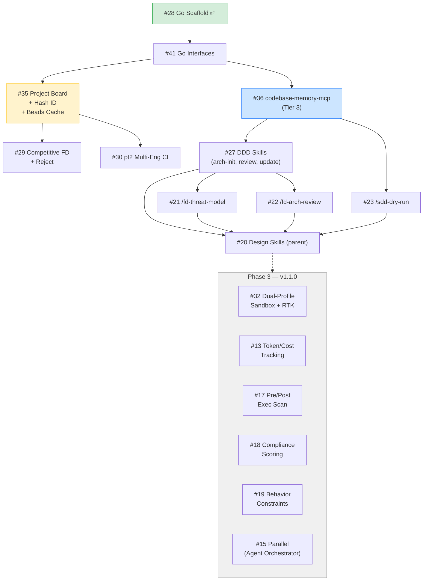

## References

- [go-integration-guide.md](go-integration-guide.md) — Go code patterns, process management
- [Forgia README](../README.md) — user-facing documentation
- [Doc 09 — Architecture-Driven Development](../../docs/spec-driven-development/09-architecture-driven-development.md) — conceptual model (in ai-bots knowledge base)
- [C4 Model](https://c4model.com/)
- [DDD Bounded Context](https://martinfowler.com/bliki/BoundedContext.html)
- [Codified Context paper](https://arxiv.org/html/2602.20478v1) — 3-tier memory
