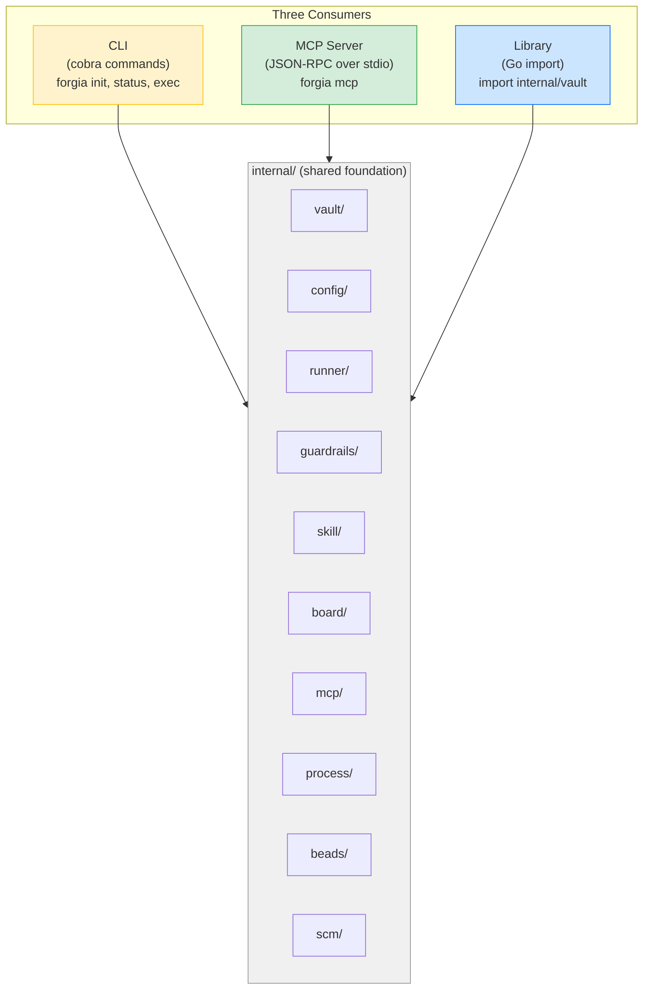
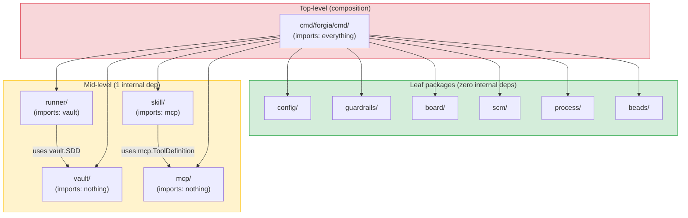
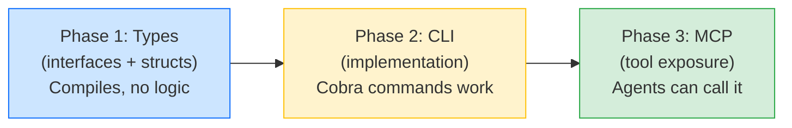
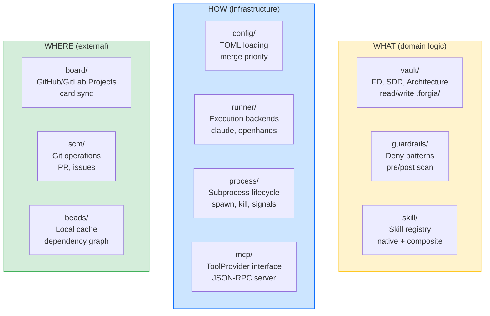

# Go Architecture — Explicit Component Design & Evolutionary Pattern

> Architecture of the Forgia Go binary: how packages compose, how they evolve
> from CLI to library to MCP server, and the dependency rules that keep it clean.

## 1. The Three Faces of Forgia

The same Go codebase serves three consumers. The `internal/` packages are the shared foundation:



### CLI (oggi e sempre)

```
cmd/forgia/main.go → cmd/forgia/cmd/root.go → internal/*
```

User at the terminal. Cobra commands call internal packages. Input: flags + args. Output: stdout + exit code.

### MCP Server (futuro prossimo)

```
cmd/forgia/cmd/mcp.go → internal/mcp/server.go → internal/*
```

Claude Code (o qualsiasi MCP client) si connette via stdio. Input: JSON-RPC tool calls. Output: JSON-RPC results. Stessi package interni del CLI.

### Library (per tool esterni)

```go
import "github.com/forgia-labs/forgia/internal/vault"

v, _ := vault.Open(".")
for fd := range v.FDs() {
    fmt.Println(fd.ID, fd.Status)
}
```

Any Go program can import the internal packages. Useful for CI, custom tools, integrations.

## 2. Package Dependency Graph



### Dependency Rules

1. **Leaf packages** import only stdlib — no internal deps
2. **Mid-level packages** import at most 1 other internal package, never upward
3. **`cmd/`** is the only package that composes everything — it's the wiring layer
4. **No circular deps** — if A imports B, B never imports A
5. **Interfaces defined where consumed** — runner defines what it needs from vault, not the other way around

### Cross-package data flow

```
vault.GuardrailsRaw() → []byte → guardrails.Parse() → *Guardrails
```

Packages communicate via **data**, not imports. Vault returns raw bytes, guardrails parses them. No cross-dependency.

## 3. Evolutionary Pattern

Ogni package evolve attraverso 3 fasi:



### Stato attuale per package

| Package | Phase 1 (Types) | Phase 2 (CLI) | Phase 3 (MCP) |
|---------|:-:|:-:|:-:|
| vault/ | ✅ | — | — |
| config/ | ✅ | — | — |
| runner/ | ✅ | — | — |
| guardrails/ | ✅ | — | — |
| mcp/ | ✅ | — | — |
| skill/ | ✅ | — | — |
| board/ | ✅ | — | — |
| scm/ | ✅ | — | — |
| process/ | ✅ | — | — |
| beads/ | ✅ | — | — |

### Phase 1 → Phase 2 (CLI implementation)

For each package, the implementation follows:

```go
// Phase 1: interface only (current)
type Vault interface {
    ListFDs(ctx context.Context) ([]*FD, error)
}

// Phase 2: concrete implementation
type fsVault struct {
    dir string
}

func Open(dir string) (Vault, error) {
    return &fsVault{dir: dir}, nil
}

func (v *fsVault) ListFDs(ctx context.Context) ([]*FD, error) {
    // actual file reading logic
}
```

Il CLI command wires everything:

```go
// cmd/forgia/cmd/status.go
func runStatus(cmd *cobra.Command, args []string) error {
    ctx := cmd.Context()
    cfg, _ := config.LoadConfig(ctx, ".forgia")
    v, _ := vault.Open(".forgia")

    for fd := range v.FDs() {
        fmt.Printf("%-10s %-12s %s\n", fd.ID, fd.Status, fd.Title)
    }
    return nil
}
```

### Phase 2 → Phase 3 (MCP exposure)

Lo stesso codice viene esposto come MCP tool:

```go
// internal/mcp/server.go
func (s *Server) registerVaultTools() {
    s.tools["forgia_status"] = func(ctx context.Context, params map[string]any) (any, error) {
        fds, _ := s.vault.ListFDs(ctx)
        return fds, nil
    }
}
```

E come skill:

```go
// Skill registration at startup
registry.Register(&nativeSkill{
    name:     "fd-status",
    category: skill.CategoryFD,
    mode:     skill.ModeBoth,
    slashCmd: "modules/claude-commands/fd-status.md",
    mcpTool:  &mcp.ToolDefinition{Name: "status", Description: "Show FD dashboard"},
    execute:  func(ctx, params) (any, error) {
        return s.vault.ListFDs(ctx)
    },
})
```

## 4. Package Responsibility Matrix



| Layer | Packages | Changes when |
|-------|----------|-------------|
| **WHAT** (domain) | vault, guardrails, skill | Business rules change (new FD fields, new skill categories) |
| **HOW** (infra) | config, runner, process, mcp | Technical decisions change (new runner, new MCP protocol) |
| **WHERE** (external) | board, scm, beads | Integrations change (new board provider, new SCM) |

**Rule**: WHAT never imports WHERE. HOW bridges them. `cmd/` wires everything.

## 5. Interface Segregation

Each package exposes the smallest possible interface:

```go
// vault/ — espone Vault (grande) ma i consumer usano subset
type Vault interface {
    FDs() iter.Seq[*FD]
    ListFDs(ctx context.Context) ([]*FD, error)
    GetFD(ctx context.Context, id string) (*FD, error)
    CreateFD(ctx context.Context, fd *FD) error
    // ... 15+ metodi
}

// runner/ — consuma solo *vault.SDD, non tutto Vault
type Runner interface {
    Execute(ctx context.Context, sdd *vault.SDD, opts ExecOptions) (*ExecResult, error)
}
// runner non importa vault.Vault — importa solo vault.SDD (il tipo concreto)

// board/ — non importa vault affatto
type ProjectBoard interface {
    CreateCard(ctx context.Context, item BoardItem) (string, error)
}
// board lavora con BoardItem (suo tipo) — il cmd/ converte FD → BoardItem
```

### Il wiring layer (cmd/)

```go
// cmd/forgia/cmd/exec.go
func runExec(cmd *cobra.Command, args []string) error {
    ctx := cmd.Context()

    // Load all dependencies
    v, _ := vault.Open(".forgia")
    cfg, _ := config.LoadConfig(ctx, ".forgia")
    r, _ := runner.Resolve(cfg.Runner.Default)

    // Read SDD from vault
    sdd, _ := v.GetSDD(ctx, fdID, sddID)

    // Check guardrails
    raw, _ := v.GuardrailsRaw(ctx)
    g, _ := guardrails.Parse(raw)
    if violations := g.CheckFiles(ctx, sdd.Boundaries.WriteDirs); len(violations) > 0 {
        return fmt.Errorf("guardrails violated: %v", violations)
    }

    // Execute
    result, _ := r.Execute(ctx, sdd, runner.ExecOptions{...})

    // Sync to board (optional)
    if b, err := board.Resolve(cfg); err == nil {
        b.UpdateCard(ctx, sdd.FD, map[string]any{"status": "done"})
    }

    return nil
}
```

`cmd/` is the only place where packages meet. No package knows about the others (except runner → vault.SDD).

## 6. Testing Strategy per Fase

### Phase 1 (Types — attuale)

```go
// Verifica che i tipi compilano e le costanti esistono
func TestFDStatusConstants(t *testing.T) {
    statuses := []FDStatus{FDPlanned, FDApproved, FDRejected}
    for _, s := range statuses {
        assert.NotEmpty(t, s)
    }
}
```

### Phase 2 (CLI — prossima)

```go
// Test con filesystem reale (t.TempDir)
func TestVaultOpen(t *testing.T) {
    dir := t.TempDir()
    setupTestVault(t, dir)  // crea .forgia/ con file noti

    v, err := vault.Open(dir)
    assert.NoError(t, err)

    fds, _ := v.ListFDs(context.Background())
    assert.Len(t, fds, 2)
}
```

### Phase 3 (MCP — futura)

```go
// Test MCP JSON-RPC
func TestMCPStatus(t *testing.T) {
    v := newTestVault(t)
    srv := mcp.NewServer(v)

    result, err := srv.HandleToolCall(context.Background(), mcp.ToolCall{
        Name: "forgia_status",
    })
    assert.NoError(t, err)
    assert.Contains(t, result, "fds")
}
```

## 7. Adding a New Capability (Checklist)

Quando aggiungi una nuova feature (es. `/arch-init`):

### Step 1: Types (internal/)

```
[ ] Definisci tipi in vault/ se toccano .forgia/ (es. Architecture struct)
[ ] Definisci interfaccia nel package consumer (es. skill.Skill)
[ ] go build ./... passa
[ ] Test per i nuovi tipi
```

### Step 2: CLI (cmd/)

```
[ ] Implementa la logica nel package (es. vault.fsVault.GetArchitecture)
[ ] Crea il cobra command (cmd/forgia/cmd/arch_init.go)
[ ] Wiring nel command: vault + config + guardrails
[ ] go test ./... passa
[ ] E2E test (bash o Go)
```

### Step 3: MCP (internal/mcp/)

```
[ ] Registra il tool nel MCP server
[ ] Registra la skill nel skill.Registry (mode: Both)
[ ] Aggiorna il .md slash command come thin wrapper
[ ] Test MCP tool call
```

### Step 4: Docs

```
[ ] Aggiorna functional-architecture.md §10 (skill table)
[ ] Aggiorna go-integration-guide.md se pattern nuovo
[ ] Aggiorna go-architecture.md §3 (phase table)
```

## References

- [go-integration-guide.md](go-integration-guide.md) — code patterns, process management
- [functional-architecture.md](functional-architecture.md) — system design, data model
- [Go Standard Project Layout](https://github.com/golang-standards/project-layout)
- [Effective Go](https://go.dev/doc/effective_go)
- [Go Code Review Comments](https://go.dev/wiki/CodeReviewComments)
