# Go Integration Guide

> Design decisions and patterns for the Forgia Go binary. Read this before writing any implementation code.

## 1. Binary Architecture

A single binary, multiple modes:

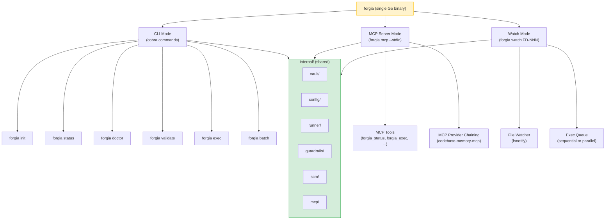

All modes share the same `internal/` packages. No code duplication.

## 2. Package Layout

```
cmd/forgia/
  main.go                    ← entry point
  cmd/
    root.go                  ← cobra root command
    init.go                  ← forgia init
    status.go                ← forgia status
    doctor.go                ← forgia doctor
    validate.go              ← forgia validate
    exec.go                  ← forgia exec
    batch.go                 ← forgia batch
    watch.go                 ← forgia watch
    mcp.go                   ← forgia mcp (starts MCP server)
    version.go               ← forgia version

internal/
  vault/                     ← .forgia/ read/write
    vault.go                 ← Vault interface
    fd.go                    ← FD types + CRUD
    sdd.go                   ← SDD types + CRUD
    id.go                    ← hash-based ID generation
  config/
    config.go                ← Config struct + LoadConfig
    merge.go                 ← config.toml + config.local.toml merge
  runner/
    runner.go                ← Runner interface
    claude.go                ← Claude Code runner (host + sandbox)
    openhands.go             ← OpenHands runner
    rtk.go                   ← RTK integration
  guardrails/
    guardrails.go            ← Guardrails struct
    check.go                 ← pre/post-exec scan
    secrets.go               ← secret pattern detection
  scm/
    scm.go                   ← SCM interface
    github.go                ← GitHub (gh CLI)
    gitlab.go                ← GitLab (glab CLI)
  mcp/
    server.go                ← MCP server (JSON-RPC over stdio)
    tools.go                 ← tool definitions (forgia_status, etc.)
    providers.go             ← MCP provider chaining (subprocess mgmt)
  process/
    spawn.go                 ← subprocess spawning + monitoring
    signals.go               ← signal handling (SIGINT, SIGTERM)
    timeout.go               ← timeout enforcement
```

## Go 1.25+ Features to Use

Forgia targets Go 1.25+. Use these modern features throughout:

| Feature | Where | Pattern |
|---------|-------|---------|
| **slog** (structured logging) | Everywhere | `slog.With()` for context reuse, `LogValuer` for types |
| **errgroup** | Batch, watch, MCP | `g, ctx := errgroup.WithContext(ctx)` |
| **Range over func** (iterators) | Vault API | `for fd := range vault.FDs()` |
| **testing/synctest** | Watch, timeout tests | Fake clock, no real `time.Sleep` |
| **errors.ErrorGroup** | Runner, subprocess | Aggregate errors from parallel ops |
| **context propagation** | All functions | Never use `context.Background()` except in `main()` |

### Iterators (range over func)

Vault exposes iterators for FDs and SDDs — Go 1.23+ `iter.Seq`:

```go
// internal/vault/vault.go
import "iter"

// FDs returns an iterator over all Feature Designs
func (v *Vault) FDs() iter.Seq[*FD] {
    return func(yield func(*FD) bool) {
        entries, _ := os.ReadDir(filepath.Join(v.dir, "fd"))
        for _, e := range entries {
            if !strings.HasPrefix(e.Name(), "FD-") { continue }
            fd, err := v.parseFD(e.Name())
            if err != nil { continue }
            if !yield(fd) { return }
        }
    }
}

// Usage — clean, no allocation of full slice:
for fd := range vault.FDs() {
    if fd.Status == FDApproved {
        logger.Info("found approved FD", "fd", fd)
    }
}

// Filter with standard library:
for fd := range vault.FDs() {
    if fd.Author == "ferruvich" {
        // ...
    }
}
```

### Context propagation rule

**Never use `context.Background()` except in `main()` and top-level test functions.** Every other function receives `ctx` from its caller:

```go
// WRONG:
func (r *Runner) Execute(sdd *vault.SDD) error {
    ctx := context.Background()  // ← loses parent's cancellation!
    return r.spawn(ctx, sdd)
}

// CORRECT:
func (r *Runner) Execute(ctx context.Context, sdd *vault.SDD) error {
    return r.spawn(ctx, sdd)  // ← parent can cancel this
}
```

## 3. Process Lifecycle

### CLI Mode (run and exit)

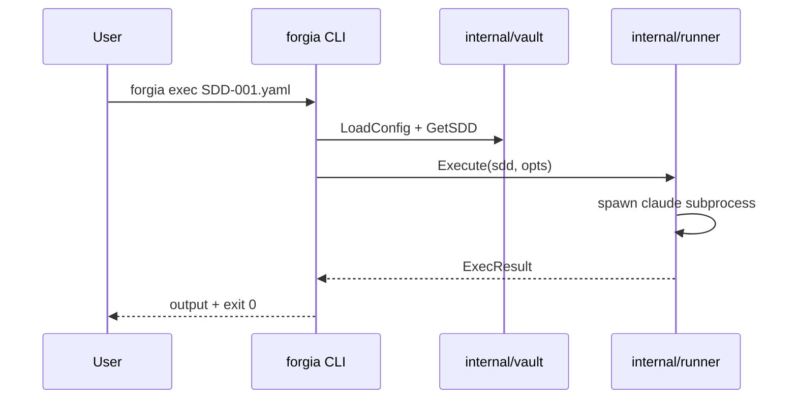

Pattern: load → execute → output → exit. No long-running state.

### MCP Server Mode (long-running)

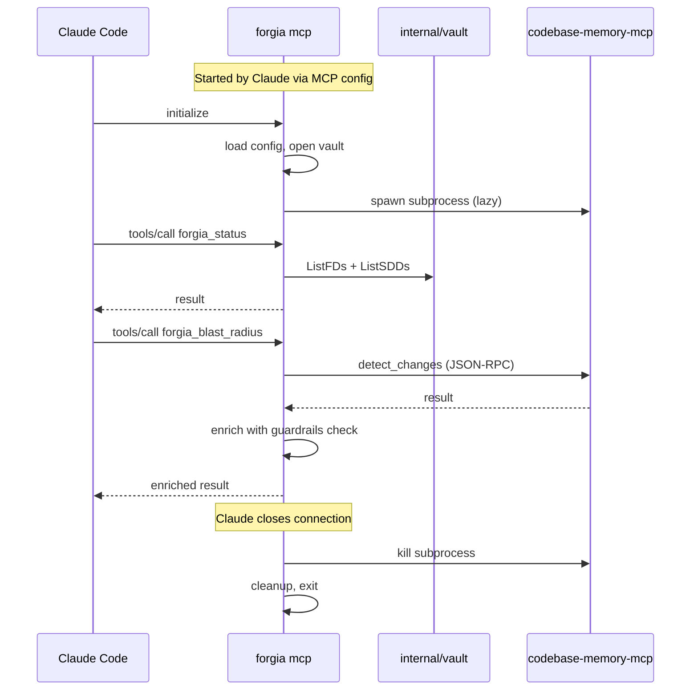

Pattern: initialize → serve tools → cleanup → exit. Stateful while running.

### Watch Mode (long-running + spawning)

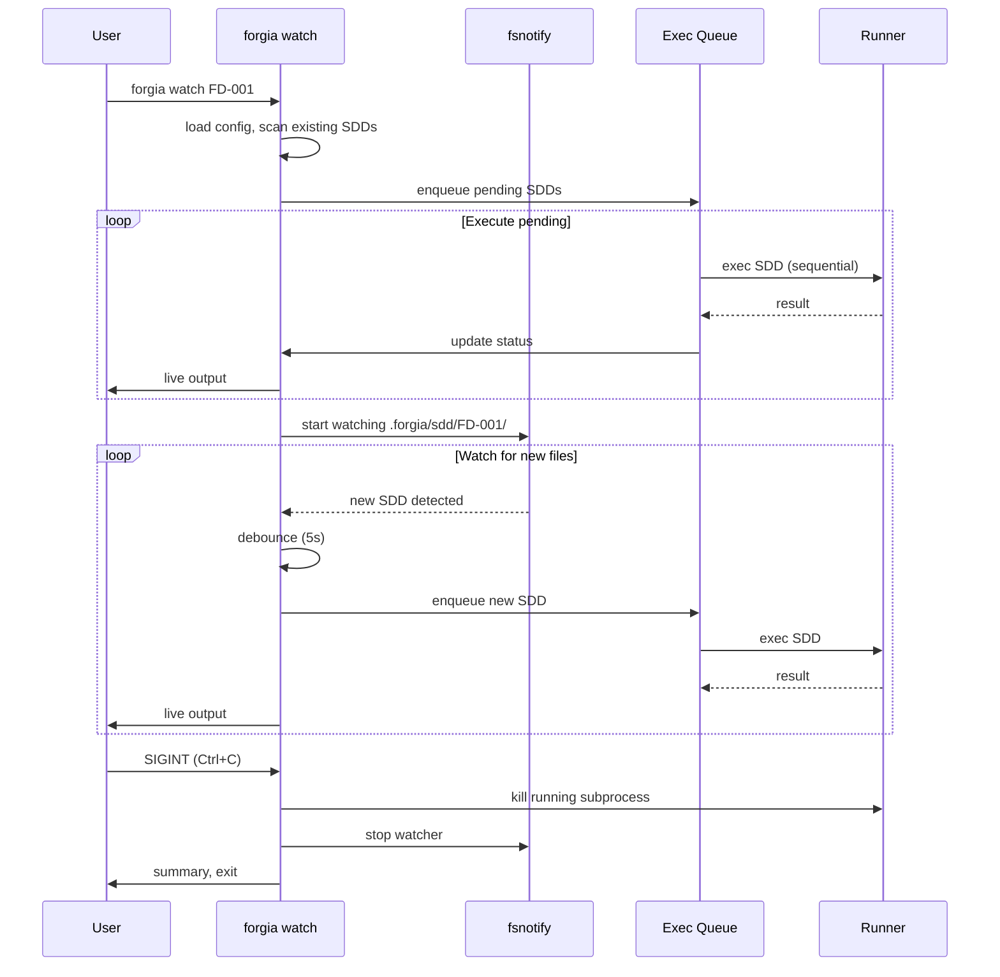

## 4. Subprocess Management

All external processes are managed through `internal/process/`:

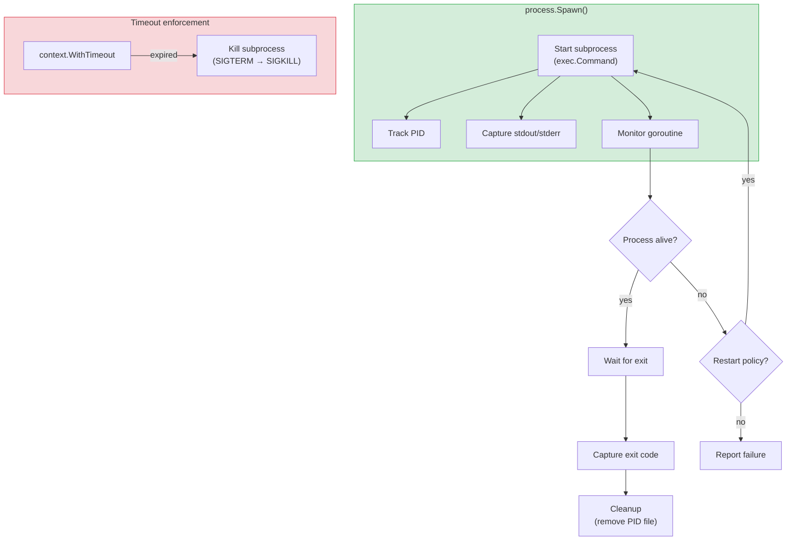

### Subprocess types

| Subprocess | Lifecycle | Restart | Timeout |
|-----------|-----------|---------|---------|
| `claude -p "..."` | Per exec, dies when done | No | `max_turns` based |
| `docker sandbox run ...` | Per exec, container dies | No | Config timeout |
| `codebase-memory-mcp` | Spawned by MCP server, long-running | Yes (on crash) | No (persistent) |
| `gh api ...` | Per call, quick | No | 30s |

### Implementation pattern

```go
// internal/process/spawn.go

type Process struct {
    Name    string
    Cmd     *exec.Cmd
    Stdout  io.ReadCloser
    Stderr  io.ReadCloser
    Done    chan error
    cancel  context.CancelFunc
}

// Spawn starts a subprocess with monitoring
func Spawn(ctx context.Context, name string, args ...string) (*Process, error) {
    ctx, cancel := context.WithCancel(ctx)
    cmd := exec.CommandContext(ctx, name, args...)

    stdout, _ := cmd.StdoutPipe()
    stderr, _ := cmd.StderrPipe()

    if err := cmd.Start(); err != nil {
        cancel()
        return nil, fmt.Errorf("spawn %s: %w", name, err)
    }

    p := &Process{
        Name:   name,
        Cmd:    cmd,
        Stdout: stdout,
        Stderr: stderr,
        Done:   make(chan error, 1),
        cancel: cancel,
    }

    // Monitor in background
    go func() {
        p.Done <- cmd.Wait()
    }()

    return p, nil
}

// Kill sends SIGTERM, waits 5s, then SIGKILL
func (p *Process) Kill() error {
    p.Cmd.Process.Signal(syscall.SIGTERM)
    select {
    case <-p.Done:
        return nil
    case <-time.After(5 * time.Second):
        return p.Cmd.Process.Kill()
    }
}
```

## 5. MCP Provider Chaining (Generic ToolProvider Interface)

Forgia doesn't hardcode integration with specific MCP servers. It uses a **generic `ToolProvider` interface** that any MCP server can implement. Adding a new provider = one config entry, zero code.

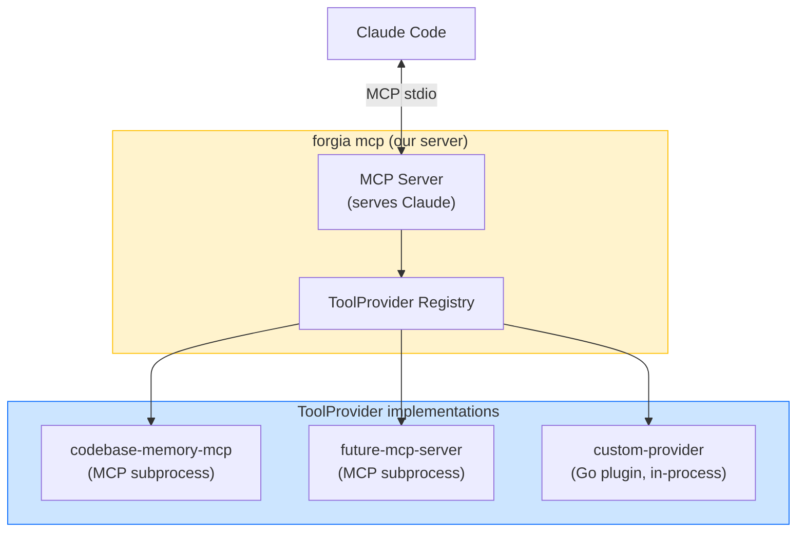

### ToolProvider interface

```go
// internal/mcp/provider.go

// ToolProvider abstracts any external tool source (MCP server, API, in-process)
type ToolProvider interface {
    // Name returns the provider identifier
    Name() string

    // Tools returns the tool definitions this provider exposes
    Tools() []ToolDefinition

    // Call invokes a tool and returns the result
    Call(ctx context.Context, tool string, params map[string]any) (any, error)

    // Start initializes the provider (spawn subprocess, connect API, etc.)
    Start(ctx context.Context) error

    // Stop gracefully shuts down the provider
    Stop() error

    // Healthy returns true if the provider is ready to serve
    Healthy() bool
}

// ToolDefinition describes a tool exposed by a provider
type ToolDefinition struct {
    Name        string            `json:"name"`
    Description string            `json:"description"`
    Parameters  map[string]any    `json:"parameters"`
    Namespace   string            `json:"-"`  // "forgia_" prefix when re-exposed
}
```

### MCPSubprocessProvider (generic MCP-over-stdio)

```go
// internal/mcp/subprocess_provider.go

// MCPSubprocessProvider connects to any MCP server via stdio
type MCPSubprocessProvider struct {
    name     string
    command  string
    args     []string
    process  *process.Process
    client   *mcpclient.Client  // JSON-RPC client over stdin/stdout
    lazy     bool
    restart  bool
}

// Any MCP server becomes a ToolProvider with zero custom code:
// - codebase-memory-mcp
// - future-analytics-mcp
// - custom-team-mcp
// All use the same MCPSubprocessProvider, just different config.
```

### Configuration

```toml
# .forgia/config.toml

# Each provider entry creates an MCPSubprocessProvider instance
[mcp.providers.codebase-memory]
command = "codebase-memory-mcp"
args = []
lazy = true                      # spawn on first call, not at startup
restart_on_crash = true
health_check = "list_projects"   # tool to call for health check
expose_tools = ["search_graph", "detect_changes", "get_architecture", "trace_call_path"]
namespace = "code"               # tools become forgia_code_search_graph, etc.

[mcp.providers.my-custom-server]
command = "/usr/local/bin/my-mcp"
args = ["--config", "/path/to/config"]
lazy = false                     # start immediately
expose_tools = ["*"]             # expose all tools
namespace = "custom"
```

### Provider Registry

```go
// internal/mcp/registry.go

type ProviderRegistry struct {
    providers map[string]ToolProvider
    mu        sync.RWMutex
}

// AllTools returns merged tool list from all providers (with namespace prefix)
func (r *ProviderRegistry) AllTools() []ToolDefinition {
    r.mu.RLock()
    defer r.mu.RUnlock()

    var tools []ToolDefinition
    for _, p := range r.providers {
        for _, t := range p.Tools() {
            t.Name = fmt.Sprintf("forgia_%s_%s", t.Namespace, t.Name)
            tools = append(tools, t)
        }
    }
    return tools
}

// Call routes a tool call to the right provider
func (r *ProviderRegistry) Call(ctx context.Context, tool string, params map[string]any) (any, error) {
    // Parse "forgia_code_search_graph" → provider="code", tool="search_graph"
    provider, toolName := parseNamespacedTool(tool)
    p, ok := r.providers[provider]
    if !ok {
        return nil, fmt.Errorf("unknown provider: %s", provider)
    }
    return p.Call(ctx, toolName, params)
}
```

## 6. Signal Handling

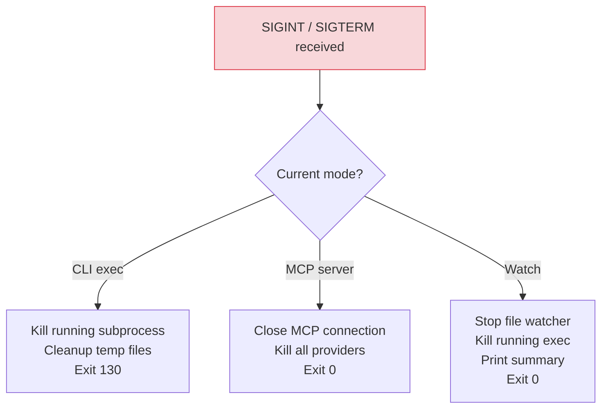

### Implementation

```go
// internal/process/signals.go

type ShutdownManager struct {
    processes []*Process
    cleanups  []func()
    mu        sync.Mutex
}

func (sm *ShutdownManager) Register(p *Process) {
    sm.mu.Lock()
    defer sm.mu.Unlock()
    sm.processes = append(sm.processes, p)
}

func (sm *ShutdownManager) OnCleanup(fn func()) {
    sm.mu.Lock()
    defer sm.mu.Unlock()
    sm.cleanups = append(sm.cleanups, fn)
}

func (sm *ShutdownManager) ListenAndShutdown() {
    sigCh := make(chan os.Signal, 1)
    signal.Notify(sigCh, syscall.SIGINT, syscall.SIGTERM)

    <-sigCh

    // Kill all registered processes
    for _, p := range sm.processes {
        p.Kill()
    }

    // Run cleanup functions
    for _, fn := range sm.cleanups {
        fn()
    }
}
```

## 7. Configuration Loading

Priority order (highest wins):

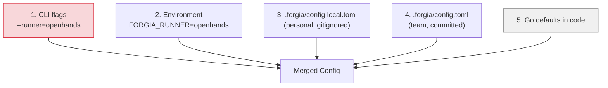

### Implementation

```go
// internal/config/config.go

func LoadConfig(vaultDir string) (*Config, error) {
    cfg := DefaultConfig()

    // 4. Team config
    teamPath := filepath.Join(vaultDir, "config.toml")
    if data, err := os.ReadFile(teamPath); err == nil {
        toml.Unmarshal(data, cfg)
    }

    // 3. Local overrides
    localPath := filepath.Join(vaultDir, "config.local.toml")
    if data, err := os.ReadFile(localPath); err == nil {
        toml.Unmarshal(data, cfg)  // merges on top
    }

    // 2. Environment variables
    applyEnvOverrides(cfg)

    // 1. CLI flags applied by cobra after LoadConfig

    return cfg, nil
}
```

## 8. Error Handling

### Exit codes

| Code | Meaning | When |
|------|---------|------|
| 0 | Success | Command completed |
| 1 | General error | Runtime failure |
| 2 | Usage error | Bad flags, missing args |
| 64 | Config error | Invalid config.toml, missing vault |
| 130 | Interrupted | SIGINT (Ctrl+C) |

### Error wrapping pattern

```go
// Always wrap with context
func (v *Vault) GetFD(id string) (*FD, error) {
    path, err := v.findFDFile(id)
    if err != nil {
        return nil, fmt.Errorf("get FD %s: %w", id, err)
    }

    data, err := os.ReadFile(path)
    if err != nil {
        return nil, fmt.Errorf("read FD %s at %s: %w", id, path, err)
    }

    var fd FD
    if err := yaml.Unmarshal(data, &fd); err != nil {
        return nil, fmt.Errorf("parse FD %s: %w", id, err)
    }

    return &fd, nil
}
```

### Structured logging (slog best practices)

```go
import "log/slog"

// Create logger with context — reuse across the operation (avoid repeating attributes)
logger := slog.With("sdd", sdd.ID, "runner", runner.Name())
logger.Info("executing",
    "sandbox", cfg.Runner.Claude.Sandbox,
)

logger.Error("subprocess failed",
    "exit_code", exitCode,
    "error", err,
)
```

### LogValuer for sensitive types

Use `slog.LogValuer` to control how types appear in logs — prevents accidental secret leakage:

```go
// internal/vault/fd.go

// LogValue ensures only metadata is logged, never content
func (fd FD) LogValue() slog.Value {
    return slog.GroupValue(
        slog.String("id", fd.ID),
        slog.String("status", string(fd.Status)),
        slog.String("author", fd.Author),
        // Intentionally omit: title content, problem description, etc.
    )
}

// Usage — slog automatically calls LogValue():
slog.Info("processing FD", "fd", fd)
// output: processing FD fd.id=FD-a3f2 fd.status=approved fd.author=ferruvich
```

Log levels:
- `DEBUG`: subprocess stdio, config parsing details
- `INFO`: command execution, SDD status changes
- `WARN`: fallback behavior, optional tool missing
- `ERROR`: failures that stop execution

## 9. Concurrency Patterns

### Use errgroup (not naked goroutines)

Go 1.25 standard: use `golang.org/x/sync/errgroup` for concurrent tasks with error propagation and context cancellation. **Never use naked `go func()` for work that can fail.**

```go
import "golang.org/x/sync/errgroup"

// Batch execution — N SDDs with error collection
func batchExecute(ctx context.Context, sdds []*vault.SDD, runner runner.Runner, parallel bool) error {
    if !parallel {
        // Sequential
        for _, sdd := range sdds {
            if _, err := runner.Execute(ctx, sdd, opts); err != nil {
                return fmt.Errorf("exec %s: %w", sdd.ID, err)
            }
        }
        return nil
    }

    // Parallel with errgroup
    g, ctx := errgroup.WithContext(ctx)
    g.SetLimit(3)  // max 3 concurrent executions

    for _, sdd := range sdds {
        sdd := sdd  // capture loop var
        g.Go(func() error {
            _, err := runner.Execute(ctx, sdd, opts)
            return err
        })
    }

    return g.Wait()  // returns first error, cancels remaining via ctx
}
```

### MCP Server (concurrent tool calls)

```go
// internal/mcp/server.go

func (s *Server) handleToolCall(ctx context.Context, call ToolCall) (any, error) {
    // Each tool call runs in its own goroutine (by MCP framework)
    // Vault operations need read lock, write operations need write lock

    switch call.Name {
    case "forgia_status":
        s.vault.RLock()
        defer s.vault.RUnlock()
        return s.handleStatus(ctx)

    case "forgia_exec":
        s.vault.Lock()
        defer s.vault.Unlock()
        return s.handleExec(ctx, call.Params)
    }
}
```

### Watch Mode (event queue with errgroup)

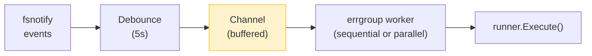

```go
// cmd/forgia/cmd/watch.go

func watchLoop(ctx context.Context, v *vault.Vault, r runner.Runner) error {
    g, ctx := errgroup.WithContext(ctx)

    events := make(chan string, 10)

    // Producer: file watcher (runs in errgroup)
    g.Go(func() error {
        watcher, err := fsnotify.NewWatcher()
        if err != nil {
            return fmt.Errorf("create watcher: %w", err)
        }
        defer watcher.Close()

        if err := watcher.Add(sddDir); err != nil {
            return fmt.Errorf("watch %s: %w", sddDir, err)
        }

        for {
            select {
            case event := <-watcher.Events:
                if isNewSDD(event) {
                    time.Sleep(debounce)
                    events <- event.Name
                }
            case err := <-watcher.Errors:
                return fmt.Errorf("watcher error: %w", err)
            case <-ctx.Done():
                return ctx.Err()
            }
        }
    })

    // Consumer: sequential executor (runs in errgroup)
    g.Go(func() error {
        for {
            select {
            case sddPath := <-events:
                sdd, _ := v.GetSDD(sddPath)
                result, err := r.Execute(ctx, sdd, opts)
                if err != nil {
                    slog.Error("exec failed", "sdd", sdd, "error", err)
                    // Don't return error — continue watching
                }
                printResult(result)
            case <-ctx.Done():
                return ctx.Err()
            }
        }
    })

    return g.Wait()
}
```

## 10. Testing Patterns

### Unit tests (per package)

```go
// internal/vault/vault_test.go
func TestGetFD(t *testing.T) {
    // Create temp .forgia/ with known state
    dir := t.TempDir()
    setupTestVault(t, dir)

    v, _ := vault.Open(dir)
    fd, err := v.GetFD("FD-a3f2")

    assert.NoError(t, err)
    assert.Equal(t, "FD-a3f2", fd.ID)
    assert.Equal(t, vault.FDPlanned, fd.Status)
}
```

### Integration tests (subprocess)

```go
// internal/mcp/providers_test.go
func TestProviderSpawn(t *testing.T) {
    if testing.Short() {
        t.Skip("skipping integration test")
    }

    // Spawn a mock MCP server
    p, err := process.Spawn(ctx, "echo", "hello")
    assert.NoError(t, err)
    defer p.Kill()
}
```

### E2E tests (CLI)

```go
// cmd/forgia/cmd/init_test.go
func TestInitCommand(t *testing.T) {
    dir := t.TempDir()

    cmd := exec.Command("go", "run", "./cmd/forgia", "init")
    cmd.Dir = dir
    output, err := cmd.CombinedOutput()

    assert.NoError(t, err)
    assert.Contains(t, string(output), "Vault scaffolded")
    assert.DirExists(t, filepath.Join(dir, ".forgia"))
}
```

### Testing concurrent code (testing/synctest)

Go 1.25 provides `testing/synctest` for testing code with timers, debounce, and timeouts **without real `time.Sleep`**:

```go
import "testing/synctest"

// Test watch debounce without waiting 5 real seconds
func TestWatchDebounce(t *testing.T) {
    synctest.Run(func() {
        events := make(chan string, 1)
        ctx, cancel := context.WithCancel(context.Background())
        defer cancel()

        // Simulate file event
        events <- "SDD-001.yaml"

        // Advance fake clock past debounce
        time.Sleep(6 * time.Second)  // instant in synctest!

        // Verify the event was processed
        // ...
    })
}

// Test subprocess timeout without waiting
func TestRunnerTimeout(t *testing.T) {
    synctest.Run(func() {
        ctx, cancel := context.WithTimeout(context.Background(), 30*time.Second)
        defer cancel()

        // Simulate long-running subprocess
        time.Sleep(31 * time.Second)  // instant!

        // ctx should be expired
        assert.Error(t, ctx.Err())
    })
}
```

### Test skip pattern for CI

```go
func TestNeedsClaude(t *testing.T) {
    if _, err := exec.LookPath("claude"); err != nil {
        t.Skip("claude CLI not available")
    }
    // ... test that needs claude
}

func TestNeedsDocker(t *testing.T) {
    if _, err := exec.LookPath("docker"); err != nil {
        t.Skip("docker not available")
    }
    // ... test that needs docker
}
```

## 11. Runner Architecture

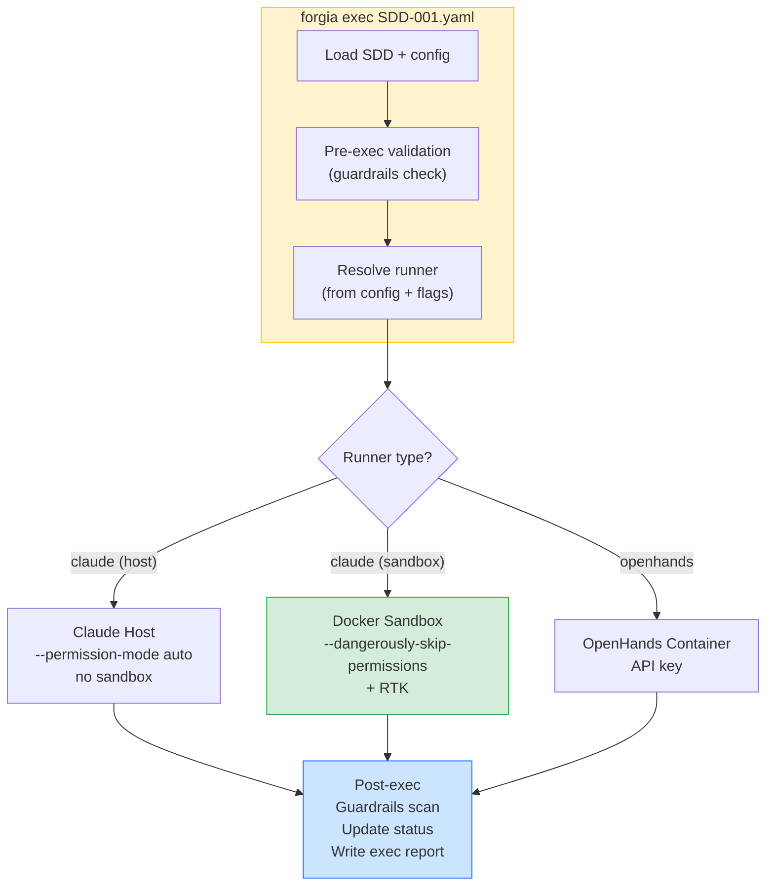

### Runner interface

```go
// internal/runner/runner.go

type Runner interface {
    Name() string
    Execute(ctx context.Context, sdd *vault.SDD, opts ExecOptions) (*ExecResult, error)
}

type ExecOptions struct {
    PermissionMode string  // default, auto, bypassPermissions
    Sandbox        string  // none, native, docker
    MaxTurns       int
    UseRTK         bool
    SystemContext   string  // constitution + guardrails + principles
    TaskPrompt     string  // the SDD task
}

// Resolve picks the right runner from config
func Resolve(cfg *config.Config, flags Flags) (Runner, error) {
    switch cfg.Runner.Default {
    case "claude":
        return NewClaudeRunner(cfg.Runner.Claude), nil
    case "openhands":
        return NewOpenHandsRunner(cfg.Runner.OpenHands), nil
    default:
        return nil, fmt.Errorf("unknown runner: %s", cfg.Runner.Default)
    }
}
```

## 12. Exec Report

Every execution produces a JSON report:

```go
type ExecResult struct {
    SDD            string    `json:"sdd"`
    FD             string    `json:"fd"`
    Runner         string    `json:"runner"`
    Started        time.Time `json:"started"`
    Completed      time.Time `json:"completed"`
    DurationSecs   int       `json:"duration_seconds"`
    ExitCode       int       `json:"exit_code"`
    Status         string    `json:"status"`
    FilesCreated   []string  `json:"files_created,omitempty"`
    FilesModified  []string  `json:"files_modified,omitempty"`
    Commits        []string  `json:"commits,omitempty"`
    TokensRaw      int       `json:"tokens_raw,omitempty"`
    TokensCompressed int     `json:"tokens_compressed,omitempty"`
    TokensSaved    int       `json:"tokens_saved,omitempty"`
}
```

Saved to `.forgia/logs/exec-{sdd-id}-{timestamp}.json`.

## 13. Project Board Integration (Generic Interface)

The project board (GitHub Projects, GitLab Boards) is the **central authority** for FD/SDD IDs and status. The Go binary uses a generic interface — not tied to GitHub.

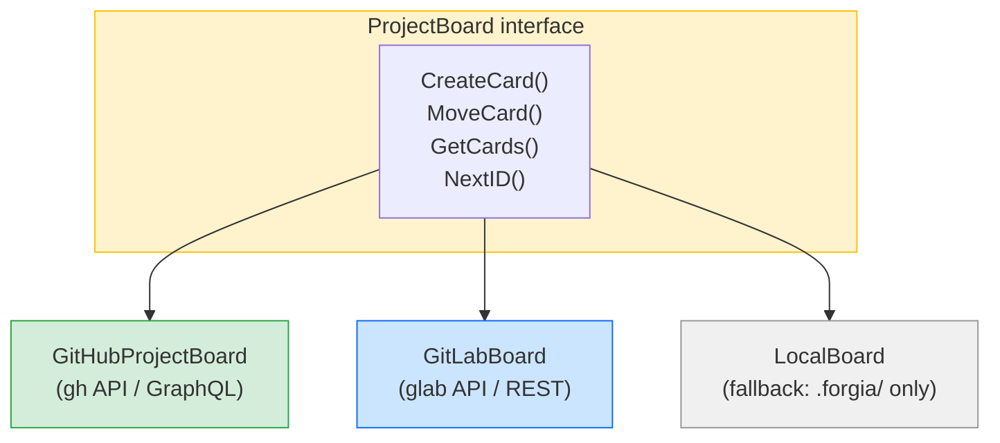

### Interface

```go
// internal/board/board.go

type ProjectBoard interface {
    // NextID generates a collision-proof ID for a new FD
    NextID(prefix string) (string, error)

    // Card CRUD
    CreateCard(item BoardItem) (string, error)
    UpdateCard(id string, fields map[string]any) error
    MoveCard(id string, column string) error
    GetCards(filter CardFilter) ([]BoardItem, error)

    // Sync
    SyncFromVault(vault *vault.Vault) error   // push local state → board
    SyncToVault(vault *vault.Vault) error     // pull board state → local
}

type BoardItem struct {
    ID        string            `json:"id"`
    Title     string            `json:"title"`
    Column    string            `json:"column"`
    Assignee  string            `json:"assignee"`
    Priority  string            `json:"priority"`
    Labels    []string          `json:"labels"`
    Fields    map[string]string `json:"fields"`  // custom fields (duration, tokens, etc.)
}
```

### Authentication

```go
// GitHub: uses gh CLI auth (already configured)
// GitLab: uses glab CLI auth or GITLAB_TOKEN env
// Local:  no auth needed (filesystem only)

func ResolveBoard(cfg *config.Config) (ProjectBoard, error) {
    switch cfg.Board.Provider {
    case "github":
        return NewGitHubBoard(cfg.Board.GitHub)
    case "gitlab":
        return NewGitLabBoard(cfg.Board.GitLab)
    default:
        return NewLocalBoard()  // fallback: works offline
    }
}
```

### Configuration

```toml
# .forgia/config.toml
[board]
provider = "github"           # github | gitlab | local

[board.github]
project_number = 1            # GitHub Project number
owner = "Deepzima"

[board.gitlab]
project_id = 123
board_id = 1
```

### Sync flow

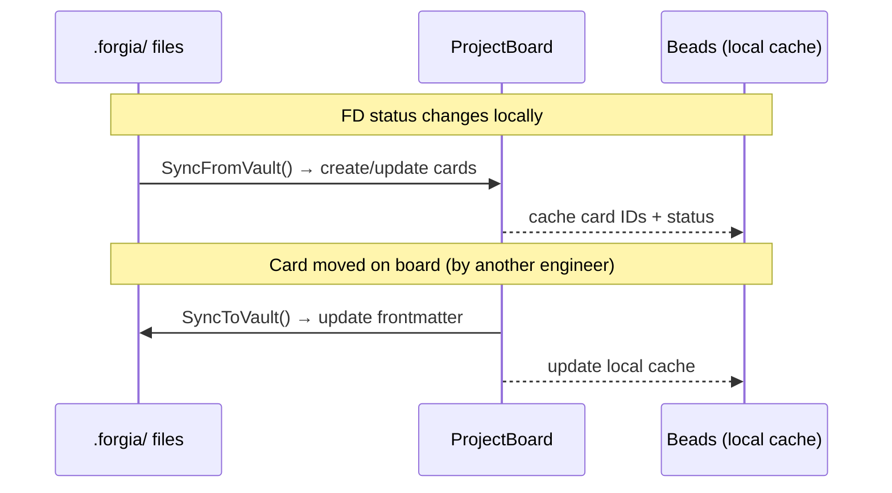

## 14. Docker Engine API (Container Management)

The Go binary manages Docker containers via the **Docker Engine API** over the Unix socket — no `docker` CLI subprocess needed.

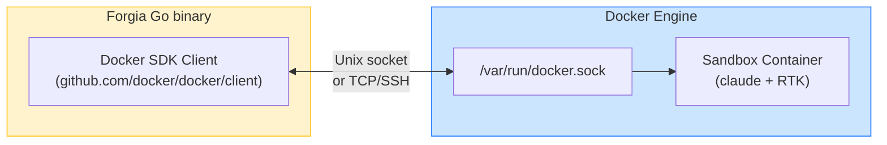

### Container lifecycle

```go
// internal/runner/docker.go

import (
    "github.com/docker/docker/api/types/container"
    "github.com/docker/docker/client"
)

type DockerSandbox struct {
    cli         *client.Client
    image       string
    networkAllow []string
}

func NewDockerSandbox(cfg config.SandboxConfig) (*DockerSandbox, error) {
    cli, err := client.NewClientWithOpts(client.FromEnv)
    if err != nil {
        return nil, fmt.Errorf("docker client: %w", err)
    }
    return &DockerSandbox{cli: cli, image: cfg.Image, networkAllow: cfg.NetworkAllow}, nil
}

func (d *DockerSandbox) Run(ctx context.Context, workDir string, cmd []string, env []string) (*ExecResult, error) {
    // 1. Create container
    resp, err := d.cli.ContainerCreate(ctx,
        &container.Config{
            Image: d.image,
            Cmd:   cmd,
            Env:   env,
            WorkingDir: "/workspace",
        },
        &container.HostConfig{
            Binds: []string{workDir + ":/workspace"},
            // No ~/.ssh, ~/.gnupg, ~/.aws mounted
            Resources: container.Resources{
                Memory:   256 * 1024 * 1024,  // 256MB limit
                NanoCPUs: 2000000000,          // 2 CPU
            },
        },
        nil, nil, "forgia-sandbox-"+uuid(),
    )
    if err != nil {
        return nil, fmt.Errorf("container create: %w", err)
    }
    defer d.cli.ContainerRemove(ctx, resp.ID, container.RemoveOptions{})

    // 2. Start
    if err := d.cli.ContainerStart(ctx, resp.ID, container.StartOptions{}); err != nil {
        return nil, fmt.Errorf("container start: %w", err)
    }

    // 3. Stream logs (for live file monitor)
    logs, _ := d.cli.ContainerLogs(ctx, resp.ID, container.LogsOptions{
        ShowStdout: true, ShowStderr: true, Follow: true,
    })
    go streamToOutput(logs)  // live output to terminal

    // 4. Wait for completion
    statusCh, errCh := d.cli.ContainerWait(ctx, resp.ID, container.WaitConditionNotRunning)
    select {
    case err := <-errCh:
        return nil, fmt.Errorf("container wait: %w", err)
    case status := <-statusCh:
        return &ExecResult{ExitCode: int(status.StatusCode)}, nil
    }
}
```

### Remote Docker support

```toml
# .forgia/config.toml
[runner.claude]
sandbox = "docker"

[docker]
# Default: local socket
host = "unix:///var/run/docker.sock"

# Remote Docker via TCP
# host = "tcp://build-server:2376"
# tls_verify = true
# cert_path = "~/.docker/certs"

# Remote Docker via SSH
# host = "ssh://user@build-server"
```

The same `client.NewClientWithOpts(client.FromEnv)` respects `DOCKER_HOST` env var — works with local, TCP, and SSH transports without code changes.

## 15. RTK Integration (Token Compression)

[RTK](https://github.com/rtk-ai/rtk) compresses command output inside the sandbox container. The Go binary doesn't talk to RTK directly — it configures the container to include RTK and extracts savings from the RTK SQLite DB after execution.

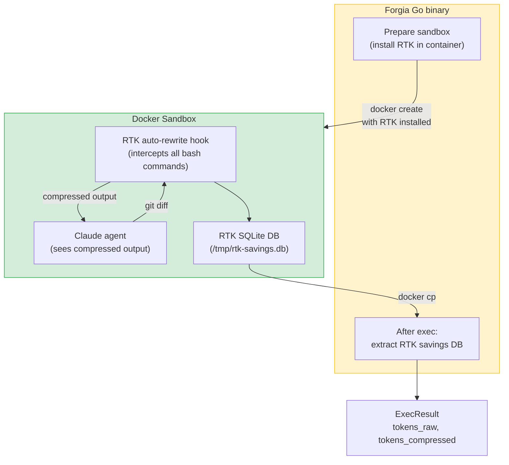

### Implementation

```go
// internal/runner/rtk.go

// PrepareRTK adds RTK installation to the container setup
func PrepareRTK(containerConfig *container.Config) {
    // RTK binary pre-installed in the sandbox image
    // OR installed at container start:
    containerConfig.Cmd = []string{
        "sh", "-c",
        "curl -sL https://github.com/rtk-ai/rtk/releases/latest/download/rtk-linux-amd64 -o /usr/local/bin/rtk && " +
        "chmod +x /usr/local/bin/rtk && " +
        "eval $(rtk hook) && " +  // activate auto-rewrite
        "claude --dangerously-skip-permissions -p \"$FORGIA_PROMPT\"",
    }
}

// ExtractRTKSavings copies the RTK DB from container and parses savings
func ExtractRTKSavings(ctx context.Context, cli *client.Client, containerID string) (raw, compressed int, err error) {
    reader, _, err := cli.CopyFromContainer(ctx, containerID, "/tmp/rtk-savings.db")
    if err != nil {
        return 0, 0, nil  // RTK savings not available — not an error
    }
    defer reader.Close()

    // Parse SQLite DB for total savings
    // ...
    return raw, compressed, nil
}
```

### Configuration

```toml
# .forgia/config.toml
[runner.claude]
use_rtk = true                 # install RTK in sandbox container
rtk_track_savings = true       # extract savings for exec report
```

## 16. Beads Integration (Local Cache)

[Beads](https://github.com/steveyegge/beads) is **always optional** — the Go binary must work 100% without it. When available, it provides fast local caching and dependency graph.

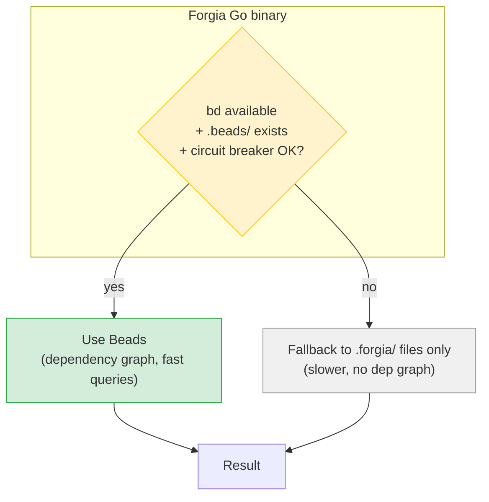

### Resilient bd interaction

```go
// internal/beads/beads.go

type BeadsClient struct {
    available bool
    timeout   time.Duration
}

func NewBeadsClient() *BeadsClient {
    bc := &BeadsClient{timeout: 5 * time.Second}

    // Check: bd installed?
    if _, err := exec.LookPath("bd"); err != nil {
        bc.available = false
        return bc
    }

    // Check: circuit breaker open?
    if isCircuitBreakerOpen() {
        slog.Warn("beads circuit breaker is open — using fallback",
            "fix", "mise run bd:reset")
        bc.available = false
        return bc
    }

    bc.available = true
    return bc
}

// Call executes a bd command with timeout and fallback
func (bc *BeadsClient) Call(ctx context.Context, args ...string) (string, error) {
    if !bc.available {
        return "", ErrBeadsUnavailable
    }

    ctx, cancel := context.WithTimeout(ctx, bc.timeout)
    defer cancel()

    cmd := exec.CommandContext(ctx, "bd", args...)
    output, err := cmd.CombinedOutput()
    if err != nil {
        if ctx.Err() == context.DeadlineExceeded {
            slog.Warn("beads call timed out", "args", args)
            return "", ErrBeadsTimeout
        }
        return "", fmt.Errorf("bd %v: %w", args, err)
    }

    return string(output), nil
}

func isCircuitBreakerOpen() bool {
    matches, _ := filepath.Glob("/tmp/beads-dolt-circuit-*.json")
    for _, f := range matches {
        data, _ := os.ReadFile(f)
        if strings.Contains(string(data), `"state":"open"`) {
            return true
        }
    }
    return false
}
```

### Usage pattern

```go
// Everywhere Beads is used, always with fallback:

func (v *Vault) GetDependencies(fdID string) ([]string, error) {
    // Try Beads first
    deps, err := v.beads.Call(ctx, "deps", fdID)
    if err == nil {
        return parseDeps(deps), nil
    }

    // Fallback: parse SDD frontmatter for deps
    sdds, _ := v.ListSDDs(fdID)
    // ... extract dependencies from YAML
    return manualDeps, nil
}
```

## 17. External Services Summary

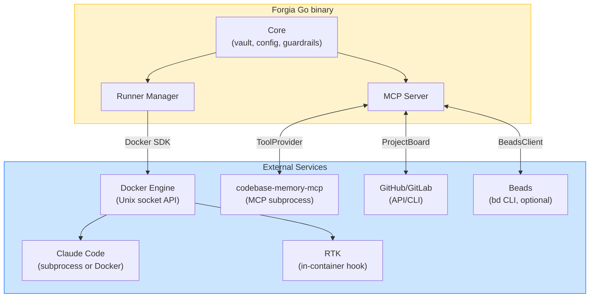

| Service | Connection | Interface | Required? |
|---------|-----------|-----------|-----------|
| Claude Code | subprocess (host) or Docker (sandbox) | `Runner` | Yes (primary runner) |
| Docker Engine | Unix socket / TCP / SSH | `DockerSandbox` (SDK client) | No (fallback: host mode) |
| RTK | Inside Docker container | N/A (Go binary doesn't talk to RTK) | No (token optimization) |
| codebase-memory-mcp | MCP subprocess (stdio) | `ToolProvider` | No (Tier 3 enrichment) |
| GitHub/GitLab | CLI (gh/glab) or REST API | `ProjectBoard` | No (fallback: LocalBoard) |
| Beads (bd) | CLI subprocess with timeout | `BeadsClient` | No (fallback: vault files) |

**Design principle**: every external service is **optional with graceful fallback**. Forgia works with zero external services (just `.forgia/` files). Each service adds capabilities when available.

## References

- [Go MCP SDK (mcp-go)](https://github.com/mark3labs/mcp-go)
- [Cobra CLI](https://cobra.dev/)
- [fsnotify](https://github.com/fsnotify/fsnotify)
- [go-toml](https://github.com/pelletier/go-toml)
- [slog (structured logging)](https://pkg.go.dev/log/slog)
- [Docker SDK for Go](https://pkg.go.dev/github.com/docker/docker/client)
- [RTK](https://github.com/rtk-ai/rtk) — token compression
- [codebase-memory-mcp](https://github.com/DeusData/codebase-memory-mcp) — Tier 3 knowledge
- [GitHub Projects API](https://docs.github.com/en/issues/planning-and-tracking-with-projects/automating-your-project/using-the-api-to-manage-projects)

- [Go MCP SDK (mcp-go)](https://github.com/mark3labs/mcp-go)
- [Cobra CLI](https://cobra.dev/)
- [fsnotify](https://github.com/fsnotify/fsnotify)
- [go-toml](https://github.com/pelletier/go-toml)
- [slog (structured logging)](https://pkg.go.dev/log/slog)
- [RTK](https://github.com/rtk-ai/rtk) — token compression
- [codebase-memory-mcp](https://github.com/DeusData/codebase-memory-mcp) — Tier 3
