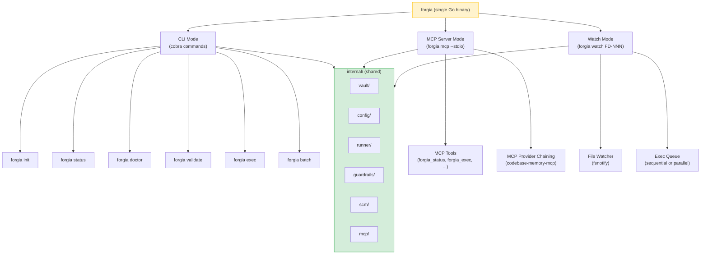
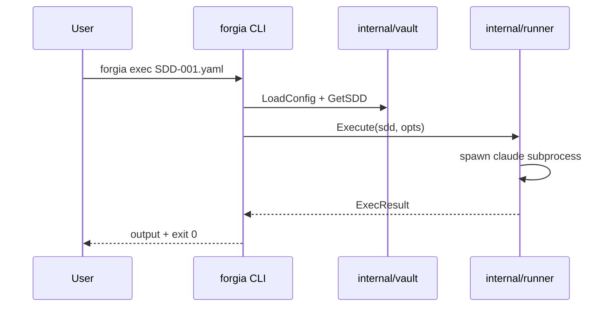
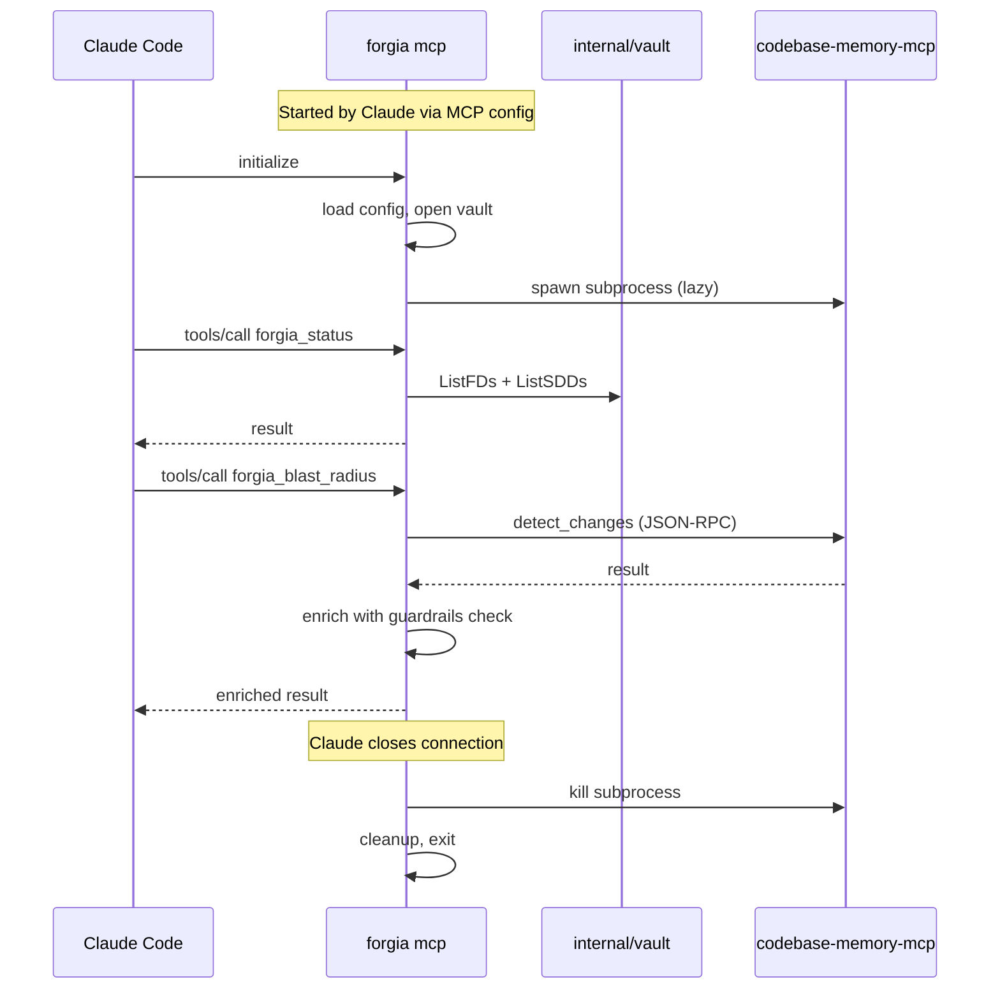
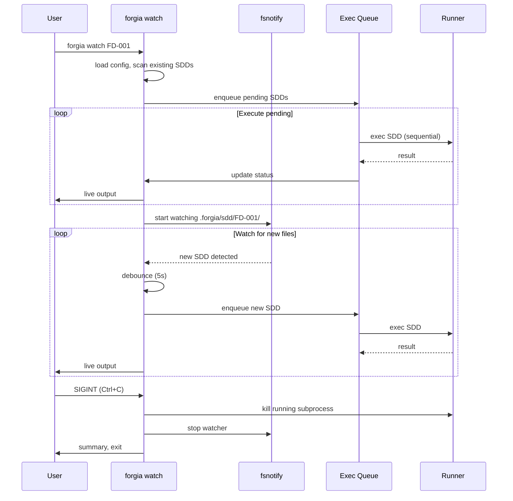
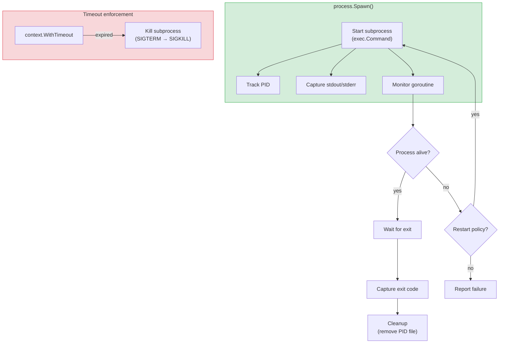
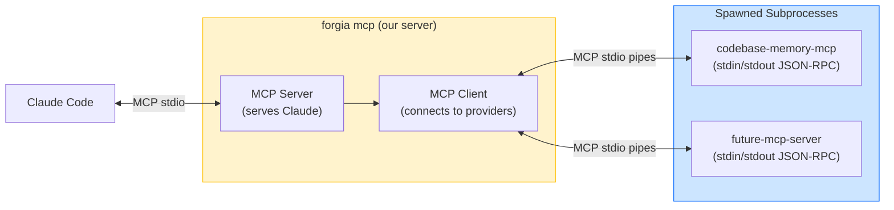
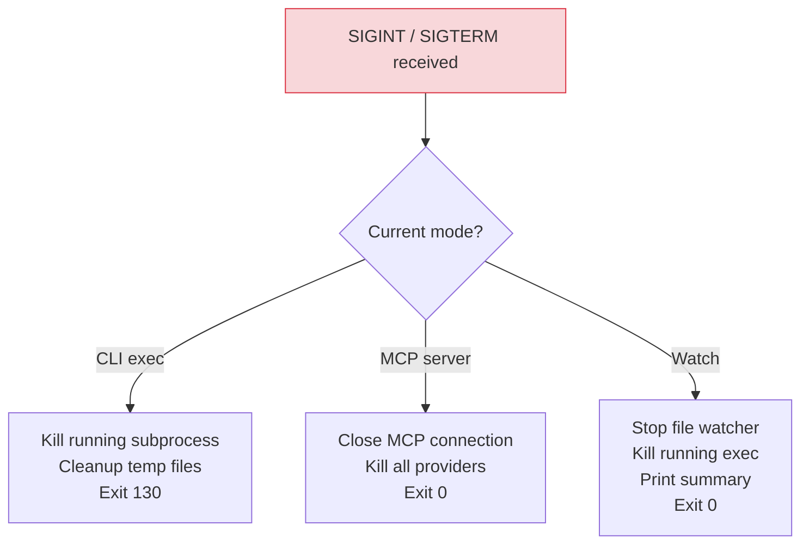
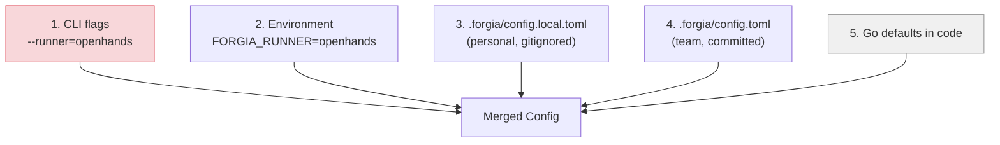
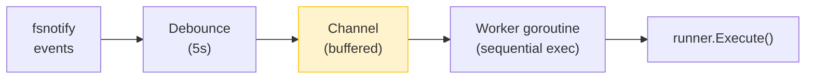
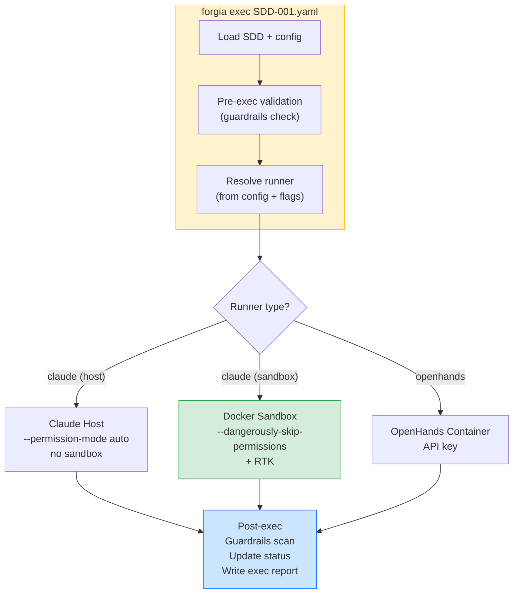

# Go Integration Guide

> Design decisions and patterns for the Forgia Go binary. Read this before writing any implementation code.

## 1. Binary Architecture

A single binary, multiple modes:



All modes share the same `internal/` packages. No code duplication.

## 2. Package Layout

```
cmd/forgia/
  main.go                    ← entry point
  cmd/
    root.go                  ← cobra root command
    init.go                  ← forgia init
    status.go                ← forgia status
    doctor.go                ← forgia doctor
    validate.go              ← forgia validate
    exec.go                  ← forgia exec
    batch.go                 ← forgia batch
    watch.go                 ← forgia watch
    mcp.go                   ← forgia mcp (starts MCP server)
    version.go               ← forgia version

internal/
  vault/                     ← .forgia/ read/write
    vault.go                 ← Vault interface
    fd.go                    ← FD types + CRUD
    sdd.go                   ← SDD types + CRUD
    id.go                    ← hash-based ID generation
  config/
    config.go                ← Config struct + LoadConfig
    merge.go                 ← config.toml + config.local.toml merge
  runner/
    runner.go                ← Runner interface
    claude.go                ← Claude Code runner (host + sandbox)
    openhands.go             ← OpenHands runner
    rtk.go                   ← RTK integration
  guardrails/
    guardrails.go            ← Guardrails struct
    check.go                 ← pre/post-exec scan
    secrets.go               ← secret pattern detection
  scm/
    scm.go                   ← SCM interface
    github.go                ← GitHub (gh CLI)
    gitlab.go                ← GitLab (glab CLI)
  mcp/
    server.go                ← MCP server (JSON-RPC over stdio)
    tools.go                 ← tool definitions (forgia_status, etc.)
    providers.go             ← MCP provider chaining (subprocess mgmt)
  process/
    spawn.go                 ← subprocess spawning + monitoring
    signals.go               ← signal handling (SIGINT, SIGTERM)
    timeout.go               ← timeout enforcement
```

## 3. Process Lifecycle

### CLI Mode (run and exit)



Pattern: load → execute → output → exit. No long-running state.

### MCP Server Mode (long-running)



Pattern: initialize → serve tools → cleanup → exit. Stateful while running.

### Watch Mode (long-running + spawning)



## 4. Subprocess Management

All external processes are managed through `internal/process/`:



### Subprocess types

| Subprocess | Lifecycle | Restart | Timeout |
|-----------|-----------|---------|---------|
| `claude -p "..."` | Per exec, dies when done | No | `max_turns` based |
| `docker sandbox run ...` | Per exec, container dies | No | Config timeout |
| `codebase-memory-mcp` | Spawned by MCP server, long-running | Yes (on crash) | No (persistent) |
| `gh api ...` | Per call, quick | No | 30s |

### Implementation pattern

```go
// internal/process/spawn.go

type Process struct {
    Name    string
    Cmd     *exec.Cmd
    Stdout  io.ReadCloser
    Stderr  io.ReadCloser
    Done    chan error
    cancel  context.CancelFunc
}

// Spawn starts a subprocess with monitoring
func Spawn(ctx context.Context, name string, args ...string) (*Process, error) {
    ctx, cancel := context.WithCancel(ctx)
    cmd := exec.CommandContext(ctx, name, args...)

    stdout, _ := cmd.StdoutPipe()
    stderr, _ := cmd.StderrPipe()

    if err := cmd.Start(); err != nil {
        cancel()
        return nil, fmt.Errorf("spawn %s: %w", name, err)
    }

    p := &Process{
        Name:   name,
        Cmd:    cmd,
        Stdout: stdout,
        Stderr: stderr,
        Done:   make(chan error, 1),
        cancel: cancel,
    }

    // Monitor in background
    go func() {
        p.Done <- cmd.Wait()
    }()

    return p, nil
}

// Kill sends SIGTERM, waits 5s, then SIGKILL
func (p *Process) Kill() error {
    p.Cmd.Process.Signal(syscall.SIGTERM)
    select {
    case <-p.Done:
        return nil
    case <-time.After(5 * time.Second):
        return p.Cmd.Process.Kill()
    }
}
```

## 5. MCP Provider Chaining

Forgia spawns MCP providers as subprocesses and communicates via JSON-RPC over stdio:



### Configuration

```toml
# .forgia/config.toml
[mcp.providers.codebase-memory]
command = "codebase-memory-mcp"
args = []
lazy = true              # spawn on first call, not at startup
restart_on_crash = true
health_check = "list_projects"  # tool to call for health check
```

### Lazy spawning

```go
// internal/mcp/providers.go

type ProviderManager struct {
    configs   map[string]ProviderConfig
    instances map[string]*process.Process
    mu        sync.Mutex
}

// Get returns a running provider, spawning if needed (lazy)
func (pm *ProviderManager) Get(name string) (*process.Process, error) {
    pm.mu.Lock()
    defer pm.mu.Unlock()

    if p, ok := pm.instances[name]; ok {
        // Check if still alive
        select {
        case <-p.Done:
            // Died — restart if configured
            delete(pm.instances, name)
        default:
            return p, nil
        }
    }

    // Spawn new instance
    cfg := pm.configs[name]
    p, err := process.Spawn(context.Background(), cfg.Command, cfg.Args...)
    if err != nil {
        return nil, err
    }
    pm.instances[name] = p
    return p, nil
}
```

## 6. Signal Handling



### Implementation

```go
// internal/process/signals.go

type ShutdownManager struct {
    processes []*Process
    cleanups  []func()
    mu        sync.Mutex
}

func (sm *ShutdownManager) Register(p *Process) {
    sm.mu.Lock()
    defer sm.mu.Unlock()
    sm.processes = append(sm.processes, p)
}

func (sm *ShutdownManager) OnCleanup(fn func()) {
    sm.mu.Lock()
    defer sm.mu.Unlock()
    sm.cleanups = append(sm.cleanups, fn)
}

func (sm *ShutdownManager) ListenAndShutdown() {
    sigCh := make(chan os.Signal, 1)
    signal.Notify(sigCh, syscall.SIGINT, syscall.SIGTERM)

    <-sigCh

    // Kill all registered processes
    for _, p := range sm.processes {
        p.Kill()
    }

    // Run cleanup functions
    for _, fn := range sm.cleanups {
        fn()
    }
}
```

## 7. Configuration Loading

Priority order (highest wins):



### Implementation

```go
// internal/config/config.go

func LoadConfig(vaultDir string) (*Config, error) {
    cfg := DefaultConfig()

    // 4. Team config
    teamPath := filepath.Join(vaultDir, "config.toml")
    if data, err := os.ReadFile(teamPath); err == nil {
        toml.Unmarshal(data, cfg)
    }

    // 3. Local overrides
    localPath := filepath.Join(vaultDir, "config.local.toml")
    if data, err := os.ReadFile(localPath); err == nil {
        toml.Unmarshal(data, cfg)  // merges on top
    }

    // 2. Environment variables
    applyEnvOverrides(cfg)

    // 1. CLI flags applied by cobra after LoadConfig

    return cfg, nil
}
```

## 8. Error Handling

### Exit codes

| Code | Meaning | When |
|------|---------|------|
| 0 | Success | Command completed |
| 1 | General error | Runtime failure |
| 2 | Usage error | Bad flags, missing args |
| 64 | Config error | Invalid config.toml, missing vault |
| 130 | Interrupted | SIGINT (Ctrl+C) |

### Error wrapping pattern

```go
// Always wrap with context
func (v *Vault) GetFD(id string) (*FD, error) {
    path, err := v.findFDFile(id)
    if err != nil {
        return nil, fmt.Errorf("get FD %s: %w", id, err)
    }

    data, err := os.ReadFile(path)
    if err != nil {
        return nil, fmt.Errorf("read FD %s at %s: %w", id, path, err)
    }

    var fd FD
    if err := yaml.Unmarshal(data, &fd); err != nil {
        return nil, fmt.Errorf("parse FD %s: %w", id, err)
    }

    return &fd, nil
}
```

### Structured logging

```go
// Use slog throughout
import "log/slog"

slog.Info("executing SDD",
    "sdd", sdd.ID,
    "runner", runner.Name(),
    "sandbox", cfg.Runner.Claude.Sandbox,
)

slog.Error("subprocess failed",
    "process", "claude",
    "exit_code", exitCode,
    "error", err,
)
```

Log levels:
- `DEBUG`: subprocess stdio, config parsing details
- `INFO`: command execution, SDD status changes
- `WARN`: fallback behavior, optional tool missing
- `ERROR`: failures that stop execution

## 9. Concurrency Patterns

### MCP Server (concurrent tool calls)

```go
// internal/mcp/server.go

func (s *Server) handleToolCall(ctx context.Context, call ToolCall) (any, error) {
    // Each tool call runs in its own goroutine (by MCP framework)
    // Vault operations need read lock, write operations need write lock

    switch call.Name {
    case "forgia_status":
        s.vault.RLock()
        defer s.vault.RUnlock()
        return s.handleStatus(ctx)

    case "forgia_exec":
        s.vault.Lock()
        defer s.vault.Unlock()
        return s.handleExec(ctx, call.Params)
    }
}
```

### Watch Mode (event queue)



```go
// cmd/forgia/cmd/watch.go

func watchLoop(ctx context.Context, vault *vault.Vault, runner runner.Runner) {
    events := make(chan string, 10)  // buffered channel

    // Producer: file watcher
    go func() {
        watcher, _ := fsnotify.NewWatcher()
        watcher.Add(sddDir)
        for {
            select {
            case event := <-watcher.Events:
                if isNewSDD(event) {
                    time.Sleep(debounce)
                    events <- event.Name
                }
            case <-ctx.Done():
                return
            }
        }
    }()

    // Consumer: sequential executor
    for {
        select {
        case sddPath := <-events:
            result, err := runner.Execute(ctx, sdd, opts)
            printResult(result, err)
        case <-ctx.Done():
            return
        }
    }
}
```

## 10. Testing Patterns

### Unit tests (per package)

```go
// internal/vault/vault_test.go
func TestGetFD(t *testing.T) {
    // Create temp .forgia/ with known state
    dir := t.TempDir()
    setupTestVault(t, dir)

    v, _ := vault.Open(dir)
    fd, err := v.GetFD("FD-a3f2")

    assert.NoError(t, err)
    assert.Equal(t, "FD-a3f2", fd.ID)
    assert.Equal(t, vault.FDPlanned, fd.Status)
}
```

### Integration tests (subprocess)

```go
// internal/mcp/providers_test.go
func TestProviderSpawn(t *testing.T) {
    if testing.Short() {
        t.Skip("skipping integration test")
    }

    // Spawn a mock MCP server
    p, err := process.Spawn(ctx, "echo", "hello")
    assert.NoError(t, err)
    defer p.Kill()
}
```

### E2E tests (CLI)

```go
// cmd/forgia/cmd/init_test.go
func TestInitCommand(t *testing.T) {
    dir := t.TempDir()

    cmd := exec.Command("go", "run", "./cmd/forgia", "init")
    cmd.Dir = dir
    output, err := cmd.CombinedOutput()

    assert.NoError(t, err)
    assert.Contains(t, string(output), "Vault scaffolded")
    assert.DirExists(t, filepath.Join(dir, ".forgia"))
}
```

### Test skip pattern for CI

```go
func TestNeedsClaude(t *testing.T) {
    if _, err := exec.LookPath("claude"); err != nil {
        t.Skip("claude CLI not available")
    }
    // ... test that needs claude
}

func TestNeedsDocker(t *testing.T) {
    if _, err := exec.LookPath("docker"); err != nil {
        t.Skip("docker not available")
    }
    // ... test that needs docker
}
```

## 11. Runner Architecture



### Runner interface

```go
// internal/runner/runner.go

type Runner interface {
    Name() string
    Execute(ctx context.Context, sdd *vault.SDD, opts ExecOptions) (*ExecResult, error)
}

type ExecOptions struct {
    PermissionMode string  // default, auto, bypassPermissions
    Sandbox        string  // none, native, docker
    MaxTurns       int
    UseRTK         bool
    SystemContext   string  // constitution + guardrails + principles
    TaskPrompt     string  // the SDD task
}

// Resolve picks the right runner from config
func Resolve(cfg *config.Config, flags Flags) (Runner, error) {
    switch cfg.Runner.Default {
    case "claude":
        return NewClaudeRunner(cfg.Runner.Claude), nil
    case "openhands":
        return NewOpenHandsRunner(cfg.Runner.OpenHands), nil
    default:
        return nil, fmt.Errorf("unknown runner: %s", cfg.Runner.Default)
    }
}
```

## 12. Exec Report

Every execution produces a JSON report:

```go
type ExecResult struct {
    SDD            string    `json:"sdd"`
    FD             string    `json:"fd"`
    Runner         string    `json:"runner"`
    Started        time.Time `json:"started"`
    Completed      time.Time `json:"completed"`
    DurationSecs   int       `json:"duration_seconds"`
    ExitCode       int       `json:"exit_code"`
    Status         string    `json:"status"`
    FilesCreated   []string  `json:"files_created,omitempty"`
    FilesModified  []string  `json:"files_modified,omitempty"`
    Commits        []string  `json:"commits,omitempty"`
    TokensRaw      int       `json:"tokens_raw,omitempty"`
    TokensCompressed int     `json:"tokens_compressed,omitempty"`
    TokensSaved    int       `json:"tokens_saved,omitempty"`
}
```

Saved to `.forgia/logs/exec-{sdd-id}-{timestamp}.json`.

## References

- [Go MCP SDK (mcp-go)](https://github.com/mark3labs/mcp-go)
- [Cobra CLI](https://cobra.dev/)
- [fsnotify](https://github.com/fsnotify/fsnotify)
- [go-toml](https://github.com/pelletier/go-toml)
- [slog (structured logging)](https://pkg.go.dev/log/slog)
- [RTK](https://github.com/rtk-ai/rtk) — token compression
- [codebase-memory-mcp](https://github.com/DeusData/codebase-memory-mcp) — Tier 3
