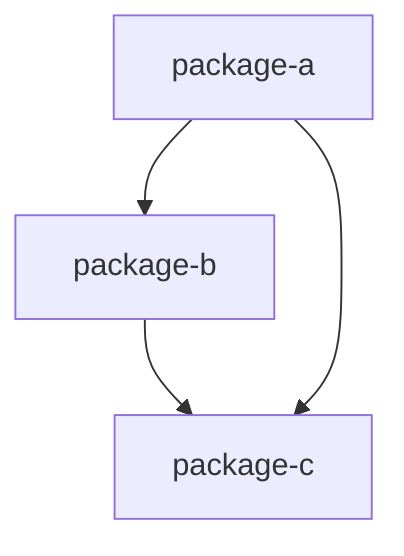

Perform architecture review of a Feature Design with pattern detection, anti-pattern scanning, and SOLID compliance scoring.

## Instructions

Given FD identifier: $ARGUMENTS

**This is a READ-ONLY operation. Do NOT create, modify, or delete any file.**

### Step 0: Resolve Input

1. If `$ARGUMENTS` is empty, refuse with: "Uso: /fd-arch-review FD-NNN"
2. Find the FD file in `.forgia/fd/` matching `$ARGUMENTS*.md` (e.g., `FD-002` matches `FD-002-*.md`)
3. If no file found, refuse with: "FD non trovato: $ARGUMENTS. Verifica l'identificatore."
4. Extract the FD title from frontmatter

### Step 1: Load Context

Read all of the following — do not skip any:

1. The FD file — extract the Architecture section (Mermaid diagrams), Interfaces table, Planned SDDs, Constraints
2. `.forgia/constitution.md`
3. `.forgia/guardrails/deny.toml` — load the `[read]` deny patterns for guardrail-aware scanning
4. All files in `.forgia/dev-guide/` (general conventions)
5. All files in `.forgia/dev-guide/principles/` (clean-code, SOLID, design-patterns)
6. All files in `.forgia/dev-guide/lang/` — load ALL language files present (they were auto-detected during `forgia init`)

### Step 2: Scan Codebase

Scan the project's actual codebase to understand the current architecture. This is NOT just reading the FD — you must examine real code.

**Before reading any file**: check its path against the `[read]` deny patterns from `.forgia/guardrails/deny.toml`. If a file matches a deny pattern, skip it and note: "skipped — blocked by guardrails (matches: `<pattern>`)". Never attempt to read denied files.

Perform these scans:

1. **Directory structure**: Use Glob to map the top-level and key subdirectories. Identify packages, modules, crates, or services depending on the language/framework.

2. **Language detection**: Check which language conventions were loaded from `.forgia/dev-guide/lang/`. Use this to guide pattern detection:
   - **Go**: scan for `internal/`, `pkg/`, `cmd/` structure; look for interface definitions, struct methods, package imports
   - **Rust**: scan for `src/`, `Cargo.toml` workspace members; look for trait definitions, mod structure
   - **Python**: scan for `src/`, package directories with `__init__.py`; look for class hierarchies, imports
   - **TypeScript**: scan for `src/`, barrel exports, module structure
   - **Shell**: scan for `bin/`, `modules/`, function definitions

3. **Import/dependency analysis**: For each major package/module, identify what it imports/depends on. Build a dependency map: `package → [dependencies]`.

### Step 3: Pattern Analysis

Using the patterns from `.forgia/dev-guide/principles/design-patterns.md` and language conventions, check the codebase for known patterns:

**Patterns to detect** (check ALL — report "Not detected" if absent):

| Pattern | How to detect |
|---------|---------------|
| Repository | Data access layer separated from business logic (e.g., `repository/`, `store/`, `dal/`) |
| Factory | Functions/types that create instances based on runtime input (e.g., `New*()`, `create_*()`) |
| Handler/Controller | Request handling layer (e.g., `handler/`, `controller/`, HTTP route registration) |
| Builder | Multi-step object construction (e.g., `*Builder` types, method chaining) |
| Strategy | Swappable algorithms via interfaces/traits (e.g., `Runner` interface with multiple implementations) |
| Observer/Event | Event-driven communication (e.g., event bus, listeners, hooks) |
| Middleware/Decorator | Wrapping behavior (e.g., middleware chains, decorator functions) |
| State Machine | Defined state transitions (e.g., status enums with transition logic) |
| Adapter | Interface translation between systems (e.g., `*Adapter` types) |
| Facade | Simplified interface over complex subsystem |

Output as a table:

```markdown
## Pattern Analysis

| Pattern | Detected | Where | Assessment |
|---------|----------|-------|------------|
| Repository | ✓ / ✗ | path/to/package | Good — reason / Missing — recommendation |
```

### Step 4: Anti-Pattern Detection

Using the rules from `.forgia/dev-guide/principles/clean-code.md` and SOLID principles, check for these anti-patterns:

**Anti-patterns to check** (check ALL — report "No" if not found):

1. **God Object**: A single file, package, or class with too many responsibilities. Heuristic: file >500 lines with multiple unrelated public functions, or package that is imported by >60% of other packages.

2. **Circular Dependency**: Package A imports B and B imports A (directly or transitively). Check the dependency map from Step 2.

3. **Missing Interface**: Concrete type used directly where an abstraction would improve testability. Look for: constructors that instantiate concrete dependencies instead of accepting interfaces, packages that depend on implementation details of another package.

4. **Hardcoded Config**: Configuration values embedded in code instead of loaded from config files or environment variables. Look for: hardcoded URLs, port numbers, file paths, timeouts that should be configurable. Exclude: test fixtures, default values with override mechanisms.

5. **Missing Error Context**: Errors returned without wrapping context. Language-specific:
   - Go: `return err` without `fmt.Errorf("context: %w", err)`
   - Rust: `.unwrap()` or `?` without `.context()`
   - Python: bare `raise` without message

Output as a table:

```markdown
## Anti-Pattern Detection

| Anti-Pattern | Found? | Where | Suggestion |
|-------------|--------|-------|------------|
| God Object | No / ⚠ Yes | file or package | Specific suggestion |
```

### Step 5: Dependency Graph

Generate a Mermaid dependency graph from the actual import analysis in Step 2.

Rules:
- Use `graph TD` (top-down) format
- Include only packages/modules that have at least one dependency or dependent
- Label edges with the type of dependency if it adds clarity (e.g., `-->|"uses interface"|`)
- Highlight circular dependencies with red styling if found: `style X fill:#ffcccc,stroke:#cc0000`

```markdown
## Dependency Graph


```

### Step 6: SOLID Compliance

Score each SOLID principle using the rules from `.forgia/dev-guide/principles/solid.md`. For each principle:

1. Assess the **current codebase** (not the FD proposal)
2. Assess how the **FD's proposed architecture** would affect compliance
3. Reference specific files or packages for any violations or concerns

Scoring:
- ✓ = compliant, no issues found
- ⚠ = minor concern, could improve
- ✗ = violation found

```markdown
## SOLID Compliance

| Principle | Score | Current Codebase | FD Impact |
|-----------|-------|------------------|-----------|
| S — Single Responsibility | ✓/⚠/✗ | Assessment with file reference | How FD affects it |
| O — Open/Closed | ✓/⚠/✗ | Assessment | Impact |
| L — Liskov Substitution | ✓/⚠/✗ | Assessment | Impact |
| I — Interface Segregation | ✓/⚠/✗ | Assessment | Impact |
| D — Dependency Inversion | ✓/⚠/✗ | Assessment | Impact |
```

### Step 7: Recommendations

Compile a numbered list of actionable recommendations. Each recommendation must:
- Reference a specific file, package, or component
- Explain the issue concisely
- Suggest a concrete fix or improvement
- Be ordered by priority (most impactful first)

Do NOT include generic advice like "write more tests" or "improve documentation". Every recommendation must be tied to a specific finding from Steps 3-6.

```markdown
## Recommendations

1. **[file/package]**: Issue description — suggested fix
2. **[file/package]**: Issue description — suggested fix
```

If no recommendations are needed (everything looks good), state: "Nessuna raccomandazione — l'architettura proposta è coerente con il codebase esistente e le convenzioni del progetto."

### Step 8: Produce Report

Assemble the final report with this exact structure:

```markdown
# Architecture Review — $FD_ID: $FD_TITLE

## Pattern Analysis
[table from Step 3]

## Anti-Pattern Detection
[table from Step 4]

## Dependency Graph
[mermaid from Step 5]

## SOLID Compliance
[table from Step 6]

## Recommendations
[list from Step 7]
```

## Important

- **READ-ONLY**: This command must NEVER create, modify, or delete any file. It is a pure analysis tool.
- **Respect guardrails**: Before reading any file, check its path against `.forgia/guardrails/deny.toml` `[read]` patterns. If it matches, skip and note "blocked by guardrails". Never attempt to read denied files.
- **Scan real code**: The report must be based on actual codebase analysis (Glob, Grep, Read tools), not just the FD text. If you can only analyze the FD without codebase access, state this limitation clearly.
- **Never silently skip a section**: Always report all 5 sections, even if a section finds nothing (e.g., "No anti-patterns detected").
- **Language-aware**: Use the loaded language conventions from `.forgia/dev-guide/lang/` to guide pattern detection and anti-pattern checks. Do not apply Go patterns to a Python codebase or vice versa.
- **Advisory, not a gate**: This command produces a report for human review. It does NOT block `/fd-review` or `/fd-sdd`. Do not set or modify any FD frontmatter fields.
- **Italian for user-facing messages**: Error messages in Italian. Report structure labels in English for consistency with other Forgia reports.
