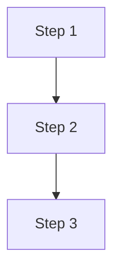

# {{ID}}: {{TITLE}}

## Problema

<!-- Descrivi il problema o la necessita'. Cosa non funziona? Cosa manca? Perche' serve? -->

## Soluzioni Considerate

### Opzione A

- **Pro:**
- **Contro:**

### Opzione B (scelta)

- **Pro:**
- **Contro:**

## Architettura

## Interfacce

<!-- Definisci le interfacce tra i componenti che verranno generati come SDD separati -->

| Componente | Input | Output | Protocollo |
|------------|-------|--------|------------|
| | | | |

## SDD Previsti

<!-- Quanti SDD verranno generati da questo FD? Uno per componente/servizio -->

1. SDD-001: <!-- componente 1 -->
2. SDD-002: <!-- componente 2 -->

## Vincoli

- <!-- vincoli tecnici, di tempo, di budget -->

## Verifica

- [ ] Problema chiaramente definito
- [ ] Almeno 2 soluzioni considerate con pro/contro
- [ ] Diagramma architetturale presente
- [ ] Interfacce tra componenti definite
- [ ] SDD previsti elencati
- [ ] Review completata (`/fd-review`)

## Note

<!-- Note aggiuntive, link, riferimenti -->
